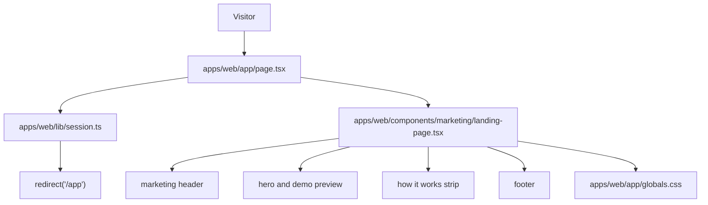

# Technical Specification: Landing Page

## 1. Technical Overview

F01 replaces the scaffolded root page with a public, minimalist Videomax landing page at `/`. The page presents the product name, a one-sentence value proposition, supporting copy, a primary "Create account" call-to-action, a top-right "Log in" link, a three-step "how it works" strip, and a footer.

The implementation is frontend-only except for consuming an authentication-session boundary when it exists. The root route remains a Next.js App Router Server Component so it can redirect authenticated visitors to `/app` before rendering public marketing content.

**Included:**
- Public root route at `/` with no authentication requirement for anonymous visitors.
- Server-side redirect from `/` to `/app` when the session helper reports an authenticated user.
- Landing page layout based on `docs/design/design-system-pages/components/landing.jsx`.
- Navigation links to `/register` and `/login`.
- Global metadata and visual tokens for the Videomax brand.
- Critical frontend tests for public rendering, CTA links, login link placement, visual landmarks, and authenticated redirect behavior.

**Deferred:**
- Registration, login, logout, secure cookie validation, and session persistence remain owned by F02.
- `/register`, `/login`, and `/app` page implementations remain owned by downstream features.
- Analytics, A/B testing, CMS editing, and marketing asset management are outside this release.

**Traceability:**
- PRD Capabilities drive the root route, hero, navigation, visual identity, "how it works" strip, footer, and redirect branch.
- PRD Experience drives above-the-fold placement, logo-left/login-right navigation, CTA destinations, and authenticated-user handling.
- `docs/design/design-system-pages/components/landing.jsx` is the visual base. Token direction `VM_TOKENS.A` is used as inspiration, with mostly white surfaces, neutral ink, and a restrained orange accent so the final page does not become a beige one-note palette.

## 2. Architecture Impact

F01 touches only the web app. The current `apps/web/app/page.tsx` calls the backend hello endpoint; that dependency is removed from the root route so the landing page can load even when anonymous visitors do not need backend data.

**Observed project patterns:**
- Runtime is TypeScript on Node with npm workspaces.
- Frontend uses Next.js 16 App Router, React 19, Server Components by default, Tailwind CSS 4 via `@import "tailwindcss"`, and Geist fonts in `app/layout.tsx`.
- Backend is a separate Fastify service with clean architecture, but F01 does not add backend behavior.
- Root scripts expose `npm run lint`, `npm run typecheck`, `npm run build`, `npm run test`, and `./scripts/run-gates.mjs`.
- Existing tests are Vitest-based on the backend. No frontend test harness exists yet, so this feature should add only critical frontend coverage.
- No prior `docs/F*-*/contract.md` files exist. No fixture convention exists outside third-party `node_modules`.
- Environment examples live at `apps/web/.env.example` and `apps/backend/.env.example`.

## 3. Technical Decisions

| Decision | Chosen Approach | Alternative Considered | Trade-off |
|---|---|---|---|
| Rendering model | Keep `/` as a Server Component that performs the session redirect before rendering marketing UI | Make the landing page a Client Component | Server rendering keeps the page fast and keeps auth redirect out of client-only effects |
| Visual base | Recreate the `VMLanding` mockup as production React/Tailwind components using white surfaces, neutral text, and orange CTAs | Copy the mockup's inline styles directly | Tailwind keeps production code maintainable while preserving the approved layout direction |
| Auth redirect boundary | Add or consume `apps/web/lib/session.ts` with a small `getCurrentSession()` contract returning authenticated state | Couple `page.tsx` directly to F02 internals | The page can own redirect behavior while F02 remains responsible for secure session validation |
| Component shape | Split marketing UI into small presentational components under `apps/web/components/marketing/` | Keep all markup inside `app/page.tsx` | More files, but each component has one reason to change |
| Tests | Add critical route/component tests and one Playwright CLI navigation verification path in implementation guidance | Create a broad e2e suite | Coverage stays focused on business-visible landing behavior |

**Assumptions and auto-accepted decisions:**
- F01 has no Core Scope / Full Scope split, so the full PRD feature is in scope.
- The authenticated redirect criterion is owned by the F01 root route, while the concrete secure session source is supplied by F02 when authentication is implemented.
- If F02 is not present when F01 is implemented, `getCurrentSession()` may return anonymous only, but its public shape must already support the authenticated branch.
- The design-system page `components/landing.jsx` is the correct base for F01.
- No static fixtures are needed for this feature.
- Detected project quality gates are included in the behavior contract.

## 4. Component Overview

**Frontend:**

| File Path | New/Modified | Purpose | Key Responsibilities |
|---|---|---|---|
| `apps/web/app/page.tsx` | Modified | Root route Server Component | Read current session state, redirect authenticated visitors to `/app`, render the public landing for anonymous visitors |
| `apps/web/app/layout.tsx` | Modified | Application shell metadata | Set Videomax title/description, preserve Geist font variables, keep document language as English |
| `apps/web/app/globals.css` | Modified | Global design tokens | Define Videomax CSS variables, base body colors, accessible focus outlines, and responsive typography helpers |
| `apps/web/lib/session.ts` | New | Frontend session boundary | Export an explicitly typed `getCurrentSession()` function consumed by the root route; isolate F02 session details |
| `apps/web/components/marketing/landing-page.tsx` | New | Landing composition | Arrange header, hero, demo preview, how-it-works strip, and footer |
| `apps/web/components/marketing/site-header.tsx` | New | Public navigation | Render wordmark, top-right login link, and primary CTA for wider breakpoints |
| `apps/web/components/marketing/hero-section.tsx` | New | Hero content | Render product value proposition, supporting copy, primary CTA, secondary login action, and demo preview |
| `apps/web/components/marketing/how-it-works.tsx` | New | Three-step strip | Render upload, transcribe, summarize steps based on the design-system page |
| `apps/web/components/marketing/site-footer.tsx` | New | Public footer | Render slim footer with wordmark and non-blocking informational links |
| `apps/web/components/ui/button-link.tsx` | New | Shared link button | Provide typed, accessible CTA styling for Next links |

**Backend:**

No backend files are added or modified for F01.

**Database:**

No database changes are required for F01.

## 5. API Contracts

F01 does not expose new HTTP endpoints and does not require a new API contract.

The root page consumes only an in-process session helper:

| Function | Input | Output | Description |
|---|---|---|---|
| `getCurrentSession()` | current request cookies/headers through Next.js server APIs | `Promise<{ authenticated: boolean }>` | Reports whether the visitor should be redirected away from the public landing page |

The helper must never throw for a missing, malformed, expired, or unsupported session. It returns `{ authenticated: false }` for all anonymous or unreadable states so `/` remains publicly reachable.

## 6. Data Model

F01 introduces no persistent data model, migrations, indexes, or constraints.

## 7. Testing Strategy

**Test File Structure:**

| Test File | Test Type | Target | Coverage Goal |
|---|---|---|---|
| `apps/web/app/page.test.tsx` | Unit/component | Root page behavior | Public render and authenticated redirect branch |
| `apps/web/components/marketing/landing-page.test.tsx` | Component | Landing composition | Visible copy, CTA hrefs, top-right login placement, semantic landmarks |
| Playwright CLI navigation check | Browser navigation | `/`, `/register`, `/login`, `/app` redirect | Critical route behavior only |

**Test Functions:**

| Test Function | Description | Assertions |
|---|---|---|
| `renders_public_landing_for_anonymous_visitor` | Root route receives anonymous session state | Product name, value proposition, "Create account", "Log in", how-it-works strip, and footer are visible |
| `redirects_authenticated_visitor_to_app` | Root route receives authenticated session state | `redirect('/app')` is invoked before landing markup renders |
| `exposes_create_account_link_to_register` | Landing composition renders primary CTA | Primary CTA has visible text "Create account" and href `/register` |
| `exposes_top_right_login_link_to_login` | Header renders returning-user link | Header navigation contains a "Log in" link with href `/login` |
| `preserves_design_system_landmarks` | Landing composition renders visual/semantic landmarks | Header, hero, three-step strip, and footer are present; focus styles are visible on actionable links |

**Frontend navigation verification:**
- Use the `playwright-cli` skill for browser navigation checks after implementation.
- Start the app only through `./scripts/init.sh`.
- Verify anonymous `/` renders the landing page.
- Verify activating "Create account" navigates to `/register`.
- Verify activating the top-right "Log in" link navigates to `/login`.
- Verify an authenticated browser context visiting `/` lands on `/app` once F02 session support exists.

**Quality Gates:**
- `npm run lint`
- `npm run typecheck`
- `npm run build`
- `npm run test`
- `./scripts/run-gates.mjs`
