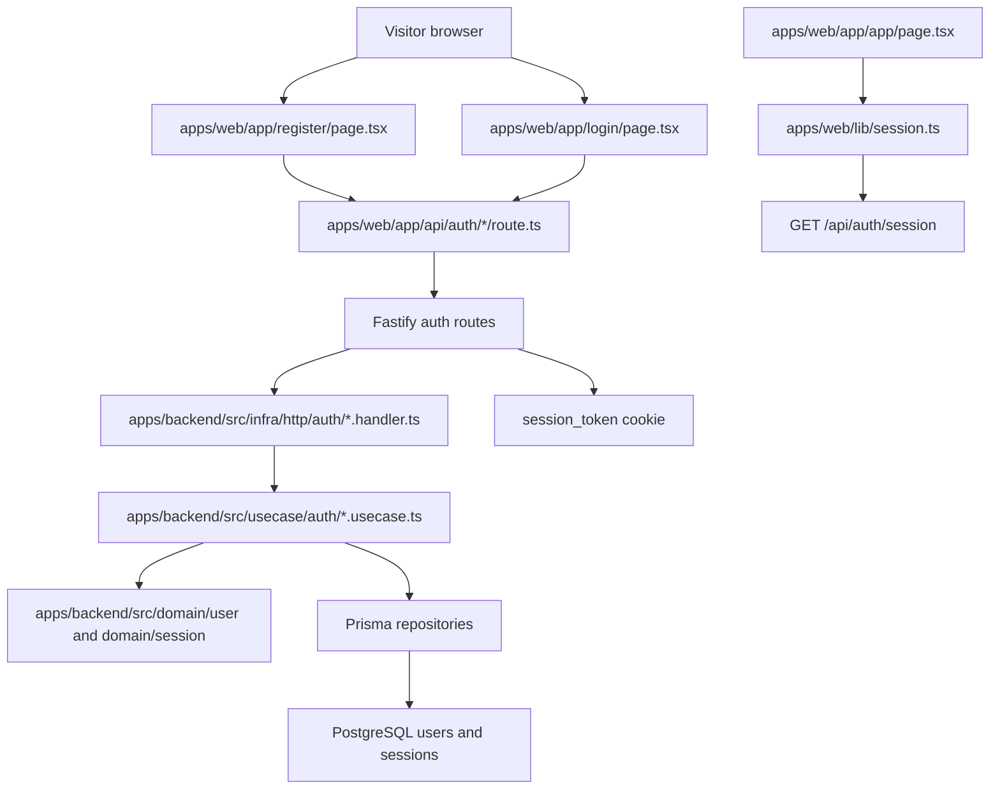

# Technical Specification: Authentication System

## 1. Technical Overview

F02 implements the authentication foundation for Videomax across the backend and web app. It adds user registration, login, logout, secure cookie sessions, session resolution for authenticated routes, and the frontend pages at `/register` and `/login`.

The backend remains the system of record. Authentication rules, password hashing, session persistence, and user lookup live in `apps/backend/` under the clean architecture layers. The web app owns first-party cookie handling, form rendering, and route-level redirects by proxying auth requests through Next.js Route Handlers.

**Included:**
- Registration with full name, normalized unique email, password confirmation on the UI, and password rules from the PRD.
- Login with email and password using a generic invalid-credentials error.
- Logout that revokes the current session and clears the browser cookie.
- Opaque database-backed sessions stored as hashed tokens.
- Backend authentication middleware that resolves the secure cookie into a current user context for downstream authenticated features.
- A minimal authenticated `/app` placeholder shell with logout so F02 redirects have a valid destination until F04 owns the library.
- Frontend `/register` and `/login` pages using Option B "Signal" dark design references.
- Next.js Route Handlers that proxy browser auth requests to the backend so session cookies remain first-party on the web origin.

**Deferred:**
- Password reset, email verification, OAuth, SSO, magic links, two-factor authentication, and passwordless flows are out of scope for the release.
- Full video library content at `/app` remains owned by F04.
- Admin user management, suspension/reactivation actions, and last-admin guardrails remain owned by F12, though F02 creates the `is_admin` and `status` fields F12 will use.
- Native mobile clients and shared-workspace authentication are out of scope.

**Traceability:**
- PRD Capabilities drive registration inputs, password rules, email uniqueness, login, secure cookie sessions, and logout.
- PRD Experience drives `/register`, `/login`, inline validation, auto-login after registration, `/app` redirects, the "Create account" link on login, and landing-page redirect integration.
- PRD Error Handling drives duplicate-email wording, weak-password detail, and generic invalid-credentials messaging.
- PRD Section 8 Foundation Features drives the backend clean-architecture skeleton, persistence schema, initial migration, session store, auth middleware, and frontend cookie proxy wiring.
- Existing F01 artifacts drive the frontend session boundary and contract conventions. F02 replaces the F01-only anonymous session stub with the real session source.

## 2. Architecture Impact

F02 turns the current backend scaffold into a real auth service and extends the web app with first-party auth pages and proxy routes.



**Observed project patterns:**
- Runtime is TypeScript on Node with npm workspaces.
- Frontend uses Next.js 16 App Router, React 19, Server Components by default, Tailwind CSS 4, Geist fonts, and path alias `@/*`.
- Frontend tests use Vitest with server-rendered component assertions; browser navigation checks must use the `playwright-cli` skill when implementation is verified.
- Backend uses Fastify 5, Prisma 5, Zod 3, TypeScript strict mode, Vitest, and explicit `HttpRoute` objects.
- Backend follows clean architecture: `domain/` imports no outer layers, `usecase/` imports only inward, `infra/` adapts HTTP and persistence, and `src/main.ts` is the composition root.
- `process.env` is only allowed in `apps/backend/src/config/env.ts`; frontend env access is currently localized in small library modules.
- Backend handlers validate input with Zod, call one use case, map output to HTTP, and do not catch errors.
- Errors extend `AppError` and are centrally mapped in `infra/http/error-handler.ts`.
- Tests are colocated as `*.spec.ts` beside backend use cases and infra modules; named fake classes are used for external I/O.
- Prisma migrations live under `apps/backend/prisma/migrations/`; there is no seed/factory convention yet, so persistent contract state remains declarative.
- No static fixture convention is needed for F02.
- Runtime config comes from `apps/backend/.env` and `apps/web/.env.local`, generated by `./scripts/init.sh`.
- Project quality gates are `npm run lint`, `npm run typecheck`, `npm run build`, `npm run test`, and `./scripts/run-gates.mjs`.

## 3. Technical Decisions

| Decision | Chosen Approach | Alternative Considered | Trade-off |
|---|---|---|---|
| Session persistence | Opaque random session token in the browser, SHA-256 token hash in Postgres `sessions` table | JWT-only sessions | Database sessions make logout, revocation, and future suspension invalidation straightforward at the cost of a DB lookup per authenticated request |
| Password hashing | Node `crypto.scrypt` adapter behind a domain gateway interface | Add bcrypt/argon2 dependency | Avoids a new native dependency while still using a memory-hard password hash; parameters must be explicit and covered by tests |
| Auth cookie | `session_token`, `HttpOnly`, `SameSite=Lax`, `Path=/`, 30-day max age, `Secure` outside local development | LocalStorage bearer token | HttpOnly cookies reduce XSS token exposure and align with Next.js first-party proxy behavior |
| Backend routes | Fastify endpoints under `/api/auth/*` wired from `main.ts` through `infra/http/index.ts` | Next.js-only auth implementation | Backend remains the system of record and downstream non-UI features can rely on the same auth boundary |
| Frontend proxy | Next.js Route Handlers mirror `/api/auth/*`, forward requests to the backend, and forward Set-Cookie/Cookie headers | Browser posts directly to backend port | Keeps cookies first-party on the web origin and avoids cross-origin cookie complexity |
| User status fields | Include `is_admin` and `status` on the F02 user model | Add admin/suspension columns later in F12 | Supports PRD foundation requirements and future admin behavior without a later user-table rewrite |
| `/app` destination | Add a minimal protected authenticated shell with logout | Leave `/app` unimplemented until F04 | Registration/login redirects become verifiable in F02; F04 can replace the placeholder with the library |

**Assumptions and auto-accepted decisions:**
- F02 has no Core Scope / Full Scope split, so the full PRD feature is in scope.
- All detected quality gates are included in the behavior contract.
- Opaque database-backed sessions are approved as the session mechanism.
- Session token plaintext is shown only once in `Set-Cookie`; persistence stores only the token hash.
- Session expiration defaults to 30 days because the design reference names a 30-day secure-cookie session.
- Registration immediately creates an active, non-admin user and a valid session.
- Email addresses are normalized to lowercase before uniqueness checks.
- Password confirmation is a UI/proxy validation concern; the backend register endpoint accepts one password value and validates its rules.
- `/api/auth/session` is included to support F01 redirect behavior, F02 `/app` protection, and downstream authenticated routes.
- F02 may create the minimal `/app` page and authenticated shell as a temporary destination until F04 replaces the library UI.
- No external services are required for F02.
- No static input files are needed for F02.

## 4. Component Overview

**Frontend:**

| File Path | New/Modified | Purpose | Key Responsibilities |
|---|---|---|---|
| `apps/web/app/register/page.tsx` | New | Registration page | Render the registration form, submit to the web auth proxy, show inline validation, and navigate to `/app` on success |
| `apps/web/app/login/page.tsx` | New | Login page | Render the login form, link to `/register`, show generic credential errors, and navigate to `/app` on success |
| `apps/web/app/app/page.tsx` | New | Temporary authenticated app landing | Require an authenticated session, render a minimal library placeholder, and expose logout |
| `apps/web/app/api/auth/register/route.ts` | New | Register proxy route | Validate browser payload shape, forward to backend registration, and preserve `Set-Cookie` headers |
| `apps/web/app/api/auth/login/route.ts` | New | Login proxy route | Forward credentials to backend login and preserve `Set-Cookie` headers |
| `apps/web/app/api/auth/logout/route.ts` | New | Logout proxy route | Forward current cookie to backend logout and return the clearing cookie |
| `apps/web/app/api/auth/session/route.ts` | New | Session proxy route | Forward current cookie to backend session endpoint and return authenticated state |
| `apps/web/lib/backend.ts` | Modified | Backend URL boundary | Keep backend origin lookup centralized for proxy routes and server helpers |
| `apps/web/lib/session.ts` | Modified | Frontend session boundary | Resolve the current browser session through the backend session endpoint and return typed authenticated state |
| `apps/web/lib/auth-api.ts` | New | Auth proxy client helpers | Provide typed request/response helpers for auth forms and route handlers |
| `apps/web/components/auth/auth-shell.tsx` | New | Auth visual shell | Recreate the design-system auth layout using Option B Signal tokens and responsive behavior |
| `apps/web/components/auth/register-form.tsx` | New | Register form | Manage form state, inline errors, password confirmation, and successful navigation |
| `apps/web/components/auth/login-form.tsx` | New | Login form | Manage form state, generic errors, and successful navigation |
| `apps/web/components/auth/logout-button.tsx` | New | Logout action | Call the logout proxy and navigate to `/` |
| `apps/web/components/ui/form-field.tsx` | New | Shared form field | Render labels, inputs, hints, and inline error text with accessible associations |
| `apps/web/components/ui/button-link.tsx` | Modified | Shared CTA primitive | Support auth-page links and button-compatible dimensions without changing F01 behavior |

**Backend:**

| File Path | New/Modified | Purpose | Key Responsibilities |
|---|---|---|---|
| `apps/backend/src/config/env.ts` | Modified | Runtime configuration | Add session cookie, session TTL, password hashing, and web origin configuration with all `process.env` reads kept in this file |
| `apps/backend/src/main.ts` | Modified | Composition root | Instantiate Prisma repositories, password hasher, token service, auth use cases, handlers, and HTTP routes |
| `apps/backend/src/domain/user/user-id.vo.ts` | New | User ID value object | Type user identifiers and validate trusted persisted IDs |
| `apps/backend/src/domain/user/email.vo.ts` | New | Email value object | Normalize and validate email addresses with offending values in errors |
| `apps/backend/src/domain/user/full-name.vo.ts` | New | Full name value object | Validate registration names and preserve display name |
| `apps/backend/src/domain/user/hashed-password.vo.ts` | New | Password hash value object | Represent trusted password hash strings and prevent plaintext serialization |
| `apps/backend/src/domain/user/user.entity.ts` | New | User aggregate | Create and restore users, track admin/status fields, update last login, and prevent direct JSON serialization |
| `apps/backend/src/domain/user/user.repository.ts` | New | User write interface | Save users and find by ID or normalized email |
| `apps/backend/src/domain/user/user.queries.ts` | New | User read interface | Return current-user DTOs for session responses |
| `apps/backend/src/domain/user/password-hasher.gateway.ts` | New | Hashing interface | Hash plaintext passwords and verify password attempts |
| `apps/backend/src/domain/user/errors.ts` | New | User domain errors | Define invalid email, weak password, duplicate email, user not found, and invalid credentials errors |
| `apps/backend/src/domain/session/session-id.vo.ts` | New | Session ID value object | Type persisted session IDs |
| `apps/backend/src/domain/session/session.entity.ts` | New | Session aggregate | Create, restore, expire, and revoke sessions |
| `apps/backend/src/domain/session/session.repository.ts` | New | Session write interface | Save sessions and find active sessions by token hash |
| `apps/backend/src/domain/session/session-token.gateway.ts` | New | Token interface | Generate opaque tokens and hash them for lookup |
| `apps/backend/src/domain/session/errors.ts` | New | Session errors | Define missing, invalid, expired, and revoked session errors |
| `apps/backend/src/usecase/auth/register-user.usecase.ts` | New | Register use case | Enforce uniqueness, hash password, persist user, create session, and return auth output |
| `apps/backend/src/usecase/auth/register-user.dto.ts` | New | Register DTO | Define register input/output and output mapping |
| `apps/backend/src/usecase/auth/login-user.usecase.ts` | New | Login use case | Verify credentials, reject inactive users, update last login, create session, and return auth output |
| `apps/backend/src/usecase/auth/login-user.dto.ts` | New | Login DTO | Define login input/output and output mapping |
| `apps/backend/src/usecase/auth/logout-user.usecase.ts` | New | Logout use case | Revoke the current session token and return a logout result |
| `apps/backend/src/usecase/auth/logout-user.dto.ts` | New | Logout DTO | Define logout input/output |
| `apps/backend/src/usecase/auth/get-current-session.usecase.ts` | New | Session lookup use case | Resolve an active session token to authenticated user output |
| `apps/backend/src/usecase/auth/get-current-session.dto.ts` | New | Session DTO | Define authenticated/anonymous session output |
| `apps/backend/src/infra/gateway/node-password-hasher.gateway.ts` | New | Password hashing adapter | Implement scrypt hashing and constant-time verification |
| `apps/backend/src/infra/gateway/node-session-token.gateway.ts` | New | Session token adapter | Generate random tokens and SHA-256 hashes |
| `apps/backend/src/infra/repository/user/user.prisma-repository.ts` | New | User persistence | Implement user repository with Prisma |
| `apps/backend/src/infra/repository/user/user.in-memory-repository.ts` | New | User fake repository | Provide named fake repository for use case tests |
| `apps/backend/src/infra/repository/user/user.mapper.ts` | New | User mapper | Map between Prisma rows and domain users |
| `apps/backend/src/infra/queries/user/user.prisma-queries.ts` | New | User read model | Return DTO-safe user projections |
| `apps/backend/src/infra/queries/user/user.in-memory-queries.ts` | New | User fake queries | Support use case tests without inline stubs |
| `apps/backend/src/infra/repository/session/session.prisma-repository.ts` | New | Session persistence | Implement session repository with token hash lookup |
| `apps/backend/src/infra/repository/session/session.in-memory-repository.ts` | New | Session fake repository | Provide named fake repository for use case tests |
| `apps/backend/src/infra/repository/session/session.mapper.ts` | New | Session mapper | Map between Prisma rows and domain sessions |
| `apps/backend/src/infra/http/auth/register.handler.ts` | New | Register HTTP handler | Validate request body, call register use case, and return body plus session cookie |
| `apps/backend/src/infra/http/auth/login.handler.ts` | New | Login HTTP handler | Validate request body, call login use case, and return body plus session cookie |
| `apps/backend/src/infra/http/auth/logout.handler.ts` | New | Logout HTTP handler | Extract cookie token, revoke session, and return clearing cookie |
| `apps/backend/src/infra/http/auth/get-session.handler.ts` | New | Session HTTP handler | Extract cookie token and return authenticated/anonymous session state |
| `apps/backend/src/infra/http/auth/auth.routes.ts` | New | Auth route list | Register `/api/auth/register`, `/api/auth/login`, `/api/auth/logout`, and `/api/auth/session` |
| `apps/backend/src/infra/http/middleware/auth.ts` | Modified | Auth middleware boundary | Resolve current user for authenticated downstream handlers and reject missing/invalid sessions |
| `apps/backend/src/infra/http/index.ts` | Modified | Route composition | Include auth routes in the existing route builder |
| `apps/backend/src/infra/http/error-handler.ts` | Modified | Error mapping | Map auth validation, duplicate, weak password, invalid credential, and session errors |
| `apps/backend/src/infra/http/cookies.ts` | New | Cookie serialization | Build and clear `session_token` cookies from injected config |

**Database:**

| Migration File | Tables Affected | Operation | Notes |
|---|---|---|---|
| `apps/backend/prisma/migrations/<timestamp>_add_auth/migration.sql` | `users`, `sessions` | CREATE | Adds user identity, password hash, admin/status fields, and database-backed sessions |
| `apps/backend/prisma/schema.prisma` | `User`, `Session` | Modified | Adds Prisma models and relations for auth persistence |

## 5. API Contracts

All backend endpoints are exposed under the backend origin and are proxied by equivalent Next.js Route Handlers on the web origin. Browser clients call the web-origin paths. Backend handlers return JSON bodies and use `Set-Cookie` for sessions.

### Endpoint: Register

- **Method:** POST
- **Path:** `/api/auth/register`
- **Authentication:** Anonymous

**Request:**

| Field | Type | Required | Validation | Description |
|---|---|---|---|---|
| `name` | `string` | Yes | trimmed length 1-120 | User display name |
| `email` | `string` | Yes | valid email, normalized lowercase, unique | Login identifier |
| `password` | `string` | Yes | minimum 8 characters, at least one letter, at least one number | Plaintext password supplied only in request |

**Request Example:**

```json
{
  "name": "Camila Rocha",
  "email": "Camila@Studio.co",
  "password": "Pass1234"
}
```

**Response (Success - 201):**

| Field | Type | Description |
|---|---|---|
| `user.id` | `uuid` | Created user ID |
| `user.name` | `string` | Display name |
| `user.email` | `string` | Normalized email |
| `user.isAdmin` | `boolean` | Defaults to `false` |
| `session.expiresAt` | `string` | ISO timestamp for session expiry |

**Response Example:**

```json
{
  "user": {
    "id": "550e8400-e29b-41d4-a716-446655440000",
    "name": "Camila Rocha",
    "email": "camila@studio.co",
    "isAdmin": false
  },
  "session": {
    "expiresAt": "2026-06-01T18:00:00.000Z"
  }
}
```

**Headers:**

| Header | Description |
|---|---|
| `Set-Cookie` | `session_token=<opaque>; HttpOnly; SameSite=Lax; Path=/; Max-Age=2592000`; includes `Secure` outside local development |

**Error Codes:**

| Code | HTTP Status | Description |
|---|---|---|
| `invalid_input` | 400 | Body shape is invalid; message includes offending value and expected shape |
| `weak_password` | 422 | Password violates one or more rules and the response names failed rules |
| `email_already_exists` | 409 | Email is already registered; message is "An account with this email already exists — try logging in" |

### Endpoint: Login

- **Method:** POST
- **Path:** `/api/auth/login`
- **Authentication:** Anonymous

**Request:**

| Field | Type | Required | Validation | Description |
|---|---|---|---|---|
| `email` | `string` | Yes | valid email syntax after trim | Login email |
| `password` | `string` | Yes | non-empty string | Password attempt |

**Request Example:**

```json
{
  "email": "camila@studio.co",
  "password": "Pass1234"
}
```

**Response (Success - 200):**

```json
{
  "user": {
    "id": "550e8400-e29b-41d4-a716-446655440000",
    "name": "Camila Rocha",
    "email": "camila@studio.co",
    "isAdmin": false
  },
  "session": {
    "expiresAt": "2026-06-01T18:00:00.000Z"
  }
}
```

**Error Codes:**

| Code | HTTP Status | Description |
|---|---|---|
| `invalid_input` | 400 | Body shape is invalid; message includes offending value and expected shape |
| `invalid_credentials` | 401 | Email or password is wrong; message is always "Invalid email or password" |
| `account_suspended` | 403 | User exists but is suspended; message is "This account has been suspended" |

### Endpoint: Logout

- **Method:** POST
- **Path:** `/api/auth/logout`
- **Authentication:** Optional session cookie

**Request:**

No JSON body is required. The current session token is read from the `session_token` cookie.

**Response (Success - 204):**

No response body.

**Headers:**

| Header | Description |
|---|---|
| `Set-Cookie` | Clears `session_token` with `Max-Age=0` and matching cookie attributes |

### Endpoint: Get Current Session

- **Method:** GET
- **Path:** `/api/auth/session`
- **Authentication:** Optional session cookie

**Response (Authenticated - 200):**

```json
{
  "authenticated": true,
  "user": {
    "id": "550e8400-e29b-41d4-a716-446655440000",
    "name": "Camila Rocha",
    "email": "camila@studio.co",
    "isAdmin": false
  }
}
```

**Response (Anonymous - 200):**

```json
{
  "authenticated": false
}
```

Expired, revoked, malformed, or unknown session tokens return the anonymous response and do not throw for public session checks.

## 6. Data Model

### Table: `users`

| Column | Type | Nullable | Default | Description |
|---|---|---|---|---|
| `id` | `uuid` | No | generated UUID | Primary key |
| `name` | `varchar(120)` | No | - | User display name |
| `email` | `varchar(320)` | No | - | Normalized lowercase email |
| `password_hash` | `text` | No | - | Scrypt password hash string |
| `is_admin` | `boolean` | No | `false` | Admin flag consumed by F12 |
| `status` | `varchar(20)` | No | `active` | `active` or `suspended` |
| `created_at` | `timestamptz` | No | `now()` | Registration timestamp |
| `updated_at` | `timestamptz` | No | `now()` | Last row update timestamp |
| `last_login_at` | `timestamptz` | Yes | `null` | Most recent successful login |

**Indexes:**

| Index Name | Columns | Type | Purpose |
|---|---|---|---|
| `ux_users_email` | `email` | unique btree | Enforce one normalized account per email |
| `ix_users_status` | `status` | btree | Support future admin filtering |
| `ix_users_created_at` | `created_at` | btree | Support future admin sorting |

**Constraints:**

| Constraint | Type | Definition | Purpose |
|---|---|---|---|
| `pk_users` | PRIMARY KEY | `id` | Unique identifier |
| `ck_users_status` | CHECK | `status in ('active', 'suspended')` | Keep status vocabulary bounded |
| `ck_users_email_lowercase` | CHECK | `email = lower(email)` | Ensure normalized uniqueness |

### Table: `sessions`

| Column | Type | Nullable | Default | Description |
|---|---|---|---|---|
| `id` | `uuid` | No | generated UUID | Primary key |
| `user_id` | `uuid` | No | - | Owner user |
| `token_hash` | `char(64)` | No | - | SHA-256 hex hash of the opaque token |
| `created_at` | `timestamptz` | No | `now()` | Session creation time |
| `expires_at` | `timestamptz` | No | - | Absolute session expiry |
| `revoked_at` | `timestamptz` | Yes | `null` | Logout or invalidation timestamp |

**Indexes:**

| Index Name | Columns | Type | Purpose |
|---|---|---|---|
| `ux_sessions_token_hash` | `token_hash` | unique btree | Fast session lookup without storing token plaintext |
| `ix_sessions_user_id` | `user_id` | btree | Invalidate all user sessions for future suspension/delete flows |
| `ix_sessions_expires_at` | `expires_at` | btree | Find expired sessions for cleanup |

**Constraints:**

| Constraint | Type | Definition | Purpose |
|---|---|---|---|
| `pk_sessions` | PRIMARY KEY | `id` | Unique identifier |
| `fk_sessions_user` | FOREIGN KEY | `user_id references users(id) on delete cascade` | Remove sessions with deleted users |
| `ck_sessions_token_hash_length` | CHECK | `char_length(token_hash) = 64` | Ensure SHA-256 hex shape |

**Migration Example:**

```sql
CREATE TABLE users (
  id UUID PRIMARY KEY,
  name VARCHAR(120) NOT NULL,
  email VARCHAR(320) NOT NULL,
  password_hash TEXT NOT NULL,
  is_admin BOOLEAN NOT NULL DEFAULT FALSE,
  status VARCHAR(20) NOT NULL DEFAULT 'active',
  created_at TIMESTAMPTZ NOT NULL DEFAULT NOW(),
  updated_at TIMESTAMPTZ NOT NULL DEFAULT NOW(),
  last_login_at TIMESTAMPTZ NULL,
  CONSTRAINT ck_users_status CHECK (status IN ('active', 'suspended')),
  CONSTRAINT ck_users_email_lowercase CHECK (email = lower(email))
);

CREATE UNIQUE INDEX ux_users_email ON users(email);
CREATE INDEX ix_users_status ON users(status);
CREATE INDEX ix_users_created_at ON users(created_at);

CREATE TABLE sessions (
  id UUID PRIMARY KEY,
  user_id UUID NOT NULL REFERENCES users(id) ON DELETE CASCADE,
  token_hash CHAR(64) NOT NULL,
  created_at TIMESTAMPTZ NOT NULL DEFAULT NOW(),
  expires_at TIMESTAMPTZ NOT NULL,
  revoked_at TIMESTAMPTZ NULL,
  CONSTRAINT ck_sessions_token_hash_length CHECK (char_length(token_hash) = 64)
);

CREATE UNIQUE INDEX ux_sessions_token_hash ON sessions(token_hash);
CREATE INDEX ix_sessions_user_id ON sessions(user_id);
CREATE INDEX ix_sessions_expires_at ON sessions(expires_at);
```

## 7. Testing Strategy

**Test File Structure:**

| Test File | Test Type | Target | Coverage Goal |
|---|---|---|---|
| `apps/backend/src/domain/user/email.vo.spec.ts` | Unit | Email value object | Normalization and invalid email errors |
| `apps/backend/src/domain/user/user.entity.spec.ts` | Unit | User aggregate | Creation, restore, status, last-login update, and serialization guard |
| `apps/backend/src/domain/session/session.entity.spec.ts` | Unit | Session aggregate | Active, expired, and revoked session behavior |
| `apps/backend/src/usecase/auth/register-user.usecase.spec.ts` | Unit | Register orchestration | Unique email, password hashing, user persistence, session creation |
| `apps/backend/src/usecase/auth/login-user.usecase.spec.ts` | Unit | Login orchestration | Credential verification, generic rejection, last login, session creation |
| `apps/backend/src/usecase/auth/logout-user.usecase.spec.ts` | Unit | Logout orchestration | Session revocation and idempotent missing session behavior |
| `apps/backend/src/usecase/auth/get-current-session.usecase.spec.ts` | Unit | Session lookup | Active, expired, revoked, and unknown token outcomes |
| `apps/backend/src/infra/http/auth/auth.handlers.spec.ts` | HTTP integration | Auth handlers through Fastify injection | Status codes, response bodies, cookies, and error mapping |
| `apps/backend/src/infra/repository/user/user.prisma-repository.spec.ts` | Repository integration | User Prisma repository | Mapping, uniqueness, save/find behavior |
| `apps/backend/src/infra/repository/session/session.prisma-repository.spec.ts` | Repository integration | Session Prisma repository | Token-hash lookup, expiry, revocation, cascade behavior |
| `apps/web/app/register/page.test.tsx` | Component | Register page | Fields, inline errors, links, and submit states |
| `apps/web/app/login/page.test.tsx` | Component | Login page | Fields, create-account link, generic errors, and submit states |
| `apps/web/lib/session.test.ts` | Unit | Frontend session helper | Authenticated and anonymous session resolution through backend proxy |

**Test Functions:**

| Test Function | Description | Assertions |
|---|---|---|
| `normalizes_valid_email_to_lowercase` | Valid email value object creation | Returns lowercase email and preserves value equality |
| `rejects_invalid_email_with_offending_value` | Invalid email value object creation | Throws error containing bad value and expected email shape |
| `creates_user_with_active_non_admin_defaults` | User creation | User has active status, `isAdmin=false`, created timestamp, and no direct JSON serialization |
| `registers_user_and_creates_session` | Register use case happy path | Saves normalized user, stores hashed password, saves session, and returns auth output |
| `rejects_duplicate_registration` | Register use case duplicate email | Throws duplicate email error and does not create another user |
| `rejects_each_password_rule` | Register use case weak password | Rejects too-short, missing-letter, and missing-number inputs with rule-specific detail |
| `logs_in_with_valid_credentials` | Login use case happy path | Verifies password, updates last login, creates session, and returns auth output |
| `rejects_wrong_password_generically` | Login use case invalid password | Throws invalid credentials without exposing which field failed |
| `rejects_unknown_email_generically` | Login use case unknown email | Throws same invalid credentials error as wrong password |
| `revokes_active_session_on_logout` | Logout use case | Marks session revoked and returns success |
| `returns_authenticated_user_for_active_session` | Session lookup use case | Resolves active token hash to user output |
| `returns_anonymous_for_expired_or_revoked_session` | Session lookup use case | Returns anonymous output without leaking token state |
| `sets_secure_session_cookie_on_register` | HTTP register handler | Returns 201, auth body, and session cookie attributes |
| `clears_cookie_on_logout` | HTTP logout handler | Returns 204 and a clearing cookie |
| `renders_register_form_with_inline_errors` | Register page | Shows name/email/password/confirmation fields and field-level messages |
| `renders_login_form_with_generic_error` | Login page | Shows email/password fields and generic credential message |

**Frontend navigation verification:**
- Use the `playwright-cli` skill for browser navigation checks after implementation.
- Start services only through `./scripts/init.sh`.
- Verify `/register` accepts valid details and lands on `/app`.
- Verify `/login` accepts existing credentials and lands on `/app`.
- Verify logout from `/app` clears the session and lands on `/`.
- Verify anonymous access to `/app` redirects to `/login`.

**Quality Gates:**
- `npm run lint`
- `npm run typecheck`
- `npm run build`
- `npm run test`
- `./scripts/run-gates.mjs`
