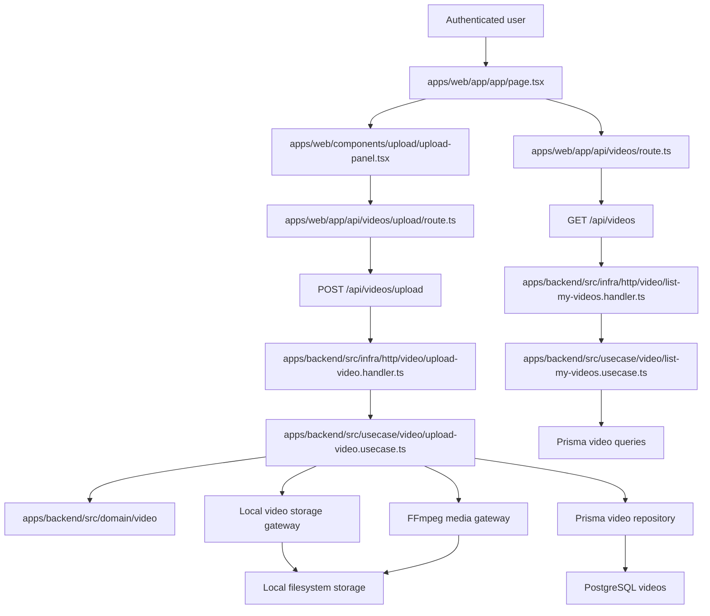

# Technical Specification: Video Upload

## 1. Technical Overview

F03 adds the authenticated video upload path for Videomax. It replaces the temporary F02 `/app` placeholder with a minimal upload-capable library surface, accepts one video at a time through drag-and-drop or file picker, reports browser upload progress, persists the uploaded file on the local filesystem, records video metadata in PostgreSQL, and starts local post-upload media work for duration probing and thumbnail extraction.

The backend remains the system of record for video ownership, storage paths, file metadata, thumbnail state, and processing status. The web app owns user interaction, client-side validation, the single-user upload queue, and upload progress display. Browser requests continue to use first-party Next.js Route Handlers as the cookie-preserving proxy boundary established by F02.

**Included:**
- Authenticated upload surface on `/app` with Option B "Signal" dark design references from `docs/design/design-system-pages/`.
- Drag-and-drop zone and file picker fallback on the library page.
- Client-side validation for accepted extensions and 2GB maximum file size before transfer starts.
- Single-file upload queue per browser session; additional selected files wait until the active transfer finishes.
- Browser upload progress card showing filename, percentage, bytes transferred, and total bytes.
- Next.js upload proxy route that preserves session cookies and streams multipart content to the backend.
- Backend multipart endpoint for one video file at a time.
- Local filesystem storage under a configured video storage root, with stable internal paths scoped by user and video ID.
- Video aggregate, repository, read query, Prisma migration, and DTOs for uploaded video metadata.
- Default title derived from original filename without extension, initially empty description, file size, container format, upload timestamp, and status.
- Media probe gateway that records exact duration seconds and rejects videos over 2 hours with a clear failed status.
- Thumbnail extraction gateway that captures a JPEG near 10% of duration; failed thumbnail extraction falls back to a default placeholder and does not block processing.
- Minimal uploaded-video list on `/app` so the just-uploaded video appears with thumbnail or placeholder and status `validating` before F04 expands the full library.
- Upload interruption handling that reports "Upload interrupted - retry" and discards partial files.

**Deferred:**
- Full library browsing, grid/list preference persistence, sorting, rename, edit description, delete, retry actions, and empty-state illustration are owned by F04.
- Background transcription, summary generation, retries, stage transitions beyond `validating`, and real-time processing status are owned by F07.
- Notifications outside the upload page are owned by F11.
- Video playback and detail pages are owned by F08.
- Admin visibility and platform-wide video counts are owned by F12.
- Chunked/resumable uploads are out of scope; interrupted multipart uploads are discarded and retried from the beginning.
- URL import, cloud import, webcam/screen recording, exports, and mobile clients remain out of scope per the PRD.

**Traceability:**
- PRD Provides drives local file storage, stable internal paths, video metadata, thumbnail image storage, status, and upload timestamp.
- PRD Capabilities drive accepted formats, size and duration limits, single-file queueing, thumbnail capture ratio, and exact duration capture.
- PRD Experience drives `/app` upload entry points, progress card content, client-side rejection, immediate library visibility, placeholder-to-thumbnail replacement, and non-blocking browsing.
- PRD Error Handling drives pre-transfer rejection messages, over-duration failure reason, upload interruption retry, thumbnail fallback, and disk-write failure behavior.
- PRD Section 8 dependency graph limits prerequisites to F03 plus F02 authentication.

## 2. Architecture Impact

F03 adds the first video feature slice across both apps. The backend introduces a `video` feature folder mirrored through domain, use case, repository, queries, and HTTP. The web app introduces a library/upload shell and upload proxy while preserving the F02 session boundary.



**Observed project patterns:**
- Runtime is TypeScript on Node with npm workspaces.
- Frontend uses Next.js 16 App Router, React 19, Server Components by default, Tailwind CSS 4, Geist fonts, and path alias `@/*`.
- Frontend forms and interactive widgets use client components below route-level server pages.
- Frontend tests use Vitest for component/business assertions; browser navigation checks use the `playwright-cli` skill.
- Frontend authenticated backend access is routed through Next.js Route Handlers so cookies remain first-party on the web origin.
- Backend uses Fastify 5, Prisma 5, Zod 3, TypeScript strict mode, Vitest, and explicit `HttpRoute` records.
- Backend follows clean architecture: `domain/` imports no outer layers, `usecase/` imports only inward, `infra/` adapts HTTP and persistence, and `src/main.ts` is the only composition root.
- `process.env` is only read in `apps/backend/src/config/env.ts`.
- Backend handlers validate input with Zod or request parser output, call one use case, map output to HTTP, and do not catch errors.
- Errors extend `AppError` and map centrally through `apps/backend/src/infra/http/error-handler.ts`.
- Tests are colocated as `*.spec.ts`; external I/O uses named fake classes rather than inline stubs.
- Prisma migrations live under `apps/backend/prisma/migrations/`.
- Persistent contract state is declarative; the current concrete seed precedent is `apps/backend/scripts/seed-auth-contract.ts`.
- No static fixture convention exists yet. F03 establishes `tests/fixtures/video-upload/` for video fixture files.
- Design references live in `docs/design/design-system-pages/`; F03 must use Option B "Signal" dark, especially `components/upload.jsx` and `components/library.jsx`.
- Project quality gates are `npm run lint`, `npm run typecheck`, `npm run build`, `npm run test`, and `./scripts/run-gates.mjs`.

## 3. Technical Decisions

| Decision | Chosen Approach | Alternative Considered | Trade-off |
|---|---|---|---|
| Upload transport | Browser uses `XMLHttpRequest` to upload `FormData` to a Next.js Route Handler proxy, which streams to backend `POST /api/videos/upload` | Browser posts directly to backend origin | Keeps first-party cookies and existing proxy pattern while adding some proxy complexity for large streams |
| Backend multipart parsing | Add Fastify multipart streaming support behind the HTTP infra boundary | Buffer full files in memory or use base64 JSON | Streaming avoids memory pressure for 2GB files; handler tests need parser-level coverage |
| Storage | Store originals and thumbnails under configured local filesystem root by user ID and video ID | Store BLOBs in Postgres | Filesystem storage matches the PRD and avoids very large database rows; DB/file consistency must be handled carefully |
| Upload completion model | Create the video record only after the file write succeeds, then run media probe/thumbnail work before returning the final upload response | Create a record before writing begins | Avoids orphan records on disk-write failure; progress remains browser-side until the server accepts the completed file |
| Processing status | F03 creates records with `validating` after successful upload and local media checks; over-duration files become `failed` with reason | Delay all validation/status work to F07 | Makes F03 acceptance criteria exercisable before F07 and gives downstream features stable metadata |
| Thumbnail failure | Persist `thumbnailPath: null`, expose a `thumbnailState: "placeholder"`, and continue with status `validating` | Fail the whole upload when thumbnail extraction fails | Preserves user progress and matches the PRD, at the cost of a nullable thumbnail field |
| Duration and thumbnail implementation | Introduce `MediaMetadataGateway` and `ThumbnailGateway` domain interfaces with FFmpeg/ffprobe infra adapters and named fakes for tests | Call FFmpeg directly from use cases | Keeps external process I/O outside use cases and preserves clean-architecture dependency direction |
| Fixture convention | Establish `tests/fixtures/video-upload/` for contract video files | Put fixtures beside app-specific tests | A root convention is shared by HTTP, UI, and E2E contract checks; this is a new convention because none existed |

**Assumptions and accepted recommendations:**
- F03 has no Core Scope / Full Scope split, so the full PRD feature is in scope.
- The detected quality gates are included unchanged in the behavior contract.
- The upload endpoint accepts exactly one multipart file field named `file`; more than one file returns a 400 validation error.
- Client-side format validation is extension-based because the PRD asks for extension rejection before transfer.
- Server-side format validation uses both extension and probed container format when available.
- Accepted container format values are normalized to lowercase: `mp4`, `mov`, `mkv`, `webm`, `avi`.
- Maximum size is exactly `2,147,483,648` bytes.
- Maximum duration is exactly `7,200` seconds.
- Thumbnail capture occurs at `durationSeconds * 0.10`, clamped to at least 1 second for very short valid files.
- The default title strips the final extension and trims whitespace; if the stripped title is empty, it falls back to the original filename.
- Upload progress is browser transfer progress, not backend media-processing progress.
- Queueing is local to the authenticated browser session for F03; cross-device or server-side upload queue coordination is out of scope.
- `@fastify/multipart` is the recommended new backend dependency for streaming uploads.
- FFmpeg/ffprobe are runtime external executables configured through `apps/backend/src/config/env.ts`.
- The initial F03 upload list is intentionally minimal and will be replaced or expanded by F04.

## 4. Component Overview

**Frontend:**

| File Path | New/Modified | Purpose | Key Responsibilities |
|---|---|---|---|
| `apps/web/app/app/page.tsx` | Modified | Upload-capable app page | Require session, render the app shell, load current videos through the proxy, and mount upload UI |
| `apps/web/app/app/page.test.tsx` | Modified | App page tests | Cover authenticated upload shell rendering and replacement of the F02 placeholder |
| `apps/web/app/api/videos/route.ts` | New | Video list proxy | Forward authenticated `GET /api/videos` requests to the backend and return uploaded video summaries |
| `apps/web/app/api/videos/upload/route.ts` | New | Upload proxy | Preserve cookies and stream multipart upload requests to backend `POST /api/videos/upload` |
| `apps/web/lib/videos-api.ts` | New | Browser video API helpers | Type uploaded video summaries and list response parsing |
| `apps/web/lib/upload-queue.ts` | New | Upload queue model | Validate extension/size, manage one active upload at a time, and expose queue state transitions |
| `apps/web/lib/upload-queue.test.ts` | New | Upload queue tests | Cover client-side rejection, queued files, progress math, retry state, and unsupported extensions |
| `apps/web/components/app/app-shell.tsx` | New | Authenticated app shell | Render Option B Signal sidebar/header structure for the minimal library surface |
| `apps/web/components/upload/upload-panel.tsx` | New | Upload experience | Render drop zone, file picker, queue cards, toast/errors, and current upload progress |
| `apps/web/components/upload/upload-panel.test.tsx` | New | Upload UI tests | Cover drag/drop, picker submission, validation messages, and progress text rendering |
| `apps/web/components/video/video-list.tsx` | New | Minimal uploaded video list | Show just-uploaded videos, placeholder thumbnails, extracted thumbnails, titles, sizes, and status badges |
| `apps/web/components/video/video-status-badge.tsx` | New | Status badge primitive | Render `validating` and `failed` states with design-system colors and accessible text |
| `apps/web/components/ui/progress-bar.tsx` | New | Progress primitive | Display stable upload percentage without layout shift |
| `apps/web/components/ui/toast-region.tsx` | New | Toast primitive | Announce upload validation and interruption messages accessibly |

**Backend:**

| File Path | New/Modified | Purpose | Key Responsibilities |
|---|---|---|---|
| `apps/backend/src/config/env.ts` | Modified | Runtime configuration | Add upload size, duration, storage root, public storage path, FFmpeg path, and ffprobe path config |
| `apps/backend/src/main.ts` | Modified | Composition root | Instantiate video repositories, queries, storage/media gateways, use cases, handlers, and routes |
| `apps/backend/src/domain/video/video-id.vo.ts` | New | Video ID value object | Type video identifiers and validate trusted persisted IDs |
| `apps/backend/src/domain/video/video-status.vo.ts` | New | Video status value object | Validate allowed status values and future downstream statuses |
| `apps/backend/src/domain/video/video-title.vo.ts` | New | Video title value object | Enforce derived title length and non-empty title rules |
| `apps/backend/src/domain/video/video-format.vo.ts` | New | Video format value object | Normalize and validate accepted formats |
| `apps/backend/src/domain/video/video.entity.ts` | New | Video aggregate | Create/restore uploaded videos, attach duration, attach thumbnail, mark failed, and prevent direct serialization |
| `apps/backend/src/domain/video/video.repository.ts` | New | Video write interface | Save videos, find by ID, and find owned videos when write-side ownership checks are needed |
| `apps/backend/src/domain/video/video.queries.ts` | New | Video read interface | Return list-safe uploaded video DTOs for the authenticated user's minimal library |
| `apps/backend/src/domain/video/video-storage.gateway.ts` | New | Storage gateway interface | Write original files atomically, discard partial files, and produce stable internal paths |
| `apps/backend/src/domain/video/media-metadata.gateway.ts` | New | Media probe interface | Probe duration and container metadata from a stored file |
| `apps/backend/src/domain/video/thumbnail.gateway.ts` | New | Thumbnail interface | Extract or report thumbnail failure without blocking the upload |
| `apps/backend/src/domain/video/errors.ts` | New | Video errors | Define unsupported format, oversized file, over-duration, disk write, media probe, and ownership errors |
| `apps/backend/src/usecase/video/upload-video.usecase.ts` | New | Upload orchestration | Validate actor, write file, create video metadata, probe duration, extract thumbnail, and persist final upload state |
| `apps/backend/src/usecase/video/upload-video.dto.ts` | New | Upload DTO | Define upload input/output and response mapping |
| `apps/backend/src/usecase/video/list-my-videos.usecase.ts` | New | Minimal library query | Return videos owned by the authenticated user sorted by upload timestamp descending |
| `apps/backend/src/usecase/video/list-my-videos.dto.ts` | New | List DTO | Define video list output shape |
| `apps/backend/src/infra/http/video/upload-video.handler.ts` | New | Upload HTTP handler | Resolve authenticated user, validate multipart file count/shape, call upload use case, and map response |
| `apps/backend/src/infra/http/video/list-my-videos.handler.ts` | New | Video list HTTP handler | Resolve authenticated user and return current user's uploaded video summaries |
| `apps/backend/src/infra/http/video/video.routes.ts` | New | Video routes | Register `POST /api/videos/upload` and `GET /api/videos` |
| `apps/backend/src/infra/http/middleware/auth.ts` | Modified | Auth middleware | Reuse F02 session resolution for video routes and pass `actorId` into handlers |
| `apps/backend/src/infra/http/index.ts` | Modified | Route composition | Include video routes with auth, health, hello, and auth routes |
| `apps/backend/src/infra/http/error-handler.ts` | Modified | Error mapping | Map video upload domain/application errors to HTTP responses and clear messages |
| `apps/backend/src/infra/repository/video/video.prisma-repository.ts` | New | Video persistence | Persist and restore video aggregate rows with Prisma |
| `apps/backend/src/infra/repository/video/video.in-memory-repository.ts` | New | Video fake repository | Support use case tests without inline stubs |
| `apps/backend/src/infra/repository/video/video.mapper.ts` | New | Video mapper | Map Prisma rows to domain video aggregate and back |
| `apps/backend/src/infra/queries/video/video.prisma-queries.ts` | New | Video read model | Return minimal library DTOs for owned videos |
| `apps/backend/src/infra/queries/video/video.in-memory-queries.ts` | New | Video fake queries | Support list use case tests |
| `apps/backend/src/infra/gateway/local-video-storage.gateway.ts` | New | Filesystem storage adapter | Create user/video directories, stream uploads to temp files, atomically rename complete files, and delete partial files |
| `apps/backend/src/infra/gateway/ffmpeg-media-metadata.gateway.ts` | New | ffprobe adapter | Probe duration and container format from stored video files |
| `apps/backend/src/infra/gateway/ffmpeg-thumbnail.gateway.ts` | New | ffmpeg thumbnail adapter | Extract a JPEG frame near 10% of duration or return a typed thumbnail failure |
| `apps/backend/src/infra/gateway/default-thumbnail.gateway.ts` | New | Placeholder adapter | Return the configured placeholder thumbnail path when extraction fails |
| `apps/backend/src/infra/http/video/upload-progress.types.ts` | New | Upload parser types | Represent parsed multipart file metadata and stream handles without leaking Fastify plugin types inward |

**Database:**

| Migration File | Tables Affected | Operation | Notes |
|---|---|---|---|
| `apps/backend/prisma/migrations/<timestamp>_add_video_upload/migration.sql` | `videos` | CREATE | Adds owned video metadata, local storage paths, duration, thumbnail path, status, failure reason, and upload timestamps |
| `apps/backend/prisma/schema.prisma` | `User`, `Video` | Modified | Adds `Video` model and `User.videos` relation |

## 5. API Contracts

All browser-facing routes live on the web origin under `/api/videos*` and proxy to equivalent backend routes while preserving the authenticated `session_token` cookie. Backend responses use JSON except where noted.

### Endpoint: Upload Video

- **Method:** POST
- **Backend Path:** `/api/videos/upload`
- **Web Proxy Path:** `/api/videos/upload`
- **Authentication:** Required session cookie
- **Content Type:** `multipart/form-data`

**Request:**

| Field | Type | Required | Validation | Description |
|---|---|---|---|---|
| `file` | file | Yes | exactly one file; extension in `mp4`, `mov`, `mkv`, `webm`, `avi`; size <= 2GB | Video file stream |

**Request Example:**

```text
POST /api/videos/upload
Content-Type: multipart/form-data; boundary=...
Cookie: session_token=<opaque>

--boundary
Content-Disposition: form-data; name="file"; filename="Lecture 05.mkv"
Content-Type: video/x-matroska

<binary stream>
--boundary--
```

**Response (Success - 201):**

| Field | Type | Description |
|---|---|---|
| `video.id` | `uuid` | Created video ID |
| `video.originalFilename` | `string` | Browser-provided filename |
| `video.title` | `string` | Derived title without extension |
| `video.description` | `string` | Empty string at upload |
| `video.fileSizeBytes` | `number` | Uploaded byte count |
| `video.durationSeconds` | `number` | Exact probed duration in seconds |
| `video.containerFormat` | `string` | Normalized format |
| `video.status` | `string` | `validating` for successful uploads |
| `video.thumbnailUrl` | `string` or `null` | URL/path for extracted thumbnail, or null when placeholder should render |
| `video.thumbnailState` | `string` | `ready` or `placeholder` |
| `video.uploadedAt` | `string` | ISO timestamp |

**Response Example:**

```json
{
  "video": {
    "id": "660e8400-e29b-41d4-a716-446655440001",
    "originalFilename": "Lecture 05.mkv",
    "title": "Lecture 05",
    "description": "",
    "fileSizeBytes": 734003200,
    "durationSeconds": 3132.42,
    "containerFormat": "mkv",
    "status": "validating",
    "thumbnailUrl": "/media/thumbnails/660e8400-e29b-41d4-a716-446655440001.jpg",
    "thumbnailState": "ready",
    "uploadedAt": "2026-05-02T21:00:00.000Z"
  }
}
```

**Error Codes:**

| Code | HTTP Status | Description |
|---|---|---|
| `unauthenticated` | 401 | Missing or invalid session cookie |
| `invalid_input` | 400 | Multipart shape is invalid; message includes offending value and expected shape |
| `unsupported_video_format` | 415 | Extension or probed container is unsupported; message names the offending format and expected formats |
| `video_file_too_large` | 413 | File is above 2GB; message is "Files must be at most 2GB" |
| `video_duration_too_long` | 422 | Probed duration exceeds 2 hours; response video status is `failed` when a record was created |
| `disk_write_failed` | 507 | File could not be written; no video record is created |
| `media_probe_failed` | 422 | File cannot be probed or read as video; status is `failed` with a clear reason |

**Error Response Example:**

```json
{
  "code": "unsupported_video_format",
  "message": "Unsupported video format \"wmv\". Expected one of: MP4, MOV, MKV, WEBM, AVI."
}
```

### Endpoint: List My Uploaded Videos

- **Method:** GET
- **Backend Path:** `/api/videos`
- **Web Proxy Path:** `/api/videos`
- **Authentication:** Required session cookie

**Request:** no body.

**Response (Success - 200):**

| Field | Type | Description |
|---|---|---|
| `videos` | `array` | Videos owned by the authenticated user |
| `videos[].id` | `uuid` | Video ID |
| `videos[].title` | `string` | Current title |
| `videos[].originalFilename` | `string` | Uploaded filename |
| `videos[].fileSizeBytes` | `number` | File size |
| `videos[].durationSeconds` | `number` or `null` | Probed duration when available |
| `videos[].containerFormat` | `string` | Normalized format |
| `videos[].status` | `string` | Current processing status |
| `videos[].failureReason` | `string` or `null` | User-facing failure reason |
| `videos[].thumbnailUrl` | `string` or `null` | Thumbnail URL when extracted |
| `videos[].thumbnailState` | `string` | `ready` or `placeholder` |
| `videos[].uploadedAt` | `string` | ISO timestamp |

**Response Example:**

```json
{
  "videos": [
    {
      "id": "660e8400-e29b-41d4-a716-446655440001",
      "title": "Lecture 05",
      "originalFilename": "Lecture 05.mkv",
      "fileSizeBytes": 734003200,
      "durationSeconds": 3132.42,
      "containerFormat": "mkv",
      "status": "validating",
      "failureReason": null,
      "thumbnailUrl": "/media/thumbnails/660e8400-e29b-41d4-a716-446655440001.jpg",
      "thumbnailState": "ready",
      "uploadedAt": "2026-05-02T21:00:00.000Z"
    }
  ]
}
```

**Error Codes:**

| Code | HTTP Status | Description |
|---|---|---|
| `unauthenticated` | 401 | Missing or invalid session cookie |

## 6. Data Model

### Table: `videos`

| Column | Type | Nullable | Default | Description |
|---|---|---|---|---|
| `id` | `uuid` | No | generated in domain | Primary key |
| `user_id` | `uuid` | No | - | Owner user ID |
| `original_filename` | `varchar(255)` | No | - | Filename supplied by browser |
| `title` | `varchar(200)` | No | - | User-facing title, defaulted from filename without extension |
| `description` | `text` | No | `''` | Initially empty description for F04 editing |
| `file_size_bytes` | `bigint` | No | - | Stored original byte count |
| `duration_seconds` | `numeric(12,3)` | Yes | `NULL` | Exact probed duration after upload |
| `container_format` | `varchar(12)` | No | - | Normalized format: `mp4`, `mov`, `mkv`, `webm`, `avi` |
| `storage_path` | `text` | No | - | Stable internal filesystem path for original video |
| `thumbnail_path` | `text` | Yes | `NULL` | Internal filesystem path for extracted JPEG thumbnail |
| `thumbnail_state` | `varchar(20)` | No | `'placeholder'` | `ready` or `placeholder` |
| `status` | `varchar(30)` | No | `'validating'` | Current processing status |
| `failure_reason` | `text` | Yes | `NULL` | User-facing reason when status is `failed` |
| `uploaded_at` | `timestamptz` | No | `NOW()` | Upload completion timestamp |
| `updated_at` | `timestamptz` | No | `NOW()` | Last metadata/status update |

**Indexes:**

| Index Name | Columns | Type | Purpose |
|---|---|---|---|
| `ix_videos_user_uploaded_at` | `user_id`, `uploaded_at DESC` | btree | Minimal library list sorted most recent first |
| `ix_videos_user_status` | `user_id`, `status` | btree | Downstream library/status queries |
| `ix_videos_status` | `status` | btree | Downstream F07 worker pickup by status |

**Constraints:**

| Constraint | Type | Definition | Purpose |
|---|---|---|---|
| `pk_videos` | PRIMARY KEY | `id` | Unique identifier |
| `fk_videos_user` | FOREIGN KEY | `user_id REFERENCES users(id) ON DELETE CASCADE` | Videos are private and owned by users |
| `ck_videos_file_size_positive` | CHECK | `file_size_bytes > 0 AND file_size_bytes <= 2147483648` | Enforce size range |
| `ck_videos_duration_limit` | CHECK | `duration_seconds IS NULL OR duration_seconds <= 7200` | Prevent ready/validating metadata above 2 hours |
| `ck_videos_format` | CHECK | `container_format IN ('mp4', 'mov', 'mkv', 'webm', 'avi')` | Accepted formats |
| `ck_videos_thumbnail_state` | CHECK | `thumbnail_state IN ('ready', 'placeholder')` | Thumbnail state safety |
| `ck_videos_status` | CHECK | `status IN ('validating', 'transcribing', 'summarizing', 'ready', 'failed')` | Shared status vocabulary for downstream features |
| `ck_videos_failed_reason` | CHECK | `(status = 'failed' AND failure_reason IS NOT NULL) OR (status <> 'failed')` | Failed videos carry clear reason |

**Prisma model shape:**

```prisma
model Video {
  id              String   @id @db.Uuid
  userId          String   @map("user_id") @db.Uuid
  originalFilename String  @map("original_filename") @db.VarChar(255)
  title           String   @db.VarChar(200)
  description     String   @default("")
  fileSizeBytes   BigInt   @map("file_size_bytes")
  durationSeconds Decimal? @map("duration_seconds") @db.Decimal(12, 3)
  containerFormat String   @map("container_format") @db.VarChar(12)
  storagePath     String   @map("storage_path")
  thumbnailPath   String?  @map("thumbnail_path")
  thumbnailState  String   @default("placeholder") @map("thumbnail_state") @db.VarChar(20)
  status          String   @default("validating") @db.VarChar(30)
  failureReason   String?  @map("failure_reason")
  uploadedAt      DateTime @default(now()) @map("uploaded_at") @db.Timestamptz
  updatedAt       DateTime @default(now()) @updatedAt @map("updated_at") @db.Timestamptz
  user            User     @relation(fields: [userId], references: [id], onDelete: Cascade)

  @@index([userId, uploadedAt], map: "ix_videos_user_uploaded_at")
  @@index([userId, status], map: "ix_videos_user_status")
  @@index([status], map: "ix_videos_status")
  @@map("videos")
}
```

**Migration notes:**
- Use SQL check constraints for format, status, thumbnail state, size, and duration.
- Use `NUMERIC(12,3)` for duration to preserve sub-second probe precision while remaining cross-database friendly.
- Store filesystem paths as internal paths, not public URLs; public thumbnail URLs are mapped by infra/query layer.
- Keep `status` as a constrained string rather than a native enum to match existing SQLite/Postgres portability guidance.

## 7. Testing Strategy

Backend tests remain colocated in `apps/backend/src/**` and use named fakes for storage/media I/O.

**Domain tests:**
- `apps/backend/src/domain/video/video-format.vo.spec.ts`
  - `accepts_supported_formats_case_insensitively`
  - `rejects_unsupported_format_with_offending_value`
- `apps/backend/src/domain/video/video-title.vo.spec.ts`
  - `derives_title_from_filename_without_extension`
  - `rejects_empty_title_with_expected_shape`
- `apps/backend/src/domain/video/video.entity.spec.ts`
  - `creates_validating_video_after_successful_upload`
  - `marks_failed_when_duration_exceeds_limit`
  - `keeps_placeholder_when_thumbnail_fails`

**Use case tests:**
- `apps/backend/src/usecase/video/upload-video.usecase.spec.ts`
  - `stores_file_and_persists_video_metadata`
  - `rejects_file_above_two_gb_before_storage`
  - `rejects_unsupported_format_before_storage`
  - `marks_video_failed_for_duration_above_two_hours`
  - `uses_placeholder_thumbnail_when_extraction_fails`
  - `discards_partial_file_when_storage_fails`
  - `derives_default_title_from_original_filename`
- `apps/backend/src/usecase/video/list-my-videos.usecase.spec.ts`
  - `returns_only_actor_owned_videos`
  - `sorts_by_uploaded_at_descending`

**Infra tests:**
- `apps/backend/src/infra/repository/video/video.mapper.spec.ts`
  - `maps_video_aggregate_to_prisma_row`
  - `restores_video_aggregate_from_prisma_row`
- `apps/backend/src/infra/gateway/local-video-storage.gateway.spec.ts`
  - `writes_completed_upload_to_stable_internal_path`
  - `removes_temp_file_when_stream_errors`
- `apps/backend/src/infra/http/video/video.routes.spec.ts`
  - `upload_requires_authenticated_session`
  - `upload_rejects_missing_file_field`
  - `upload_returns_created_video_response`
  - `list_requires_authenticated_session`
  - `list_returns_actor_videos`

**Frontend tests:**
- `apps/web/lib/upload-queue.test.ts`
  - `rejects_unsupported_extension_before_upload`
  - `rejects_file_above_two_gb_before_upload`
  - `queues_second_file_until_first_finishes`
  - `computes_percentage_and_byte_labels`
  - `surfaces_interrupted_retry_state`
- `apps/web/components/upload/upload-panel.test.tsx`
  - `renders_drop_zone_and_picker`
  - `shows_supported_formats_and_size_limit`
  - `shows_progress_card_with_filename_percentage_and_bytes`
  - `shows_clear_format_and_size_errors`
- `apps/web/components/video/video-list.test.tsx`
  - `renders_uploaded_video_with_status_and_thumbnail`
  - `renders_placeholder_when_thumbnail_is_missing`

**Navigation verification with `playwright-cli`:**
- Start the project with `./scripts/init.sh`.
- Authenticate as a seeded user through the UI.
- Navigate to `/app` and verify the upload zone is visible.
- Upload `tests/fixtures/video-upload/sample-valid.mp4` via file picker and verify progress text appears.
- After completion, verify the video row/card appears with title, thumbnail or placeholder, and `validating` status.
- Attempt unsupported and oversized fixture flows and verify the clear pre-transfer messages.

**Contract fixtures:**
- `tests/fixtures/video-upload/sample-valid.mp4`
- `tests/fixtures/video-upload/sample-thumbnail-fails.mp4`
- `tests/fixtures/video-upload/sample-over-duration.mp4`
- `tests/fixtures/video-upload/sample-unsupported.wmv`

