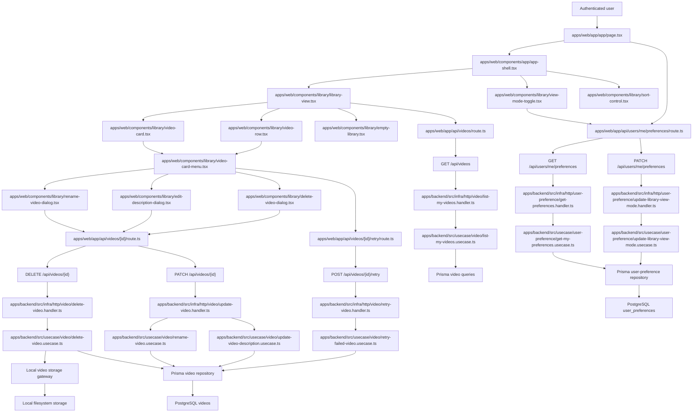

# Technical Specification: Video Library

## 1. Technical Overview

F04 turns the minimal F03 upload list at `/app` into the full personal video library. Every video the authenticated user has uploaded is visible in either a grid or a list view, with status badges that reflect the current processing state, sort options, per-card actions for opening, renaming, editing description, deleting, and retrying, and an empty-state experience that introduces uploading. Library view-mode is persisted per user so the next visit reuses the chosen density.

The backend remains the system of record. F04 extends the existing `Video` aggregate with rename and description updates, adds an authenticated delete that removes both the database row and the on-disk artifacts, and introduces a small `UserPreference` aggregate so the user's chosen view mode survives across sessions and devices. Sort order is a query-time concern surfaced through the existing list query interface and is not persisted.

The web app keeps using the F02 first-party Next.js Route Handler proxy pattern. New `/api/videos/[id]` (PATCH/DELETE) and `/api/users/me/preferences` (GET/PATCH) Route Handlers forward the authenticated `session_token` cookie to the backend. The library UI follows the Option B "Signal" dark references in `docs/design/design-system-pages/components/library.jsx` and `library2.jsx`.

**Included:**
- Authenticated `/app` library replaces the F03 minimal list with grid and list rendering for every owned video.
- Status badge component covering `validating`, `transcribing`, `summarizing`, `ready`, and `failed`, with distinct visual treatments per state.
- Grid view with responsive columns (4 wide / 2 narrow), thumbnail with duration overlay, title, and status badge.
- List view with thumbnail, title, duration, upload date, file size, and status badge in a compact row.
- Per-user persistent view-mode toggle stored in a new `user_preferences` table, defaulting to `grid` on first visit, fetched and applied during the server render of `/app`.
- Sort selector covering `most-recent` (default), `oldest`, and `title-asc`.
- Per-card context menu actions: open, rename, edit description, delete, retry (only when status is `failed`).
- Inline title rename validating 1–200 non-empty characters; empty/whitespace input is rejected inline and on the backend.
- Description modal with a textarea capped at 2000 characters.
- Delete confirmation modal showing `Delete '{title}'? This cannot be undone.`, a Cancel and Delete button, and a Delete button disabled for 1 second after the modal opens.
- Delete cascades on the backend to the original file, the thumbnail file, and the `videos` row, and is wired so that downstream cascades from F05/F06/F07 will remove their associated rows automatically once those features add foreign keys with `ON DELETE CASCADE`.
- Empty library state with illustration, copy "Upload your first video to get started", and a visible upload drop zone provided by F03's upload component.
- Card click navigates to `/app/videos/{id}`; the destination page itself is owned by F08 and is not in F04's scope.
- Retry action calls a backend endpoint that resets the failed video's processing state (currently a thin no-op handler that clears `failureReason` and resets `status` to `validating`; the actual pipeline retry is wired by F07).

**Deferred:**
- Folder organization (sidebar, filtering, "Move to folder") is owned by F05.
- Tag organization (chips, multi-tag filtering, manage tags view) is owned by F06.
- Background processing pipeline transitions and real-time stage updates are owned by F07.
- Video player and detail page rendering is owned by F08.
- In-video transcription search is owned by F09.
- AI summary display is owned by F10.
- Notification panel and cross-page processing notifications are owned by F11.
- Admin visibility into the library is owned by F12.
- Cross-video library search is out of scope per the PRD.
- Bulk actions (multi-select, bulk delete, bulk move) are out of scope per the PRD.
- Server-side pagination is deferred; library returns the user's full video set under realistic single-user volumes (the PRD targets unlimited per-user uploads but does not require pagination semantics in this release).

**Traceability:**
- PRD Consumes drives the metadata fields that the library renders (title, description, thumbnail, duration, upload timestamp, file size, processing status).
- PRD Capabilities drive grid/list rendering, sort options, status badge states, card actions, rename/description limits, delete confirmation behavior, retry availability, and click-to-detail navigation.
- PRD Experience drives default grid layout, responsive column counts, placeholder shimmer, status colors, the 1-second delete-confirmation guard, and the empty state illustration plus drop zone.
- PRD Error Handling drives empty-title rejection, concurrent-delete behavior, and the silent server-side alert when filesystem cleanup fails after a successful database delete.
- PRD Section 8 limits prerequisites to F02 authentication and F03 upload.

## 2. Architecture Impact

F04 extends the existing video slice across both apps, adds a small user-preference slice on the backend, and replaces the temporary F03 minimal list with the full library UI. The session boundary established by F02 and the upload boundary established by F03 are preserved.



**Observed project patterns:**
- TypeScript on Node with npm workspaces; backend and web are separate workspaces.
- Frontend uses Next.js 16 App Router with React 19, Server Components by default, Tailwind CSS 4, Geist fonts, path alias `@/*`, and component-level `"use client"` for interactive widgets.
- Frontend backend access is routed through Next.js Route Handlers so cookies remain first-party on the web origin.
- Frontend automated tests use Vitest for component/business assertions; navigation-level checks use the `playwright-cli` skill against the project started via `./scripts/init.sh`.
- Frontend design uses Option B "Signal" dark references from `docs/design/design-system-pages/`.
- Backend uses Fastify 5, Prisma 5, Zod 3, TypeScript strict mode, Vitest, and explicit `HttpRoute` records.
- Backend follows clean architecture: `domain/` imports nothing outer, `usecase/` only inward, `infra/` adapts HTTP and persistence, and `src/main.ts` is the only composition root.
- `process.env` is read only in `apps/backend/src/config/env.ts`.
- Backend handlers validate input via request parser output, call one use case, map output to HTTP, and do not catch errors.
- Errors extend `AppError` from `apps/backend/src/domain/_shared/errors.ts` and map centrally through `apps/backend/src/infra/http/error-handler.ts`.
- Tests are colocated as `*.spec.ts`; external I/O uses named fake classes rather than inline stubs.
- Prisma migrations live under `apps/backend/prisma/migrations/`.
- Persistent contract state is declarative; the existing concrete seed precedent is `apps/backend/scripts/seed-auth-contract.ts`.
- Static fixture convention is `tests/fixtures/<feature-slug>/`, established by F03 with `tests/fixtures/video-upload/`.
- Project quality gates are `npm run lint`, `npm run typecheck`, `npm run build`, `npm run test`, and `./scripts/run-gates.mjs`.

## 3. Technical Decisions

| Decision | Chosen Approach | Alternative Considered | Trade-off |
|---|---|---|---|
| View-mode persistence | Add a `user_preferences` table keyed by `user_id` with a `library_view_mode` column; fetch on `/app` server render and update via PATCH | Persist in `localStorage` on the browser, or add a column to `users` | Server persistence honors "per-user" semantics (not per-browser) and isolates UI prefs from the user identity aggregate; a separate aggregate is also forward-friendly if more prefs accrue |
| Title and description endpoint | Single PATCH `/api/videos/{id}` accepting `{ title?, description? }` and applying only the present fields | Two endpoints (PATCH for title, PATCH for description) or PUT-based replacement | One endpoint matches the simple "edit one field at a time" UI flow without exploding the route surface; partial-update semantics are explicit through the optional fields |
| Delete cascade strategy | DB row removal first within a transaction-like flow, then best-effort filesystem cleanup; if filesystem cleanup fails the row is still removed and a structured-JSON warning is logged for later sweeping | Two-phase commit, or refusing deletion when filesystem is unavailable | Matches the PRD: the user must not see the video again even if cleanup partially fails; orphaned files are a backend operations concern handled by future sweeping, not user-visible |
| Concurrent delete behavior | Second DELETE on a missing video returns 404 with code `video_not_found`; the UI surfaces "This video has already been deleted" | Return 410 Gone, or 200 OK idempotently | 404 matches REST conventions for a missing resource and lets the UI distinguish concurrent-delete from authorization failures; the PRD's wording is a UI concern, not an HTTP semantic |
| Sort persistence | Sort is a per-render query parameter on `GET /api/videos?sort=recent\|oldest\|title`; not persisted across sessions | Persist sort in `user_preferences` alongside view mode | PRD calls out only view-mode persistence; matching that scope avoids speculative schema additions |
| Retry endpoint scope | F04 ships `POST /api/videos/{id}/retry` that resets `status` from `failed` to `validating` and clears `failureReason`; downstream pipeline re-entry is wired by F07 | Defer the entire endpoint to F07 | The PRD lists "retry (only when failed)" inside F04's library card actions, so the user-facing surface must exist; F04 owns the surface, F07 owns the actual pipeline restart by extending the use case |
| Inline rename validation | Client-side input validation for the 1–200 length and non-empty rule; backend re-validates and returns `invalid_video_title` (HTTP 400) on violation | Server-side only, accepting whatever the input says | Matches PRD inline messaging and prevents a server round-trip for trivially invalid inputs without weakening the server-side guarantee |
| Delete confirmation guard | Implement the 1-second disabled state as a client-side timer scoped to the dialog component | Server-side throttle | The guard is purely UX (prevents accidental Enter/double-click confirms); server semantics are unchanged |
| Empty library trigger | Render the empty state when `videos.length === 0` after a successful server fetch; leave the upload drop zone present so the F03 upload flow continues to work | Hide upload until the user dismisses an onboarding modal | The PRD asks for upload to be present in the empty state; reusing the F03 component keeps the upload flow uniform |

**Assumptions and accepted recommendations:**
- F04 has neither a Core Scope nor a Full Scope additions block in the PRD; the entire feature is in scope.
- The detected quality gates (`npm run lint`, `npm run typecheck`, `npm run build`, `npm run test`, `./scripts/run-gates.mjs`) are included unchanged in the behavior contract.
- View modes are exactly two: `grid` and `list`. Default for first visit is `grid`.
- Sort values are exactly three: `recent` (default), `oldest`, `title-asc`. Invalid values fall back to `recent` with no error.
- Title length bounds are 1–200 inclusive, applied after trim. A title that is whitespace-only is rejected as empty.
- Description length bounds are 0–2000 inclusive, applied after trim. Empty description is allowed.
- Delete is irreversible per the PRD; no soft-delete or trash. Hard-delete removes the DB row and best-effort removes the original file and the thumbnail file.
- A user attempting to update or delete a video they do not own receives 404 (not 403) so video IDs are not enumerable.
- The retry endpoint accepts only videos currently in `failed` status; retrying a non-failed video returns 409 with code `video_not_failed`.
- The library list does not paginate in F04. Realistic personal libraries are small enough that returning the full set is acceptable; pagination can be added later without breaking F04's contract.
- Card click navigation to `/app/videos/{id}` is implemented as a Next.js link; the destination page is F08's responsibility.
- The cascade delete behavior covers files and the DB row owned by F04. Downstream tables (transcriptions, summaries, folder/tag associations) declare `ON DELETE CASCADE` against `videos.id` when F05/F06/F07 are implemented; verifying that cascade is each downstream feature's contract responsibility, not F04's.
- The `library-user` test account uses an HMAC-derivable session cookie value to match the existing F02/F03 contract-seed pattern.
- Fixtures follow the established `tests/fixtures/<feature-slug>/` convention; F04 introduces `tests/fixtures/video-library/` for any small files it needs (e.g., a stand-in thumbnail).

## 4. Component Overview

**Frontend:**

| File Path | New/Modified | Purpose | Key Responsibilities |
|---|---|---|---|
| `apps/web/app/app/page.tsx` | Modified | Library entry page | Resolve session, fetch the user's videos plus their preferences, render the library shell with view mode applied |
| `apps/web/app/app/page.test.tsx` | Modified | Library page tests | Cover unauthenticated redirect, empty-library rendering, and grid/list mode application from preferences |
| `apps/web/app/api/videos/route.ts` | Modified | Video list proxy | Forward authenticated `GET /api/videos` requests, including the `sort` query parameter |
| `apps/web/app/api/videos/[id]/route.ts` | New | Single-video proxy | Forward authenticated `PATCH /api/videos/{id}` and `DELETE /api/videos/{id}` requests, preserving cookies |
| `apps/web/app/api/videos/[id]/retry/route.ts` | New | Retry proxy | Forward authenticated `POST /api/videos/{id}/retry` requests |
| `apps/web/app/api/users/me/preferences/route.ts` | New | Preferences proxy | Forward authenticated `GET` and `PATCH` for the current user's preferences |
| `apps/web/lib/videos-api.ts` | Modified | Browser video API helpers | Add typed sort parameter, rename, edit description, delete, and retry helpers |
| `apps/web/lib/preferences-api.ts` | New | Browser preferences helpers | Type the preferences payload and the update API |
| `apps/web/components/app/app-shell.tsx` | Modified | App shell | Show video count, mount the sort control, the view-mode toggle, and the upload trigger |
| `apps/web/components/library/library-view.tsx` | New | Library top-level view | Render grid or list based on the current view mode and the videos prop, render empty state when there are none |
| `apps/web/components/library/video-card.tsx` | New | Grid card | Render thumbnail with duration overlay, title, status badge, and the card menu trigger |
| `apps/web/components/library/video-row.tsx` | New | List row | Render thumbnail, title, duration, upload date, file size, status badge, and the menu trigger in a compact row |
| `apps/web/components/library/video-card-menu.tsx` | New | Per-card actions | Show open/rename/edit description/delete/retry items, hide retry unless `failed`, route each action to the corresponding dialog |
| `apps/web/components/library/rename-video-dialog.tsx` | New | Rename UI | Validate 1–200 length inline, submit PATCH with the new title, surface backend errors |
| `apps/web/components/library/edit-description-dialog.tsx` | New | Description UI | Provide a textarea capped at 2000 characters with a live counter, submit PATCH with the new description |
| `apps/web/components/library/delete-video-dialog.tsx` | New | Delete confirmation modal | Show "Delete '{title}'? This cannot be undone." with Cancel/Delete buttons, disable Delete for 1 second after open, surface concurrent-delete error |
| `apps/web/components/library/empty-library.tsx` | New | Empty state | Show illustration, "Upload your first video to get started" copy, and the F03 upload drop zone |
| `apps/web/components/library/view-mode-toggle.tsx` | New | Grid/list toggle | Switch active mode, optimistically update local state, PATCH the preference, revert on failure |
| `apps/web/components/library/sort-control.tsx` | New | Sort selector | Toggle between recent / oldest / title-asc, refetch the list with the chosen sort |
| `apps/web/components/library/library-view.test.tsx` | New | Library view tests | Cover empty state, grid render, list render, and switching between modes |
| `apps/web/components/library/delete-video-dialog.test.tsx` | New | Delete modal tests | Cover the 1-second disabled state, the visible title-templated copy, and the concurrent-delete error message |
| `apps/web/components/video/video-status-badge.tsx` | Modified | Status badge primitive | Cover all five processing states (`validating`, `transcribing`, `summarizing`, `ready`, `failed`) with distinct visual treatments |
| `apps/web/components/ui/dialog.tsx` | New | Modal primitive | Provide an accessible modal with focus management for rename, description, and delete dialogs |
| `apps/web/components/ui/icon-button.tsx` | New | Icon-only button primitive | Provide an accessible icon button used by the card menu trigger |

**Backend:**

| File Path | New/Modified | Purpose | Key Responsibilities |
|---|---|---|---|
| `apps/backend/src/main.ts` | Modified | Composition root | Wire video update/delete/retry use cases and handlers, plus the user-preference repository, queries, use cases, and handlers |
| `apps/backend/src/domain/video/video-description.vo.ts` | New | Description value object | Validate 0–2000 character description length |
| `apps/backend/src/domain/video/video.entity.ts` | Modified | Video aggregate | Expose `rename`, `updateDescription`, and `resetToValidating` operations consistent with the existing factory and getter pattern |
| `apps/backend/src/domain/video/errors.ts` | Modified | Video errors | Add `VideoNotFoundError` (404), `VideoDescriptionTooLongError` (400), and `VideoNotFailedError` (409) |
| `apps/backend/src/domain/user-preference/user-preference.entity.ts` | New | Preference aggregate | Hold a single user's library view mode and timestamp; default to `grid` on first creation |
| `apps/backend/src/domain/user-preference/library-view-mode.vo.ts` | New | View-mode value object | Validate the `grid` / `list` set with offending-value error messages |
| `apps/backend/src/domain/user-preference/user-preference.repository.ts` | New | Preference write interface | Find by user, save (upsert) preference |
| `apps/backend/src/domain/user-preference/user-preference.queries.ts` | New | Preference read interface | Return `{ libraryViewMode }` for a given user, defaulting to `grid` when absent |
| `apps/backend/src/usecase/video/list-my-videos.usecase.ts` | Modified | Library list use case | Accept a `sort` input (`recent`/`oldest`/`title-asc`) and forward it to the queries |
| `apps/backend/src/usecase/video/list-my-videos.dto.ts` | Modified | List DTO | Add the `sort` field to input and tolerate absent/unknown values defaulting to `recent` |
| `apps/backend/src/usecase/video/rename-video.usecase.ts` | New | Rename use case | Validate ownership, apply the new title, and persist |
| `apps/backend/src/usecase/video/update-video-description.usecase.ts` | New | Description use case | Validate ownership, apply the new description, and persist |
| `apps/backend/src/usecase/video/delete-video.usecase.ts` | New | Delete use case | Validate ownership, remove the database row, and best-effort delete the original and thumbnail files |
| `apps/backend/src/usecase/video/retry-failed-video.usecase.ts` | New | Retry use case | Validate ownership and current `failed` state, reset status to `validating`, clear failure reason |
| `apps/backend/src/usecase/video/rename-video.dto.ts` | New | Rename DTO | Define `actorId`, `videoId`, `title` input |
| `apps/backend/src/usecase/video/update-video-description.dto.ts` | New | Description DTO | Define `actorId`, `videoId`, `description` input |
| `apps/backend/src/usecase/video/delete-video.dto.ts` | New | Delete DTO | Define `actorId`, `videoId` input |
| `apps/backend/src/usecase/video/retry-failed-video.dto.ts` | New | Retry DTO | Define `actorId`, `videoId` input and the resulting status output |
| `apps/backend/src/usecase/user-preference/get-my-preferences.usecase.ts` | New | Get preferences use case | Return the user's library view mode, defaulting when no row exists |
| `apps/backend/src/usecase/user-preference/update-library-view-mode.usecase.ts` | New | Update preferences use case | Upsert the user's library view mode |
| `apps/backend/src/usecase/user-preference/get-my-preferences.dto.ts` | New | Get DTO | Define `actorId` input and `libraryViewMode` output |
| `apps/backend/src/usecase/user-preference/update-library-view-mode.dto.ts` | New | Update DTO | Define `actorId` and `libraryViewMode` input |
| `apps/backend/src/infra/http/video/list-my-videos.handler.ts` | Modified | Video list handler | Parse the `sort` query parameter, call the list use case, return the list payload |
| `apps/backend/src/infra/http/video/update-video.handler.ts` | New | PATCH handler | Validate body shape, dispatch to rename or description use cases for the present fields |
| `apps/backend/src/infra/http/video/delete-video.handler.ts` | New | DELETE handler | Resolve actor, call the delete use case, return 204 |
| `apps/backend/src/infra/http/video/retry-video.handler.ts` | New | Retry handler | Resolve actor, call the retry use case, return the updated status |
| `apps/backend/src/infra/http/video/video.routes.ts` | Modified | Video routes | Register PATCH/DELETE/POST retry alongside the existing list and upload routes |
| `apps/backend/src/infra/http/user-preference/get-preferences.handler.ts` | New | GET preferences handler | Resolve actor, return the user's library view mode |
| `apps/backend/src/infra/http/user-preference/update-library-view-mode.handler.ts` | New | PATCH preferences handler | Validate body, upsert the preference, return the new view mode |
| `apps/backend/src/infra/http/user-preference/preferences.routes.ts` | New | Preferences routes | Register GET and PATCH `/api/users/me/preferences` |
| `apps/backend/src/infra/http/index.ts` | Modified | Route composition | Include preferences routes in the registered HTTP routes |
| `apps/backend/src/infra/http/error-handler.ts` | Modified | Error mapping | Map `VideoNotFoundError`, `VideoDescriptionTooLongError`, `VideoNotFailedError`, and view-mode validation errors |
| `apps/backend/src/infra/repository/video/video.prisma-repository.ts` | Modified | Video persistence | Implement save for update and delete; ensure delete returns boolean of presence |
| `apps/backend/src/infra/repository/video/video.in-memory-repository.ts` | Modified | Video fake repository | Mirror update/delete semantics for tests |
| `apps/backend/src/infra/queries/video/video.prisma-queries.ts` | Modified | Video read model | Accept the `sort` argument and apply the corresponding `orderBy` |
| `apps/backend/src/infra/queries/video/video.in-memory-queries.ts` | Modified | Video fake queries | Mirror the new sort argument |
| `apps/backend/src/infra/repository/user-preference/user-preference.prisma-repository.ts` | New | Preference persistence | Upsert and load library view mode |
| `apps/backend/src/infra/repository/user-preference/user-preference.in-memory-repository.ts` | New | Preference fake repository | Cover use case tests |
| `apps/backend/src/infra/queries/user-preference/user-preference.prisma-queries.ts` | New | Preference read model | Return the view mode for the actor |
| `apps/backend/src/infra/queries/user-preference/user-preference.in-memory-queries.ts` | New | Preference fake queries | Cover handler tests |
| `apps/backend/scripts/seed-video-library-contract.ts` | New | Contract seed | Seed `library-user`, `other-user`, and a fixed set of videos in known statuses (validating, transcribing, summarizing, ready, failed) plus a small original file and thumbnail file per video |

**Database:**

| Migration File | Tables Affected | Operation | Notes |
|---|---|---|---|
| `apps/backend/prisma/migrations/<timestamp>_add_user_preferences/migration.sql` | `user_preferences` | CREATE | Adds the per-user library view mode store; `user_id` PK with FK and `ON DELETE CASCADE` against `users.id` |
| `apps/backend/prisma/schema.prisma` | `User`, `UserPreference` | Modified | Adds the `UserPreference` model and the `User.preference` relation |

## 5. API Contracts

All browser-facing routes live on the web origin under `/api/videos*` and `/api/users/me/preferences*` and proxy to the equivalent backend routes while preserving the authenticated `session_token` cookie. Backend responses use JSON.

### Endpoint: List My Videos (extended)

- **Method:** GET
- **Backend Path:** `/api/videos`
- **Web Proxy Path:** `/api/videos`
- **Authentication:** Required session cookie

**Request:**

| Field | Type | Required | Validation | Description |
|---|---|---|---|---|
| `sort` (query) | `string` | No | `recent`, `oldest`, `title-asc`; unknown values fall back to `recent` | Sort order for the returned list |

**Response (Success - 200):** unchanged from F03 except the order honors `sort`.

```json
{
  "videos": [
    {
      "id": "660e8400-e29b-41d4-a716-446655440001",
      "title": "Lecture 05",
      "originalFilename": "Lecture 05.mkv",
      "fileSizeBytes": 734003200,
      "durationSeconds": 3132.42,
      "containerFormat": "mkv",
      "status": "ready",
      "failureReason": null,
      "thumbnailUrl": "/media/thumbnails/660e8400-e29b-41d4-a716-446655440001.jpg",
      "thumbnailState": "ready",
      "uploadedAt": "2026-05-02T21:00:00.000Z"
    }
  ]
}
```

**Error Codes:**

| Code | HTTP Status | Description |
|---|---|---|
| `unauthenticated` | 401 | Missing or invalid session cookie |

### Endpoint: Update Video

- **Method:** PATCH
- **Backend Path:** `/api/videos/{id}`
- **Web Proxy Path:** `/api/videos/{id}`
- **Authentication:** Required session cookie
- **Content Type:** `application/json`

**Request:**

| Field | Type | Required | Validation | Description |
|---|---|---|---|---|
| `title` | `string` | No | trimmed length 1–200 | New title; absent means unchanged |
| `description` | `string` | No | trimmed length 0–2000 | New description; absent means unchanged |

At least one of `title` or `description` must be present.

**Request Example:**

```json
{ "title": "Lecture 05 — RNN vs Attention", "description": "Highlights from the talk." }
```

**Response (Success - 200):**

| Field | Type | Description |
|---|---|---|
| `video.id` | `uuid` | Video ID |
| `video.title` | `string` | Updated title |
| `video.description` | `string` | Updated description |
| `video.updatedAt` | `string` | ISO timestamp of the update |

**Response Example:**

```json
{
  "video": {
    "id": "660e8400-e29b-41d4-a716-446655440001",
    "title": "Lecture 05 — RNN vs Attention",
    "description": "Highlights from the talk.",
    "updatedAt": "2026-05-02T22:30:00.000Z"
  }
}
```

**Error Codes:**

| Code | HTTP Status | Description |
|---|---|---|
| `unauthenticated` | 401 | Missing or invalid session cookie |
| `invalid_input` | 400 | Body shape invalid; message includes offending value and expected shape |
| `invalid_video_title` | 400 | Title is empty or above 200 characters; message reads "Title cannot be empty" or "Title must be at most 200 characters" |
| `video_description_too_long` | 400 | Description above 2000 characters; message names the limit |
| `video_not_found` | 404 | Video does not exist or is not owned by the authenticated user |

### Endpoint: Delete Video

- **Method:** DELETE
- **Backend Path:** `/api/videos/{id}`
- **Web Proxy Path:** `/api/videos/{id}`
- **Authentication:** Required session cookie

**Request:** no body.

**Response (Success - 204):** empty body.

**Error Codes:**

| Code | HTTP Status | Description |
|---|---|---|
| `unauthenticated` | 401 | Missing or invalid session cookie |
| `video_not_found` | 404 | Video does not exist or is not owned by the authenticated user |

### Endpoint: Retry Failed Video

- **Method:** POST
- **Backend Path:** `/api/videos/{id}/retry`
- **Web Proxy Path:** `/api/videos/{id}/retry`
- **Authentication:** Required session cookie

**Request:** no body.

**Response (Success - 200):**

| Field | Type | Description |
|---|---|---|
| `video.id` | `uuid` | Video ID |
| `video.status` | `string` | New status, always `validating` after a successful retry |

**Error Codes:**

| Code | HTTP Status | Description |
|---|---|---|
| `unauthenticated` | 401 | Missing or invalid session cookie |
| `video_not_found` | 404 | Video does not exist or is not owned by the authenticated user |
| `video_not_failed` | 409 | Video is not currently in `failed` status |

### Endpoint: Get My Preferences

- **Method:** GET
- **Backend Path:** `/api/users/me/preferences`
- **Web Proxy Path:** `/api/users/me/preferences`
- **Authentication:** Required session cookie

**Response (Success - 200):**

| Field | Type | Description |
|---|---|---|
| `preferences.libraryViewMode` | `string` | `grid` or `list`; defaults to `grid` when no record exists |

```json
{ "preferences": { "libraryViewMode": "grid" } }
```

**Error Codes:**

| Code | HTTP Status | Description |
|---|---|---|
| `unauthenticated` | 401 | Missing or invalid session cookie |

### Endpoint: Update Library View Mode

- **Method:** PATCH
- **Backend Path:** `/api/users/me/preferences`
- **Web Proxy Path:** `/api/users/me/preferences`
- **Authentication:** Required session cookie
- **Content Type:** `application/json`

**Request:**

| Field | Type | Required | Validation | Description |
|---|---|---|---|---|
| `libraryViewMode` | `string` | Yes | exactly `grid` or `list` | New view mode |

```json
{ "libraryViewMode": "list" }
```

**Response (Success - 200):**

```json
{ "preferences": { "libraryViewMode": "list" } }
```

**Error Codes:**

| Code | HTTP Status | Description |
|---|---|---|
| `unauthenticated` | 401 | Missing or invalid session cookie |
| `invalid_input` | 400 | Body shape invalid; message includes offending value and expected shape |
| `invalid_library_view_mode` | 400 | Value is not `grid` or `list`; message names the offending value and the accepted set |

## 6. Data Model

### Table: `user_preferences`

| Column | Type | Nullable | Default | Description |
|---|---|---|---|---|
| `user_id` | `uuid` | No | - | PK and FK to `users.id` with `ON DELETE CASCADE` |
| `library_view_mode` | `varchar(8)` | No | `'grid'` | `grid` or `list` |
| `created_at` | `timestamptz` | No | `NOW()` | Initial creation |
| `updated_at` | `timestamptz` | No | `NOW()` | Last update |

**Indexes:**

| Index Name | Columns | Type | Purpose |
|---|---|---|---|
| `pk_user_preferences` | `user_id` | btree (PK) | Single-row-per-user lookup |

**Constraints:**

| Constraint | Type | Definition | Purpose |
|---|---|---|---|
| `pk_user_preferences` | PRIMARY KEY | `user_id` | One row per user |
| `fk_user_preferences_user` | FOREIGN KEY | `user_id REFERENCES users(id) ON DELETE CASCADE` | Preferences die with the user |
| `ck_user_preferences_view_mode` | CHECK | `library_view_mode IN ('grid', 'list')` | Valid view-mode set |

**Prisma model shape:**

```prisma
model UserPreference {
  userId           String   @id @map("user_id") @db.Uuid
  libraryViewMode  String   @default("grid") @map("library_view_mode") @db.VarChar(8)
  createdAt        DateTime @default(now()) @map("created_at") @db.Timestamptz
  updatedAt        DateTime @default(now()) @updatedAt @map("updated_at") @db.Timestamptz
  user             User     @relation(fields: [userId], references: [id], onDelete: Cascade)

  @@map("user_preferences")
}
```

**User model addition:**

```prisma
model User {
  // existing fields...
  preference UserPreference?
}
```

**Migration notes:**
- A `CHECK` constraint on `library_view_mode` keeps the value set strict at the DB layer.
- `user_id` is both PK and FK so the table is naturally one-row-per-user.
- The migration backfills no rows; the read path defaults to `grid` whenever a row is absent, which keeps existing F02/F03 users functional immediately after migration.

### Table: `videos` (consumer-side notes)

No schema changes in F04. F04 issues `UPDATE videos SET title = $, description = $, updated_at = NOW() WHERE id = $ AND user_id = $` for renames/descriptions and `DELETE FROM videos WHERE id = $ AND user_id = $` for deletes. The existing `ON DELETE CASCADE` from `videos.user_id` to `users.id` continues to apply, so user deletion in F12 cascades through F04's videos. F05/F06/F07 will add their own tables with `ON DELETE CASCADE` on `videos.id` so that deleting a video here cascades into transcriptions, summaries, folder/tag associations once those features ship.

## 7. Testing Strategy

Backend tests remain colocated under `apps/backend/src/**` and use named fakes for storage, repositories, and queries.

**Domain tests:**
- `apps/backend/src/domain/video/video-description.vo.spec.ts`
  - `accepts_empty_description`
  - `accepts_two_thousand_character_description`
  - `rejects_description_above_two_thousand_with_offending_length`
- `apps/backend/src/domain/video/video.entity.spec.ts` (extended)
  - `renames_video_with_valid_title`
  - `rejects_rename_to_empty_title`
  - `updates_description`
  - `resets_failed_video_to_validating`
- `apps/backend/src/domain/user-preference/library-view-mode.vo.spec.ts`
  - `accepts_grid_and_list`
  - `rejects_unknown_value_with_offending_value`
- `apps/backend/src/domain/user-preference/user-preference.entity.spec.ts`
  - `creates_preference_with_grid_default`
  - `updates_view_mode_and_timestamp`

**Use case tests:**
- `apps/backend/src/usecase/video/list-my-videos.usecase.spec.ts` (extended)
  - `returns_videos_sorted_by_recent_default`
  - `returns_videos_sorted_by_oldest_when_requested`
  - `returns_videos_sorted_by_title_ascending_when_requested`
  - `falls_back_to_recent_for_unknown_sort`
- `apps/backend/src/usecase/video/rename-video.usecase.spec.ts`
  - `renames_video_owned_by_actor`
  - `returns_not_found_when_actor_does_not_own_video`
  - `rejects_empty_title`
- `apps/backend/src/usecase/video/update-video-description.usecase.spec.ts`
  - `updates_description_for_owned_video`
  - `returns_not_found_when_actor_does_not_own_video`
  - `rejects_description_above_two_thousand`
- `apps/backend/src/usecase/video/delete-video.usecase.spec.ts`
  - `removes_database_row_and_deletes_files`
  - `succeeds_even_when_filesystem_cleanup_fails`
  - `returns_not_found_when_video_already_deleted`
  - `returns_not_found_when_actor_does_not_own_video`
- `apps/backend/src/usecase/video/retry-failed-video.usecase.spec.ts`
  - `resets_failed_video_to_validating`
  - `rejects_retry_when_status_is_not_failed`
  - `returns_not_found_when_actor_does_not_own_video`
- `apps/backend/src/usecase/user-preference/get-my-preferences.usecase.spec.ts`
  - `returns_grid_default_when_no_record_exists`
  - `returns_persisted_view_mode_when_record_exists`
- `apps/backend/src/usecase/user-preference/update-library-view-mode.usecase.spec.ts`
  - `creates_record_when_absent`
  - `updates_existing_record`
  - `rejects_unknown_view_mode`

**Infra tests:**
- `apps/backend/src/infra/repository/video/video.in-memory-repository.spec.ts` (extended)
  - `delete_returns_true_when_present`
  - `delete_returns_false_when_absent`
- `apps/backend/src/infra/queries/video/video.in-memory-queries.spec.ts` (extended)
  - `applies_recent_oldest_and_title_sorts`
- `apps/backend/src/infra/repository/user-preference/user-preference.in-memory-repository.spec.ts`
  - `upserts_preference_for_user`
- `apps/backend/src/infra/queries/user-preference/user-preference.in-memory-queries.spec.ts`
  - `returns_grid_when_no_record_exists`
- `apps/backend/src/infra/http/video/video.routes.spec.ts` (extended)
  - `patch_video_renames_owned_video`
  - `patch_video_updates_description_of_owned_video`
  - `patch_video_returns_404_for_other_users_video`
  - `delete_video_removes_owned_video`
  - `delete_video_returns_404_for_other_users_video`
  - `delete_video_returns_404_when_already_deleted`
  - `retry_video_resets_failed_video_to_validating`
  - `retry_video_rejects_non_failed_video`
- `apps/backend/src/infra/http/user-preference/preferences.routes.spec.ts`
  - `get_preferences_returns_grid_default_for_new_user`
  - `patch_preferences_updates_to_list`
  - `patch_preferences_rejects_unknown_value`

**Frontend tests:**
- `apps/web/lib/videos-api.test.ts` (extended)
  - `list_attaches_sort_query_parameter`
  - `rename_sends_patch_with_title_only`
  - `delete_sends_delete_request`
- `apps/web/lib/preferences-api.test.ts`
  - `get_preferences_returns_default_grid_for_new_user`
  - `update_preferences_sends_patch_with_view_mode`
- `apps/web/components/library/library-view.test.tsx`
  - `renders_grid_view_with_status_badges`
  - `renders_list_view_with_status_badges`
  - `renders_empty_state_with_upload_zone`
  - `delete_action_opens_confirmation_modal`
- `apps/web/components/library/delete-video-dialog.test.tsx`
  - `delete_button_is_disabled_for_one_second_after_open`
  - `cancel_closes_modal_without_request`
- `apps/web/components/library/rename-video-dialog.test.tsx`
  - `rejects_empty_title_inline`
  - `submits_trimmed_title`

**Navigation verification with `playwright-cli`:**
- Start the project with `./scripts/init.sh`.
- Authenticate as `library-user` through the UI.
- Visit `/app` and verify the seeded videos render in grid view by default with their status badges and metadata.
- Toggle to list view, reload the page, and verify list view persists.
- Trigger rename, edit description, and delete from a card menu and verify the corresponding API calls and UI updates.
- Verify the empty-library state by deleting all videos for the test user and reloading.
- Attempt a retry on a `failed` video and verify the badge transitions to `validating`.

**Contract fixtures:**
- `tests/fixtures/video-library/seed-thumbnail.jpg` (small placeholder JPEG used by the seed script for `ready` videos with thumbnails)
- `tests/fixtures/video-library/seed-original.bin` (small binary placeholder used by the seed script as a stand-in for original files; storage path semantics are what's being verified, not media playback)
