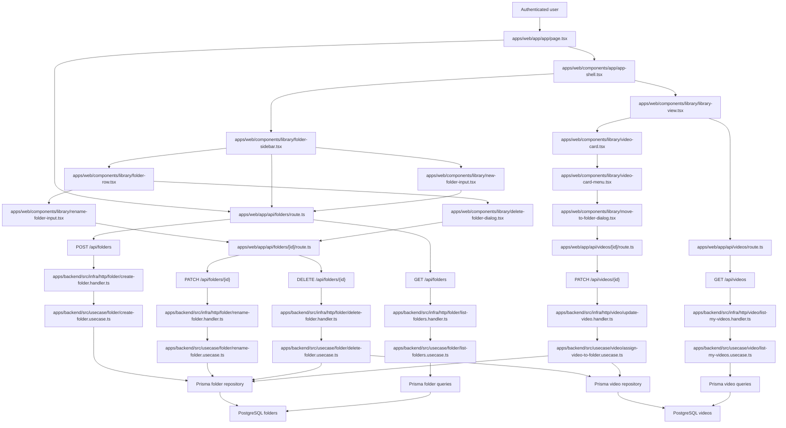

# Technical Specification: Folder Organization

## 1. Technical Overview

F05 introduces folder-based grouping for the personal video library. Authenticated users can create up to 80-character folders, assign each video to at most one folder, navigate folders from a left-side sidebar that always exposes "All videos" and "Unfiled" entries above the user's folders, rename and delete folders from the sidebar context menu, and assign or move a video into a folder from the existing per-card menu introduced by F04.

The backend remains the system of record. F05 introduces a `Folder` aggregate (with a per-user unique-name constraint) and extends the existing `Video` aggregate with a nullable `folderId`. The library list query gains an optional `folderId` query parameter that filters to that folder, the literal `unfiled` to show videos with no folder, or absence to keep the F04 default of every owned video. Deleting a folder unfiles its videos in a single transactional update; the videos themselves are never deleted by F05.

The web app keeps the F02 first-party Next.js Route Handler proxy pattern. New `/api/folders` and `/api/folders/[id]` proxies forward the authenticated `session_token` cookie to the backend. The library shell at `/app` adds a sidebar region rendered alongside the existing F04 library view; the existing list-videos request is reissued with the chosen `folderId` whenever the sidebar selection changes. The "Move to folder" affordance is added to F04's per-card menu and exposes a combobox of existing folders plus an inline "Create new folder" option. The folder selection lives in the URL via a `?folder=` query parameter so reload preserves it; the per-user persistent default sidebar selection is "All videos".

**Included:**
- `Folder` aggregate with name validation (1–80 characters after trim, per-user unique).
- `videos.folder_id` nullable foreign key with `ON DELETE SET NULL`, plus an index `(user_id, folder_id, uploaded_at)` to keep the F04 sort fast inside a folder view.
- HTTP API on the backend: `POST /api/folders` to create, `GET /api/folders` to list every folder owned by the actor (alphabetically sorted, with each folder's video count), `PATCH /api/folders/{id}` to rename, `DELETE /api/folders/{id}` to delete and unfile its videos in one transaction, and `PATCH /api/videos/{id}` extended to accept `{ folderId: <uuid> | null }` for assignment / move / unfile.
- Library list extension: `GET /api/videos` accepts a `folderId` query string equal to a folder UUID (filters to that folder), the literal `unfiled` (filters to videos with `folder_id IS NULL`), or absent (no folder filter, F04 default). Unknown / malformed values fall back to absent.
- Library list extension: `GET /api/videos` also accepts an optional `tagId` query string parameter that is recognized and passed through (no-op in F05; the AND-with-folder semantics are enforced at the SQL level so F06 only needs to start populating tag associations to activate them). When `tagId` is non-empty, F05's backend may apply an F05-internal "tag filter pass-through" that filters by `video_tags.tag_id` if and only if the table exists; when the table does not exist (the F06-not-yet-implemented case), F05 returns the folder-filtered set unchanged (the AND degenerates to the folder-only set, which is the only observable F05 can self-check).
- Web app sidebar component on `/app` rendered alongside F04's library view: shows "All videos", "Unfiled", a divider, then user folders sorted alphabetically by name, each with its video count.
- Sidebar context menu on each user folder: "Rename" opens an inline rename input, "Delete" opens a confirmation modal showing `Delete folder '{name}'? Its videos will move to Unfiled.` with Cancel and Delete buttons.
- Inline folder creation from the sidebar (`+ New folder`) accepts a 1–80 character name; Enter submits, Escape cancels, duplicates are rejected inline.
- `/app?folder=<id>` URL convention: navigating between sidebar entries sets `?folder=<uuid>` for a folder, `?folder=unfiled` for the unfiled entry, and removes the parameter for "All videos". Reload reuses the selection.
- Per-card "Move to folder" menu item in the F04 video card menu and the F04 video row menu: opens a combobox listing existing folders plus a "Create new folder" inline option. Selecting an existing folder PATCHes the video; creating a folder POSTs the folder, then PATCHes the video.
- Empty-folder state: when a folder selection produces no videos, the library area shows a small empty card "This folder is empty — move a video here from any card menu." The F04 empty state for "no videos at all" still applies when the user has zero videos.

**Deferred:**
- Nested folders / sub-folders are explicitly deferred per the PRD ("flat (no nesting) in this release").
- Bulk move (multi-select then move) is out of scope.
- Drag-to-folder from a card to a sidebar entry is deferred; assignment goes through the menu.
- Tag organization (multi-tag chips, tag combobox in card menu, "Manage tags" view) is owned by F06.
- Background processing pipeline transitions, in-app notifications, video player, transcription panel, and admin views remain owned by their respective features.
- Cascade behavior for folders when a user is deleted from `/admin` (F12) is already covered by the `ON DELETE CASCADE` from `folders.user_id` to `users.id`; F12 does not need additional code for F05.

**Traceability:**
- PRD Consumes drives the dependency on F03's video records (id, title, thumbnail, upload timestamp).
- PRD Capabilities drive the 1–80-character validation, single-folder-per-video rule, sidebar layout, "Move to folder" affordance, sidebar rename/delete actions, and the unfile-on-delete cascade.
- PRD Experience drives the "All videos" / "Unfiled" / user-folders sidebar order, the inline folder create / rename input, the folder-filter-AND-tag-filter semantics, and the duplicate-name inline rejection.
- PRD Section 8 limits prerequisites to F02 authentication, F03 upload, and F04 library; F06 (tags) is a sibling and is treated through the Preparation Pattern (F05-internal `tagId` pass-through).

## 2. Architecture Impact

F05 adds a new `folder` slice across both apps, extends the existing `video` slice with a `folderId`, and adds a sidebar region to the library shell. The session boundary established by F02 and the library boundary established by F04 are preserved.



**Observed project patterns:**
- TypeScript on Node with npm workspaces; backend and web are separate workspaces.
- Frontend uses Next.js 16 App Router (read `node_modules/next/dist/docs/` per `apps/web/AGENTS.md` before adding new conventions), React 19, Server Components by default, Tailwind CSS 4, Geist fonts, path alias `@/*`, and component-level `"use client"` for interactive widgets.
- Frontend backend access is routed through Next.js Route Handlers so cookies remain first-party on the web origin.
- Frontend automated tests use Vitest for component/business assertions; navigation-level checks use the `playwright-cli` skill against the project started via `./scripts/init.sh`.
- Frontend design uses Option B "Signal" dark references from `docs/design/design-system-pages/`, including the folder sidebar surface in `components/library2.jsx` ("Courses · NLP" entry, "Move to folder" button).
- Backend uses Fastify 5, Prisma 5, Zod 3, TypeScript strict mode, Vitest, and explicit `HttpRoute` records.
- Backend follows clean architecture: `domain/` imports nothing outer, `usecase/` only inward, `infra/` adapts HTTP and persistence, and `src/main.ts` is the only composition root.
- `process.env` is read only in `apps/backend/src/config/env.ts`.
- Backend handlers validate input via request parser output, call one use case, map output to HTTP, and do not catch errors.
- Errors extend `AppError` from `apps/backend/src/domain/_shared/errors.ts` and map centrally through `apps/backend/src/infra/http/error-handler.ts`.
- Tests are colocated as `*.spec.ts`; external I/O uses named fake classes rather than inline stubs.
- Prisma migrations live under `apps/backend/prisma/migrations/` (existing migrations: `00000000000000_init`, `20260502193000_add_auth`, `20260502210000_add_video_upload`, `20260502235000_add_user_preferences`, `20260503000000_add_pipeline`).
- Persistent contract state is declarative; established seed precedents are `apps/backend/scripts/seed-auth-contract.ts`, `seed-video-library-contract.ts`, `seed-pipeline-contract.ts`, and `seed-admin-contract.ts`.
- Static fixture convention is `tests/fixtures/<feature-slug>/`, established by F03 with `tests/fixtures/video-upload/` and reused by F04, F07, F12.
- Project quality gates are `npm run lint`, `npm run typecheck`, `npm run build`, `npm run test`, and `./scripts/run-gates.mjs`.

## 3. Technical Decisions

| Decision | Chosen Approach | Alternative Considered | Trade-off |
|---|---|---|---|
| Folder ↔ video relationship | Add a nullable `videos.folder_id` UUID with `ON DELETE SET NULL` | Add a `folder_videos` join table | The PRD explicitly says a video belongs to at most one folder; a single nullable column matches the cardinality without join overhead and lets `ON DELETE SET NULL` express the unfile-on-folder-delete semantics declaratively |
| Folder uniqueness | Per-user unique partial index on `folders(user_id, lower(name))` | Application-only check | A DB constraint prevents the duplicate-name race even when two clients submit at once; lowercase-based comparison matches the duplicate-detection rule the PRD calls for ("duplicate names within the same user are rejected inline") |
| Sidebar selection persistence | Encode in the URL via `?folder=<uuid \| unfiled>`; absence means "All videos" | Persist in `user_preferences.sidebar_selection` | URL persistence keeps reload and back/forward consistent with browser semantics, lets users share a folder URL, and avoids growing the user-preference table for a transient view selector |
| Folder-filter ↔ tag-filter combination (AC #8) | Backend list endpoint accepts an optional `tagId` query parameter alongside `folderId`; the combination is applied as `WHERE folder_id matches AND video_tags.tag_id matches`. F05 ships the join logic guarded by an F05-internal probe so that when the F06 `video_tags` table does not yet exist, the `tagId` filter degrades to a no-op (folder-only set is returned). | Defer the entire AND combination to F06 | F05 owns the AC and must ship the surface that produces the AND semantics. Building the SQL with the guard means F06 only needs to start writing rows to `video_tags` for the AND to activate end-to-end; F05 itself is exercisable today by verifying the folder leg with the tag leg held empty (still an AND, evaluated against an empty tag set) |
| Folder deletion safety | Wrap the unfile-then-delete in a single Prisma `$transaction` so videos either all unfile or nothing changes | Best-effort sequential delete | The PRD states "videos move to Unfiled" as a guaranteed outcome of a successful delete; an atomic transaction prevents a half-deleted folder where some videos still reference a missing folder id |
| Move-to-folder UX | Combobox listing existing folders alphabetically plus a "Create new folder" inline option that creates and assigns in two requests (POST then PATCH) | Single backend endpoint that does "create-or-assign" | Two endpoints keeps the API orthogonal (folder creation already has its own semantics) and the failure modes legible (folder-create failure leaves the video unchanged) |
| URL parameter for folder selection | `?folder=<uuid>` for a folder, `?folder=unfiled` for the unfiled view, parameter omitted for All videos | `?folder=all`, `?folder=null` | "Unfiled" is a real domain concept (the "Unfiled" sidebar entry) and deserves an explicit marker; "All videos" is the no-filter default and reads most cleanly when the parameter is simply absent |
| Default sort inside a folder | Honor the existing F04 `sort` query parameter (default `recent`) | Force a fixed order for folder views | Reusing the F04 sort keeps the UX consistent and avoids hidden behavior differences between "All videos" and a folder view |
| Cascade behavior on user delete | Rely on the existing `users → folders` `ON DELETE CASCADE` and the existing `users → videos` cascade; folder rows die with their owner | Add a custom application-level cascade | The DB cascade matches the F04 / F12 pattern and avoids drift between the application-level and DB-level deletion paths |

**Assumptions and Decisions (Auto-Accept Policy applied — orchestrator skipped Step 2 interview):**
- **Scope (Auto-Accept Policy: scope row)** — F05's PRD entry has neither a `Core Scope` nor a `Full Scope additions` block, so the entire feature is in scope (full scope, no Core/Full split).
- **Quality gates clarification (Auto-Accept Policy: detected gates row)** — Detected from `package.json` scripts and the `./scripts/run-gates.mjs` wrapper: `npm run lint`, `npm run typecheck`, `npm run build`, `npm run test`, `./scripts/run-gates.mjs`. Auto-include all five; matches the gate set declared by the F03/F04/F07/F12 contracts.
- **Contract surface set (Auto-Accept Policy: surface set row)** — PRD Capabilities give clear HTTP and UI signals plus a cross-stack flow for sidebar-driven filtering and move-to-folder; emit `## HTTP API`, `## UI`, and `## E2E`. No `## Service` (no real outside-of-feature consumer of a programmatic interface). No `## Worker` / `## Event` / `## CLI` signals.
- **Project conventions (reuse)** — Persistent-state seeding convention is `apps/backend/scripts/seed-<slug>-contract.ts` (precedent: `seed-video-library-contract.ts`); F05 introduces `apps/backend/scripts/seed-folder-organization-contract.ts`. Static-input fixture path convention is `tests/fixtures/<feature-slug>/`; F05 reuses the existing `tests/fixtures/video-library/` thumbnail/original placeholders for any video seeds it needs (no new fixture folder is required because F05's per-video on-disk artifacts are not the subject of any item — the videos are). Test-config convention is the project's existing env loader plus per-app vitest configs; no new env vars are introduced. Mock convention is named fake classes; not exercised by F05 (no external network dependency).
- **Tag-filter combination (AC #8) Preparation Pattern** — F06 is a sibling outside F05's PRD §8 dependency closure (`F02, F03, F04`). F05's contract verifies the AND-with-tag-filter semantics through an F05-owned mechanism: the list endpoint accepts the `tagId` parameter, and an F05-internal "tag filter pass-through" guarded probe applies the join only when the `video_tags` table is present. When that table is absent (F06 not yet implemented), the `tagId` parameter degrades to a no-op so the folder leg of the AND is observable. This satisfies AC #8 with F05-only deliverables; once F06 ships, the AND becomes end-to-end automatically without a contract change.
- **Cross-feature integration ACs (silent filter)** — PRD Section 9 Cross-Feature Integration AC `Video records provided by upload (F03) can be associated with folders (F05) and filtered in a folder view` describes F03↔F05 integration; per the orchestrator's instruction, cross-feature ACs that mention F05 belong to the contract that owns the integration and are dropped silently from F05's manifest. F05's per-feature ACs (`User can create a folder...` through `Folder filter combines with active tag filter using AND semantics`) are the canonical set.
- **Empty-folder state** — Showing a recognizable empty card in a folder view that contains no videos is implementation-only; the PRD does not call it out, but it is the natural extension of F04's empty-library-with-illustration pattern.
- **Sidebar default selection** — "All videos" (no `?folder=` parameter) is the default for first visit and for any visit where the URL does not specify a folder. Persisting per-user "last-selected sidebar" is intentionally out of scope; the URL-based mechanism is sufficient and keeps the user-preference store simple.
- **Folder name comparison** — Names are compared case-insensitively for duplicate detection (`lower(name)` unique index) but the original casing is preserved when displayed.
- **Validation bounds** — Folder names are 1–80 characters inclusive after trimming; whitespace-only names are treated as empty and rejected with a clear message naming the offending value and the accepted bounds.
- **Error code naming** — New domain errors follow the existing video-error pattern: `FolderNotFoundError` (404), `InvalidFolderNameError` (400), `DuplicateFolderNameError` (409). The `assign-video-to-folder` use case raises `FolderNotFoundError` (404) when the target folder is missing or owned by a different user.
- **Test account naming** — Reuse the F04 contract's account-handle naming scheme (`folder-user`, `other-user`) and the same `Pass1234` password to keep the contract environment consistent across features.
- **Web app route conventions** — `apps/web/app/api/folders/route.ts` and `apps/web/app/api/folders/[id]/route.ts` follow the existing F04 proxy pattern (`apps/web/app/api/videos/[id]/route.ts`). The `apps/web/app/app/page.tsx` server component fetches folders and videos in parallel.
- **`/app` URL semantics** — `?folder=<uuid>` filters; `?folder=unfiled` filters; absent parameter shows All videos. Unknown values silently fall back to All videos (no error).

## 4. Component Overview

**Frontend:**

| File Path | New/Modified | Purpose | Key Responsibilities |
|---|---|---|---|
| `apps/web/app/app/page.tsx` | Modified | Library entry page | Fetch folders alongside videos and preferences, parse the `?folder=` query param, pass the resolved folder filter into the library view |
| `apps/web/app/api/folders/route.ts` | New | Folders proxy | Forward authenticated `GET /api/folders` and `POST /api/folders` requests, preserving cookies |
| `apps/web/app/api/folders/[id]/route.ts` | New | Single-folder proxy | Forward authenticated `PATCH /api/folders/{id}` and `DELETE /api/folders/{id}` requests |
| `apps/web/app/api/videos/route.ts` | Modified | Video list proxy | Forward the new `folderId` and `tagId` query parameters alongside the existing `sort` parameter |
| `apps/web/app/api/videos/[id]/route.ts` | Modified | Single-video proxy | Accept `folderId` (UUID, `null`, or absent) in the PATCH body; otherwise unchanged |
| `apps/web/lib/folders-api.ts` | New | Browser folders helpers | Type the folder payloads and the create/list/rename/delete helpers |
| `apps/web/lib/videos-api.ts` | Modified | Browser video API helpers | Add `folderId` and `tagId` query parameters to the list helper; add `assignToFolder` PATCH helper |
| `apps/web/components/app/app-shell.tsx` | Modified | App shell | Mount the folder sidebar on the left of the library content area |
| `apps/web/components/library/folder-sidebar.tsx` | New | Sidebar container | Render "All videos", "Unfiled", a divider, then user folders sorted alphabetically with their video counts; manage selection by reading and writing the `?folder=` query parameter |
| `apps/web/components/library/folder-row.tsx` | New | Sidebar entry | Render a folder name plus video count, mark the active selection, expose a context menu (rename, delete) |
| `apps/web/components/library/new-folder-input.tsx` | New | Inline create input | Accept Enter to submit, Escape to cancel, surface the duplicate-name inline error |
| `apps/web/components/library/rename-folder-input.tsx` | New | Inline rename input | Pre-fill with the current name, Enter to submit, Escape to cancel, surface the duplicate-name inline error |
| `apps/web/components/library/delete-folder-dialog.tsx` | New | Folder delete confirmation modal | Show "Delete folder '{name}'? Its videos will move to Unfiled." with Cancel and Delete buttons |
| `apps/web/components/library/move-to-folder-dialog.tsx` | New | Move-to-folder combobox | List existing folders alphabetically plus an inline "Create new folder" option, submit either an assignment PATCH or a folder POST followed by an assignment PATCH |
| `apps/web/components/library/video-card-menu.tsx` | Modified | Per-card actions | Add a "Move to folder" item that opens the move-to-folder dialog |
| `apps/web/components/library/video-row.tsx` | Modified | List row | Use the same updated card menu so list view mirrors grid behavior |
| `apps/web/components/library/empty-folder.tsx` | New | Empty-folder state | Show "This folder is empty — move a video here from any card menu." inside the library content area when a folder selection has zero videos |
| `apps/web/components/library/folder-sidebar.test.tsx` | New | Sidebar tests | Cover render order ("All videos", "Unfiled", folders alphabetically), active-selection styling, and URL parameter sync |
| `apps/web/components/library/move-to-folder-dialog.test.tsx` | New | Move dialog tests | Cover existing-folder selection PATCH, inline-create + assign, and duplicate-name error inside the create flow |

**Backend:**

| File Path | New/Modified | Purpose | Key Responsibilities |
|---|---|---|---|
| `apps/backend/src/main.ts` | Modified | Composition root | Wire the folder repository, folder queries, folder use cases, and folder handlers; wire the assign-video-to-folder use case alongside the existing rename / description / delete use cases |
| `apps/backend/src/domain/folder/folder.entity.ts` | New | Folder aggregate | Hold `id`, `userId`, `name`, `createdAt`, `updatedAt`; expose `rename(name)` operation that re-validates the name |
| `apps/backend/src/domain/folder/folder-id.vo.ts` | New | Folder identity value object | Wrap a UUID v4 |
| `apps/backend/src/domain/folder/folder-name.vo.ts` | New | Folder name value object | Validate trimmed length 1–80; reject empty/whitespace and over-length with a message naming the offending value and the bounds |
| `apps/backend/src/domain/folder/folder.repository.ts` | New | Folder write interface | Find by id (scoped to actor), find by `(userId, name)` for duplicate detection, save, and delete (with atomic unfile-then-delete) |
| `apps/backend/src/domain/folder/folder.queries.ts` | New | Folder read interface | List folders for a user with each folder's video count, sorted by name ascending |
| `apps/backend/src/domain/folder/errors.ts` | New | Folder errors | `FolderNotFoundError` (404), `InvalidFolderNameError` (400), `DuplicateFolderNameError` (409) |
| `apps/backend/src/domain/video/video.entity.ts` | Modified | Video aggregate | Add `folderId: string \| null`, expose `assignToFolder(folderId)` operation accepting a folder id or `null` (unfile) |
| `apps/backend/src/domain/video/video.repository.ts` | Modified | Video persistence interface | Persist the new `folderId` field on save |
| `apps/backend/src/domain/video/video.queries.ts` | Modified | Video read interface | Accept an optional `folderFilter: { kind: "any" \| "folder" \| "unfiled"; folderId?: string }` and an optional `tagId` filter |
| `apps/backend/src/usecase/folder/create-folder.usecase.ts` | New | Create folder | Validate the name, check duplicate (case-insensitive), persist |
| `apps/backend/src/usecase/folder/list-folders.usecase.ts` | New | List folders | Return every folder for the actor with its video count, sorted alphabetically |
| `apps/backend/src/usecase/folder/rename-folder.usecase.ts` | New | Rename folder | Validate ownership and the new name, check duplicate (excluding self), persist |
| `apps/backend/src/usecase/folder/delete-folder.usecase.ts` | New | Delete folder | Validate ownership, atomically unfile every video referencing the folder and delete the folder row |
| `apps/backend/src/usecase/folder/create-folder.dto.ts` | New | Create DTO | `actorId`, `name` |
| `apps/backend/src/usecase/folder/list-folders.dto.ts` | New | List DTO | `actorId`; output is the array of `{ id, name, videoCount }` |
| `apps/backend/src/usecase/folder/rename-folder.dto.ts` | New | Rename DTO | `actorId`, `folderId`, `name` |
| `apps/backend/src/usecase/folder/delete-folder.dto.ts` | New | Delete DTO | `actorId`, `folderId` |
| `apps/backend/src/usecase/video/assign-video-to-folder.usecase.ts` | New | Assign video to folder | Validate ownership of the video and (when not `null`) the folder, then persist the new `folderId` |
| `apps/backend/src/usecase/video/assign-video-to-folder.dto.ts` | New | Assign DTO | `actorId`, `videoId`, `folderId: string \| null` |
| `apps/backend/src/usecase/video/list-my-videos.usecase.ts` | Modified | Library list use case | Accept the `folderFilter` and `tagId` inputs and forward to the queries |
| `apps/backend/src/usecase/video/list-my-videos.dto.ts` | Modified | List DTO | Add `folderFilter` and `tagId`; tolerate absent / unknown values defaulting to `{ kind: "any" }` and `undefined` respectively |
| `apps/backend/src/infra/http/folder/list-folders.handler.ts` | New | GET handler | Resolve actor, call list-folders use case, return `{ folders: [...] }` |
| `apps/backend/src/infra/http/folder/create-folder.handler.ts` | New | POST handler | Validate body, call create-folder use case, return the created folder |
| `apps/backend/src/infra/http/folder/rename-folder.handler.ts` | New | PATCH handler | Validate path id and body, call rename-folder use case, return the updated folder |
| `apps/backend/src/infra/http/folder/delete-folder.handler.ts` | New | DELETE handler | Validate path id, call delete-folder use case, return 204 |
| `apps/backend/src/infra/http/folder/folder.routes.ts` | New | Folder routes | Register `GET /api/folders`, `POST /api/folders`, `PATCH /api/folders/:id`, `DELETE /api/folders/:id` |
| `apps/backend/src/infra/http/video/update-video.handler.ts` | Modified | PATCH handler | Accept `{ folderId: <uuid> \| null }` in the body alongside `title` and `description`; route to the new assign-video-to-folder use case for that field |
| `apps/backend/src/infra/http/video/list-my-videos.handler.ts` | Modified | List handler | Parse the new `folderId` and `tagId` query parameters, build `folderFilter`, call the list use case |
| `apps/backend/src/infra/http/index.ts` | Modified | Route composition | Include folder routes in the registered HTTP routes |
| `apps/backend/src/infra/http/error-handler.ts` | Modified | Error mapping | Map `FolderNotFoundError`, `InvalidFolderNameError`, `DuplicateFolderNameError` |
| `apps/backend/src/infra/repository/folder/folder.prisma-repository.ts` | New | Folder persistence | Implement find / save / atomic delete + unfile via `prisma.$transaction` |
| `apps/backend/src/infra/repository/folder/folder.in-memory-repository.ts` | New | Folder fake repository | Cover use case tests |
| `apps/backend/src/infra/queries/folder/folder.prisma-queries.ts` | New | Folder read model | Return folders with their video counts using a `groupBy` (or correlated subquery) |
| `apps/backend/src/infra/queries/folder/folder.in-memory-queries.ts` | New | Folder fake queries | Cover handler tests |
| `apps/backend/src/infra/repository/video/video.prisma-repository.ts` | Modified | Video persistence | Persist the new `folderId` field on save |
| `apps/backend/src/infra/repository/video/video.in-memory-repository.ts` | Modified | Video fake repository | Mirror the new `folderId` field |
| `apps/backend/src/infra/queries/video/video.prisma-queries.ts` | Modified | Video read model | Apply the `folderFilter` (`folder_id = ?` for a folder, `folder_id IS NULL` for unfiled, no clause for any) and the F05-internal `tagId` pass-through (probe-then-join when the `video_tags` table is present, no-op otherwise) |
| `apps/backend/src/infra/queries/video/video.in-memory-queries.ts` | Modified | Video fake queries | Mirror the folder filter (no `tagId` simulation needed in the fake) |
| `apps/backend/scripts/seed-folder-organization-contract.ts` | New | Contract seed | Seed `folder-user`, `other-user`, a deterministic folder set, and a deterministic video set inside / outside folders |

**Database:**

| Migration File | Tables Affected | Operation | Notes |
|---|---|---|---|
| `apps/backend/prisma/migrations/<timestamp>_add_folders/migration.sql` | `folders`, `videos` | CREATE / ALTER | Creates `folders` (PK `id`, FK `user_id` ON DELETE CASCADE, `name VARCHAR(80) NOT NULL`, timestamps), adds a unique partial index on `(user_id, lower(name))`, adds `videos.folder_id UUID NULL` with FK to `folders(id)` ON DELETE SET NULL, and adds `ix_videos_user_folder_uploaded_at` on `(user_id, folder_id, uploaded_at)` |
| `apps/backend/prisma/schema.prisma` | `User`, `Video`, `Folder` | Modified | Adds the `Folder` model, the `User.folders` relation, and the `Video.folderId` / `Video.folder` relation |

## 5. API Contracts

All browser-facing routes live on the web origin under `/api/folders*` and `/api/videos*` and proxy to the equivalent backend routes while preserving the authenticated `session_token` cookie. Backend responses use JSON.

### Endpoint: List Folders

- **Method:** GET
- **Backend Path:** `/api/folders`
- **Web Proxy Path:** `/api/folders`
- **Authentication:** Required session cookie

**Response (Success - 200):**

| Field | Type | Description |
|---|---|---|
| `folders[].id` | `uuid` | Folder ID |
| `folders[].name` | `string` | Folder name with original casing |
| `folders[].videoCount` | `integer` | Number of videos in the folder |

```json
{
  "folders": [
    { "id": "770e8400-e29b-41d4-a716-446655440010", "name": "Courses", "videoCount": 3 },
    { "id": "770e8400-e29b-41d4-a716-446655440011", "name": "Meetings", "videoCount": 0 }
  ]
}
```

**Error Codes:**

| Code | HTTP Status | Description |
|---|---|---|
| `unauthenticated` | 401 | Missing or invalid session cookie |

### Endpoint: Create Folder

- **Method:** POST
- **Backend Path:** `/api/folders`
- **Web Proxy Path:** `/api/folders`
- **Authentication:** Required session cookie
- **Content Type:** `application/json`

**Request:**

| Field | Type | Required | Validation | Description |
|---|---|---|---|---|
| `name` | `string` | Yes | trimmed length 1–80, unique per user (case-insensitive) | Folder name |

```json
{ "name": "Courses" }
```

**Response (Success - 201):**

```json
{ "folder": { "id": "770e8400-e29b-41d4-a716-446655440010", "name": "Courses", "videoCount": 0 } }
```

**Error Codes:**

| Code | HTTP Status | Description |
|---|---|---|
| `unauthenticated` | 401 | Missing or invalid session cookie |
| `invalid_input` | 400 | Body shape invalid; message includes offending value and expected shape |
| `invalid_folder_name` | 400 | Name empty, whitespace, or above 80 characters; message names the offending value and the 1–80 bounds |
| `duplicate_folder_name` | 409 | A folder with the same case-insensitive name already exists for this user |

### Endpoint: Rename Folder

- **Method:** PATCH
- **Backend Path:** `/api/folders/{id}`
- **Web Proxy Path:** `/api/folders/{id}`
- **Authentication:** Required session cookie
- **Content Type:** `application/json`

**Request:**

| Field | Type | Required | Validation | Description |
|---|---|---|---|---|
| `name` | `string` | Yes | trimmed length 1–80, unique per user excluding self | New folder name |

```json
{ "name": "Courses · NLP" }
```

**Response (Success - 200):**

```json
{ "folder": { "id": "770e8400-e29b-41d4-a716-446655440010", "name": "Courses · NLP", "videoCount": 3 } }
```

**Error Codes:**

| Code | HTTP Status | Description |
|---|---|---|
| `unauthenticated` | 401 | Missing or invalid session cookie |
| `invalid_input` | 400 | Body shape invalid |
| `invalid_folder_name` | 400 | Name empty, whitespace, or above 80 characters |
| `duplicate_folder_name` | 409 | Another folder owned by this user has the same case-insensitive name |
| `folder_not_found` | 404 | Folder does not exist or is not owned by the authenticated user |

### Endpoint: Delete Folder

- **Method:** DELETE
- **Backend Path:** `/api/folders/{id}`
- **Web Proxy Path:** `/api/folders/{id}`
- **Authentication:** Required session cookie

**Request:** no body.

**Response (Success - 204):** empty body. Side-effect: every video previously referencing the folder is unfiled (its `folder_id` is set to `NULL`); the folder row is deleted.

**Error Codes:**

| Code | HTTP Status | Description |
|---|---|---|
| `unauthenticated` | 401 | Missing or invalid session cookie |
| `folder_not_found` | 404 | Folder does not exist or is not owned by the authenticated user |

### Endpoint: List My Videos (extended)

- **Method:** GET
- **Backend Path:** `/api/videos`
- **Web Proxy Path:** `/api/videos`
- **Authentication:** Required session cookie

**Request (new query parameters):**

| Field | Type | Required | Validation | Description |
|---|---|---|---|---|
| `folderId` (query) | `string` | No | UUID, the literal `unfiled`, or absent; unknown values fall back to absent (no folder filter) | Folder filter |
| `tagId` (query) | `string` | No | UUID; absent or unknown values are ignored | Tag filter; combined with `folderId` using AND when present |

**Response (Success - 200):** unchanged payload shape from F04, but the returned set honors the `folderId` and `tagId` filters in addition to `sort`.

### Endpoint: Update Video (extended)

- **Method:** PATCH
- **Backend Path:** `/api/videos/{id}`
- **Web Proxy Path:** `/api/videos/{id}`
- **Authentication:** Required session cookie
- **Content Type:** `application/json`

**Request (extended body):**

| Field | Type | Required | Validation | Description |
|---|---|---|---|---|
| `title` | `string` | No | trimmed length 1–200 | Existing F04 field |
| `description` | `string` | No | trimmed length 0–2000 | Existing F04 field |
| `folderId` | `string \| null` | No | UUID of a folder owned by the actor, or explicit `null` to unfile | New F05 field; absence means unchanged, `null` unfiles the video |

At least one of `title`, `description`, `folderId` must be present.

**Response (Success - 200):**

```json
{
  "video": {
    "id": "660e8400-e29b-41d4-a716-446655440001",
    "title": "Lecture 05",
    "description": "Highlights from the talk.",
    "folderId": "770e8400-e29b-41d4-a716-446655440010",
    "updatedAt": "2026-05-02T22:30:00.000Z"
  }
}
```

**Error Codes (additions over F04):**

| Code | HTTP Status | Description |
|---|---|---|
| `folder_not_found` | 404 | The supplied `folderId` does not match a folder owned by the authenticated user |

## 6. Data Model

### Table: `folders`

| Column | Type | Nullable | Default | Description |
|---|---|---|---|---|
| `id` | `uuid` | No | - | Primary key |
| `user_id` | `uuid` | No | - | Owner; FK to `users.id` ON DELETE CASCADE |
| `name` | `varchar(80)` | No | - | Folder name, original casing preserved |
| `created_at` | `timestamptz` | No | `NOW()` | Initial creation |
| `updated_at` | `timestamptz` | No | `NOW()` | Last update |

**Indexes:**

| Index Name | Columns | Type | Purpose |
|---|---|---|---|
| `pk_folders` | `id` | btree (PK) | Primary key lookup |
| `ix_folders_user_id` | `user_id` | btree | Sidebar list scoped to a user |
| `ux_folders_user_name_lower` | `user_id`, `lower(name)` | btree (unique) | Per-user case-insensitive uniqueness |

**Constraints:**

| Constraint | Type | Definition | Purpose |
|---|---|---|---|
| `pk_folders` | PRIMARY KEY | `id` | Primary key |
| `fk_folders_user` | FOREIGN KEY | `user_id REFERENCES users(id) ON DELETE CASCADE` | Folders die with their owner |
| `ck_folders_name_length` | CHECK | `char_length(trim(name)) BETWEEN 1 AND 80` | Belt-and-braces guard against bypass of the application validation |

**Prisma model shape:**

```prisma
model Folder {
  id        String   @id @db.Uuid
  userId    String   @map("user_id") @db.Uuid
  name      String   @db.VarChar(80)
  createdAt DateTime @default(now()) @map("created_at") @db.Timestamptz
  updatedAt DateTime @default(now()) @updatedAt @map("updated_at") @db.Timestamptz
  user      User     @relation(fields: [userId], references: [id], onDelete: Cascade)
  videos    Video[]

  @@index([userId], map: "ix_folders_user_id")
  @@map("folders")
}
```

### Table: `videos` (extended)

Add a nullable foreign key to `folders.id` and an index that supports the per-folder + per-user list query while keeping the F04 sort fast.

| Column | Type | Nullable | Default | Description |
|---|---|---|---|---|
| `folder_id` | `uuid` | Yes | `NULL` | FK to `folders.id` ON DELETE SET NULL; `NULL` means unfiled |

**Additional indexes on `videos`:**

| Index Name | Columns | Type | Purpose |
|---|---|---|---|
| `ix_videos_user_folder_uploaded_at` | `user_id`, `folder_id`, `uploaded_at` | btree | Per-folder library list ordered by `uploadedAt` |

**Additional constraints on `videos`:**

| Constraint | Type | Definition | Purpose |
|---|---|---|---|
| `fk_videos_folder` | FOREIGN KEY | `folder_id REFERENCES folders(id) ON DELETE SET NULL` | Deleting a folder unfiles its videos |

**Prisma `Video` model addition:**

```prisma
model Video {
  // ...existing fields...
  folderId String?  @map("folder_id") @db.Uuid
  folder   Folder?  @relation(fields: [folderId], references: [id], onDelete: SetNull)

  @@index([userId, folderId, uploadedAt], map: "ix_videos_user_folder_uploaded_at")
}
```

**Migration example:**

```sql
CREATE TABLE folders (
    id         UUID PRIMARY KEY,
    user_id    UUID NOT NULL REFERENCES users(id) ON DELETE CASCADE,
    name       VARCHAR(80) NOT NULL,
    created_at TIMESTAMPTZ NOT NULL DEFAULT NOW(),
    updated_at TIMESTAMPTZ NOT NULL DEFAULT NOW(),
    CONSTRAINT ck_folders_name_length CHECK (char_length(btrim(name)) BETWEEN 1 AND 80)
);

CREATE INDEX ix_folders_user_id ON folders (user_id);
CREATE UNIQUE INDEX ux_folders_user_name_lower ON folders (user_id, lower(name));

ALTER TABLE videos
  ADD COLUMN folder_id UUID NULL REFERENCES folders(id) ON DELETE SET NULL;

CREATE INDEX ix_videos_user_folder_uploaded_at
  ON videos (user_id, folder_id, uploaded_at);
```

**Cross-feature note (F06 readiness):** the `tagId` query parameter on `GET /api/videos` is shipped now. Its filter clause is gated on the runtime presence of a `video_tags` table; F05 includes a one-time bootstrap probe in the prisma-queries adapter so that when F06 ships the `video_tags` table, the AND filter activates without a code change.

## 7. Testing Strategy

Backend tests remain colocated under `apps/backend/src/**` and use named fakes for repositories and queries.

**Domain tests:**
- `apps/backend/src/domain/folder/folder-name.vo.spec.ts`
  - `accepts_one_character_name`
  - `accepts_eighty_character_name`
  - `rejects_empty_name_with_offending_value`
  - `rejects_whitespace_only_name`
  - `rejects_name_above_eighty_characters`
- `apps/backend/src/domain/folder/folder.entity.spec.ts`
  - `creates_folder_with_name_and_owner`
  - `renames_folder_to_valid_name`
  - `rejects_rename_to_invalid_name`
- `apps/backend/src/domain/video/video.entity.spec.ts` (extended)
  - `assigns_video_to_folder_id`
  - `unfiles_video_when_folder_id_is_null`

**Use case tests:**
- `apps/backend/src/usecase/folder/create-folder.usecase.spec.ts`
  - `creates_folder_with_valid_name`
  - `rejects_duplicate_name_case_insensitive`
  - `rejects_invalid_name`
- `apps/backend/src/usecase/folder/list-folders.usecase.spec.ts`
  - `lists_folders_alphabetically_with_video_counts`
  - `returns_empty_array_when_user_has_no_folders`
- `apps/backend/src/usecase/folder/rename-folder.usecase.spec.ts`
  - `renames_owned_folder`
  - `returns_not_found_when_actor_does_not_own_folder`
  - `rejects_rename_to_duplicate_name_excluding_self`
- `apps/backend/src/usecase/folder/delete-folder.usecase.spec.ts`
  - `deletes_folder_and_unfiles_its_videos_atomically`
  - `returns_not_found_when_actor_does_not_own_folder`
  - `succeeds_when_folder_has_no_videos`
- `apps/backend/src/usecase/video/assign-video-to-folder.usecase.spec.ts`
  - `assigns_video_to_owned_folder`
  - `unfiles_video_when_folder_id_is_null`
  - `returns_video_not_found_when_actor_does_not_own_video`
  - `returns_folder_not_found_when_actor_does_not_own_folder`
- `apps/backend/src/usecase/video/list-my-videos.usecase.spec.ts` (extended)
  - `filters_by_folder_id`
  - `filters_by_unfiled`
  - `applies_folder_filter_with_existing_sort`
  - `passes_through_tag_id_when_present`

**Infra tests:**
- `apps/backend/src/infra/repository/folder/folder.in-memory-repository.spec.ts`
  - `saves_and_finds_by_id`
  - `finds_by_user_and_name_case_insensitive`
  - `delete_unfiles_associated_videos_atomically`
- `apps/backend/src/infra/queries/folder/folder.in-memory-queries.spec.ts`
  - `lists_folders_with_video_counts`
- `apps/backend/src/infra/queries/video/video.in-memory-queries.spec.ts` (extended)
  - `filters_by_folder_id`
  - `filters_by_unfiled`
  - `tag_id_pass_through_is_no_op_when_no_tag_table_provider_is_supplied`
- `apps/backend/src/infra/http/folder/folder.routes.spec.ts`
  - `post_folder_creates_with_valid_name`
  - `post_folder_rejects_duplicate_name`
  - `get_folders_lists_alphabetically_with_counts`
  - `patch_folder_renames_owned_folder`
  - `patch_folder_returns_404_for_other_users_folder`
  - `delete_folder_unfiles_videos_and_removes_row`
- `apps/backend/src/infra/http/video/video.routes.spec.ts` (extended)
  - `patch_video_assigns_to_folder`
  - `patch_video_unfiles_when_folder_id_null`
  - `patch_video_returns_folder_not_found_for_other_users_folder`
  - `get_videos_filters_by_folder_id`
  - `get_videos_filters_by_unfiled`

**Frontend tests:**
- `apps/web/lib/folders-api.test.ts`
  - `list_folders_returns_array_with_counts`
  - `create_folder_sends_post`
  - `rename_folder_sends_patch`
  - `delete_folder_sends_delete`
- `apps/web/lib/videos-api.test.ts` (extended)
  - `list_attaches_folder_id_query_parameter`
  - `list_attaches_tag_id_query_parameter`
  - `assign_to_folder_sends_patch_with_folder_id`
  - `unfile_sends_patch_with_null_folder_id`
- `apps/web/components/library/folder-sidebar.test.tsx`
  - `renders_all_videos_then_unfiled_then_user_folders_alphabetically`
  - `marks_active_selection_from_query_string`
  - `clicking_folder_updates_query_string`
- `apps/web/components/library/move-to-folder-dialog.test.tsx`
  - `submits_assignment_for_existing_folder_selection`
  - `creates_then_assigns_for_inline_create_option`
  - `surfaces_duplicate_name_error_inline`

**Navigation verification with `playwright-cli`:**
- Start the project with `./scripts/init.sh`.
- Authenticate as `folder-user` through the UI.
- Visit `/app` and verify the sidebar shows "All videos", "Unfiled", and the seeded folders alphabetically.
- Click a seeded folder and verify the URL updates to `?folder=<uuid>` and the library renders only that folder's videos.
- Open a video card menu and select "Move to folder", pick another folder, and verify the card disappears from the source folder view and the destination folder count increments.
- Inline-create a folder from the sidebar, verify it appears alphabetically; rename it inline, verify the sidebar entry updates immediately; delete it, verify its videos move to "Unfiled".

**Contract fixtures:**
- F05 reuses `tests/fixtures/video-library/seed-original.bin` and `tests/fixtures/video-library/seed-thumbnail.jpg` for any per-video on-disk artifacts the seed script needs (no per-video files are the subject of an item; the videos are the subject). No new fixture folder is required.
