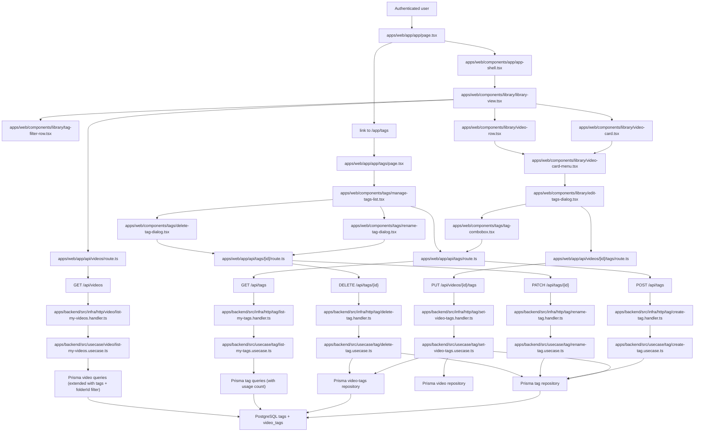

# Technical Specification: Tag Organization

## 1. Technical Overview

F06 introduces tag-based cross-classification on top of the F04 library: users create lowercase tags (1–40 characters, hyphens allowed, no spaces), apply 0 to 20 tags per video, and filter the library by one or more selected tags with OR semantics. A dedicated `/app/tags` "Manage tags" view lists every tag with its usage count and supports rename and delete. Tag application happens inline on each video's card menu and in the video detail header, while tag filter pills sit on the library header.

The backend extends the existing `Video` aggregate with a non-owning `tags` association via a new `Tag` aggregate and a join `video_tags` table, both scoped per user. Tags are created lazily as part of the apply flow (a "create or get" inline path on the apply endpoint and an explicit POST endpoint for the manage view), so the user never juggles a separate "create tag" step before assigning. Tag rename and delete propagate through the join table — rename updates the canonical row, delete removes the tag and cascades the join rows so videos lose only the association.

The web app keeps the F02 first-party Next.js Route Handler proxy pattern. New `/api/videos/[id]/tags` (PUT for the full tag set), `/api/tags` (GET list with usage count, POST create), and `/api/tags/[id]` (PATCH rename, DELETE) Route Handlers forward the authenticated `session_token` cookie to the backend. The library list endpoint (`GET /api/videos`) is extended with a `tags` query parameter and a `folderId` query parameter — `tags` is the user-selected OR set, `folderId` is the F-internal hook that F05 will populate later. The UI follows the Option B "Signal" dark references in `docs/design/design-system-pages/`.

**Included:**
- Tag creation with lowercase 1–40 character names; only `[a-z0-9-]` characters, must contain at least one non-hyphen character, may not start or end with a hyphen.
- A video accepts 0 to 20 tags; assigning a 21st tag is rejected.
- Tag application via PUT `/api/videos/{id}/tags` accepting the full desired tag set; partial-update verbs are not used so the client always sends the canonical set.
- Tag application UI: tag combobox in the video card menu ("Edit tags") and the video detail header. Combobox suggests existing tags and offers "Create tag '{name}'" inline when the typed name does not exist.
- Tag filter pill row on the library header showing every user tag (or recently used subset, see Decisions); clicking a pill toggles selection; "Clear tags" removes the entire selection.
- Library list extension: `GET /api/videos` accepts a `tags` query parameter (comma-separated tag IDs) applying OR-between-tags semantics, and a `folderId` query parameter that is combined with the tag selection using AND semantics. The `folderId` extension point is delivered by F06 with a test-only mechanism that lets the contract drive an "active folder filter" without depending on F05.
- Tag rename via PATCH `/api/tags/{id}`; the canonical tag row is renamed and every video that references it sees the new label.
- Tag delete via DELETE `/api/tags/{id}`; the tag is removed and the join rows that reference it are cascaded; videos remain.
- "Manage tags" view at `/app/tags` listing every tag for the authenticated user with its usage count, sorted alphabetically by tag name; rename and delete actions inline.
- Optimistic UI on apply/create: the new tag appears immediately in the combobox and on the card; the request is fired in the background and the UI reverts only on server failure.
- Up to 3 tags rendered inline on each video card; additional tags collapse into a `+N` indicator.
- Backend cascades: deleting a video (F04) cascades the `video_tags` join rows for that video; deleting a user (F12) cascades both the user's tags and the join rows.

**Deferred:**
- Tag autocomplete / fuzzy search beyond exact-prefix substring matching.
- Tag colors, icons, or per-tag descriptions.
- Tag aliases or merge.
- Bulk tag operations (apply tag X to N selected videos).
- Cross-user tag suggestions (tags are strictly per-user).
- Tag usage analytics beyond the per-tag video count exposed by Manage Tags.
- Real-time tag updates pushed to other open tabs.

**Traceability:**
- PRD Consumes drives the per-video tag association (id, title from F03) and the library filter integration with F04.
- PRD Capabilities drive tag creation rules, the 0–20 per-video limit, library-shared tag set, inline create-on-apply, rename and delete propagation, manage tags view, and the OR-between-tags + AND-with-folder filter semantics.
- PRD Experience drives the inline +3/+N card display, the tag combobox in the card menu and detail header, the filter pill row, optimistic UI, and the manage view layout.
- PRD Section 8 limits prerequisites to F02 authentication, F03 upload, and F04 library; F05 folders is explicitly outside this feature's dependency closure and is handled via the Preparation Pattern (a test-only `folderId` driver delivered by F06 itself).

## 2. Architecture Impact

F06 adds a tag slice (domain, use cases, infra) to the backend, extends the existing video list query to apply tag and folder filters, adds tag-related Next.js Route Handlers and UI components on the web app, and extends the library page to render tag filter pills. The F02 session boundary, the F03 upload boundary, and the F04 library boundary are preserved.



**Observed project patterns:**
- TypeScript on Node with npm workspaces; backend and web are separate workspaces.
- Frontend uses Next.js 16 App Router with React 19, Server Components by default, Tailwind CSS 4, Geist fonts, path alias `@/*`, and component-level `"use client"` for interactive widgets.
- Frontend backend access is routed through Next.js Route Handlers so cookies remain first-party on the web origin.
- Frontend automated tests use Vitest for component/business assertions; navigation-level checks use the `playwright-cli` skill against the project started via `./scripts/init.sh`.
- Frontend design uses Option B "Signal" dark references from `docs/design/design-system-pages/`.
- Backend uses Fastify 5, Prisma 5, Zod 3, TypeScript strict mode, Vitest, and explicit `HttpRoute` records (see `apps/backend/src/infra/http/video/video.routes.ts`).
- Backend follows clean architecture: `domain/` imports nothing outer, `usecase/` only inward, `infra/` adapts HTTP and persistence, and `src/main.ts` is the only composition root.
- `process.env` is read only in `apps/backend/src/config/env.ts`.
- Backend handlers validate input via request parser output, call one use case, map output to HTTP, and do not catch errors.
- Errors extend `AppError` from `apps/backend/src/domain/_shared/errors.ts` and map centrally through `apps/backend/src/infra/http/error-handler.ts`.
- Tests are colocated as `*.spec.ts`; external I/O uses named fake classes rather than inline stubs.
- Prisma migrations live under `apps/backend/prisma/migrations/`.
- Persistent contract state is declarative; concrete seed precedents are `apps/backend/scripts/seed-auth-contract.ts`, `apps/backend/scripts/seed-video-library-contract.ts`, and `apps/backend/scripts/seed-admin-contract.ts`.
- Static fixture convention is `tests/fixtures/<feature-slug>/`, established by F03 with `tests/fixtures/video-upload/` and reused by F04 (`tests/fixtures/video-library/`) and F12 (`tests/fixtures/admin-panel/`).
- Project quality gates are `npm run lint`, `npm run typecheck`, `npm run build`, `npm run test`, and `./scripts/run-gates.mjs`.

## 3. Technical Decisions

| Decision | Chosen Approach | Alternative Considered | Trade-off |
|---|---|---|---|
| Tag scope | Tags are scoped per user (each user has their own private tag namespace) | Global cross-user tag pool | Matches the PRD's "Tags are shared across the user's library (a tag exists once and is reused across many videos)" — "shared across the user's library" implies per-user shared, not cross-user. Per-user keeps single-user privacy intact and avoids name-collision concerns |
| Apply endpoint shape | Single PUT `/api/videos/{id}/tags` accepting the full canonical tag set, with inline create-or-get for any tag name not already present | Two endpoints (POST `/tags`, then PUT `/videos/{id}/tags` with IDs) or partial PATCH with add/remove arrays | Matches the PRD's optimistic inline create flow and matches the F04 PATCH `/api/videos/{id}` precedent of "client sends the new state". Inline create reduces round-trips so the optimistic UI works |
| Tag identity | Tags have a UUID `id` plus a normalized `name` unique per user; the client refers to tags by `id` for filter and assignment | Use the tag name as the natural key | UUIDs survive renames and decouple display from identity. The unique `(userId, name)` index enforces per-user uniqueness |
| Tag normalization | Names are lowercased, trimmed, and validated against `^[a-z0-9](?:[a-z0-9-]{0,38}[a-z0-9])?$` (1–40 chars, lowercase alphanumeric and hyphens, no leading/trailing hyphen, must contain at least one alphanumeric) | Allow uppercase and normalize on display, or allow leading/trailing hyphens | Matches PRD "lowercase enforced, no spaces (hyphens allowed)" and produces a canonical form whose display matches storage. Forbidding leading/trailing hyphens prevents `-` and `--` style placeholder names |
| Per-video tag cap | A video accepts 0 to 20 tags; PUT requests with > 20 tags are rejected with `too_many_video_tags` (HTTP 422) | Silently cap at 20 | Hard reject avoids silent data loss; matches F03/F04 pattern of explicit limit errors with the offending value in the message |
| Filter combination semantics | `tags` query (comma-separated tag IDs) → OR among the listed tags; `folderId` query (single ID or `unfiled`) → AND with the tag set; absence of either leaves that dimension unconstrained | All-AND semantics across tags | PRD explicitly says "OR semantics between selected tags, and AND with any active folder filter" |
| F05 folder integration | F06 ships the `folderId` query parameter, the AND filter logic, and a test-only mechanism that lets the contract assert the AND semantics without F05 being implemented (an env-driven test override that maps a known video to a synthetic folder ID). The production `folderId` value flows from F05 once F05 is implemented | Defer the folder AND semantics to F05's contract | F06's PRD AC "AND with an active folder filter" is owned by F06 (the AND combine is F06's filter logic). Per the dependency-closure rule, F06 cannot depend on F05; the Preparation Pattern lets F06 verify its own filter without F05 |
| Rename propagation | Rename updates the single `tags` row; videos see the new name immediately because they reference by id | Cascade-rewrite a denormalized name on every join row | Single row update is faster and avoids drift. The join table only stores ids |
| Delete propagation | DELETE removes the `tags` row; the `video_tags` join rows are removed via `ON DELETE CASCADE` on `tag_id`; videos and their other tags are untouched | Soft-delete with `deleted_at` | PRD says "removes it from every video; videos are not deleted" — a hard delete with cascade is the most direct read of that |
| Manage tags page route | New page at `/app/tags`; the library page links to it from the header | Inline manage view inside the library page | A separate route keeps the library uncluttered and matches the PRD's "Manage tags' view under the library" wording |
| Card pill render budget | Render up to 3 inline tag pills per card; collapse the rest into a `+N` indicator | Render every tag pill | PRD explicitly says "Video cards show up to 3 tags inline; additional tags are indicated with '+N'" |

**Assumptions and accepted recommendations (Auto-Accept Policy applied — F06 ran in Batch Mode):**
- F06 has neither a Core Scope nor a Full Scope additions block in the PRD; the entire feature is in scope. *(Auto-Accept policy row: "Scope (Core vs Core+Full, when both blocks exist)" — neither block exists, full scope assumed.)*
- The detected quality gates (`npm run lint`, `npm run typecheck`, `npm run build`, `npm run test`, `./scripts/run-gates.mjs`) are included unchanged in the behavior contract. *(Auto-Accept policy row: "Quality gates clarification (Step 2 — detected gates)" — auto-include every detected gate.)*
- The fixture path convention is `tests/fixtures/video-tags/`, following the established `tests/fixtures/<feature-slug>/` precedent set by F03 and reused by F04/F12. *(Auto-Accept policy row: "Empty codebase bootstrap" applied to fixture path discovery — but the project convention is non-empty here, so reuse is the rule.)*
- The persistent-state seeding mechanism for the F06 contract is a Node script `apps/backend/scripts/seed-tag-contract.ts`, mirroring the precedent of `seed-auth-contract.ts`, `seed-video-library-contract.ts`, and `seed-admin-contract.ts`. *(Reuse of discovered convention.)*
- Test configuration follows the existing `apps/backend/src/config/env.ts` discipline; no new env-only knobs are introduced for production behavior. The F06-scoped test-only override that simulates an "active folder filter" is read through the same env module, gated by an existing test environment marker. *(Reuse of discovered convention; new value documented in Configuration prerequisites.)*
- The "Manage tags" view shows usage count and supports rename + delete; tag detail (per-tag video list) is deferred — the user reaches a tag's videos by selecting that tag in the library filter pill row. *(Best-practice default for a vague PRD detail.)*
- The library tag filter pill row shows every tag the user has, sorted alphabetically; if the user has more than 20 tags the pill row scrolls horizontally. The PRD does not specify a cap, so the row is fully populated. *(Best-practice default for a vague PRD detail.)*
- Tags whose name collides with an existing tag on rename are rejected with `tag_already_exists` (HTTP 409); the client may then retry with a different name. *(Best-practice default; matches F02's `email_already_exists` precedent.)*
- Apply (PUT `/api/videos/{id}/tags`) accepts a `desiredTagSet` payload of `{ tagIds: string[], newTagNames: string[] }` where `newTagNames` are inline-created and `tagIds` reference existing tags; the server returns the resolved tag list (every entry as `{ id, name }`). *(Auto-Accept: design choice when PRD inline-create flow does not specify wire shape; chosen for explicit two-bucket semantics so the server never has to guess whether a string is an id or a name.)*
- A user attempting to apply a tag id that belongs to another user, or to rename/delete another user's tag, receives 404 `tag_not_found` (not 403) so tag IDs are not enumerable. *(Reuse of F04's "404 instead of 403 for ownership" decision.)*
- The library list endpoint accepts `tags` as a comma-separated list of tag IDs and `folderId` as a single string (`<uuid>` for a real folder, or the literal `unfiled` for the "Unfiled" partition). The `folderId` parameter is wired into F06's filter logic; F05 will populate it from its sidebar selection later. *(Preparation Pattern for F05.)*
- The F06-scoped test override that drives the `folderId` AND-with-tags assertion is named `LIBRARY_FILTER_FOLDER_OVERRIDE` and reads `videoId=folderId` mappings (semicolon-separated). When set, the `folderId` query parameter on `GET /api/videos` is interpreted against this synthetic mapping instead of consulting an absent `folders` table. *(Preparation Pattern; documented under Configuration prerequisites.)*
- The contract seed introduces fixed video, tag, and join state but does not need any media file fixtures — videos exist in `ready` status with stable internal storage paths but no real media is required to verify tag association/filter behavior. *(Best-practice default; smaller fixture footprint.)*
- The `video_tags` join table cascades on both `tag_id` and `video_id`; existing F04 video deletion already cascades on `video_id` so tag cleanup happens automatically when a video is deleted. *(Aligns with F04's documented downstream-cascade expectation.)*
- A tag's `created_at` and `updated_at` timestamps follow the existing `timestamptz` Prisma pattern.

## 4. Component Overview

**Frontend:**

| File Path | New/Modified | Purpose | Key Responsibilities |
|---|---|---|---|
| `apps/web/app/app/page.tsx` | Modified | Library entry page | Pass selected `tags` and the (test-driven) `folderId` query into the list fetch and into the tag filter row |
| `apps/web/app/app/tags/page.tsx` | New | Manage Tags page | Server-render the user's tags with usage count and mount the manage list |
| `apps/web/app/api/videos/route.ts` | Modified | Video list proxy | Forward `tags` and `folderId` query parameters in addition to the existing `sort` |
| `apps/web/app/api/videos/[id]/tags/route.ts` | New | Per-video tags proxy | Forward authenticated PUT `/api/videos/{id}/tags`, preserving cookies |
| `apps/web/app/api/tags/route.ts` | New | Tags collection proxy | Forward authenticated GET `/api/tags` (with usage count) and POST `/api/tags` |
| `apps/web/app/api/tags/[id]/route.ts` | New | Single-tag proxy | Forward authenticated PATCH and DELETE for a tag id |
| `apps/web/lib/tags-api.ts` | New | Browser tag API helpers | Type list/create/rename/delete tag plus apply tags to a video |
| `apps/web/lib/videos-api.ts` | Modified | Browser video API helpers | Add `tags` and `folderId` query parameters to the list helper |
| `apps/web/components/library/library-view.tsx` | Modified | Library top-level view | Mount the tag filter row and forward selected tag ids into list fetches |
| `apps/web/components/library/tag-filter-row.tsx` | New | Tag filter pills | Render every user tag as a pill, toggle selection, expose "Clear tags" when any are selected |
| `apps/web/components/library/video-card.tsx` | Modified | Grid card | Render up to 3 tag pills inline, collapse extra into a `+N` indicator |
| `apps/web/components/library/video-row.tsx` | Modified | List row | Render up to 3 tag pills inline, collapse extra into a `+N` indicator |
| `apps/web/components/library/video-card-menu.tsx` | Modified | Per-card actions | Add an "Edit tags" entry that opens the edit-tags dialog |
| `apps/web/components/library/edit-tags-dialog.tsx` | New | Edit tags dialog | Mount the tag combobox bound to a video; submit the resolved tag set with PUT |
| `apps/web/components/tags/tag-combobox.tsx` | New | Reusable tag combobox | Suggest existing tags, offer "Create tag '{name}'" inline when the typed name does not match, expose the chosen `tagIds` plus `newTagNames` |
| `apps/web/components/tags/manage-tags-list.tsx` | New | Manage tags list | Render every tag with name, usage count, and rename/delete actions; sorts alphabetically |
| `apps/web/components/tags/rename-tag-dialog.tsx` | New | Rename tag dialog | Validate name client-side, submit PATCH, surface server errors |
| `apps/web/components/tags/delete-tag-dialog.tsx` | New | Delete tag confirmation | Confirm "Delete tag '{name}'? It will be removed from N videos." and submit DELETE |
| `apps/web/components/library/library-view.test.tsx` | Modified | Library tests | Cover tag pill rendering, selection toggling, and clear-tags behavior |
| `apps/web/components/tags/manage-tags-list.test.tsx` | New | Manage list tests | Cover usage-count display, rename optimistic flow, and delete confirmation copy |
| `apps/web/components/tags/tag-combobox.test.tsx` | New | Combobox tests | Cover suggestion filtering, "Create tag '{name}'" affordance, and the `>20` selection cap |

**Backend:**

| File Path | New/Modified | Purpose | Key Responsibilities |
|---|---|---|---|
| `apps/backend/src/main.ts` | Modified | Composition root | Wire tag repository, queries, use cases, and handlers; register the new routes file |
| `apps/backend/src/domain/tag/tag.entity.ts` | New | Tag aggregate | Hold `id`, `userId`, `name`, timestamps; expose `rename` operation |
| `apps/backend/src/domain/tag/tag-name.vo.ts` | New | Tag name value object | Validate the lowercase 1–40 character / `[a-z0-9-]` rule with offending-value error message |
| `apps/backend/src/domain/tag/tag-id.vo.ts` | New | Tag id value object | UUID branded type for tag references |
| `apps/backend/src/domain/tag/tag.repository.ts` | New | Tag write interface | `findById`, `findByName`, `save`, `delete` |
| `apps/backend/src/domain/tag/tag.queries.ts` | New | Tag read interface | `listForUserWithUsage`, `findByIds` (used by apply use case to resolve incoming ids) |
| `apps/backend/src/domain/tag/video-tag.repository.ts` | New | Video-tag join write interface | `replaceTagsForVideo(videoId, tagIds)` and supporting cascades |
| `apps/backend/src/domain/tag/errors.ts` | New | Tag domain errors | `InvalidTagNameError` (400), `TagNotFoundError` (404), `TagAlreadyExistsError` (409), `TooManyVideoTagsError` (422) |
| `apps/backend/src/usecase/tag/list-my-tags.usecase.ts` | New | List use case | Return all tags owned by the actor with usage count, sorted alphabetically |
| `apps/backend/src/usecase/tag/list-my-tags.dto.ts` | New | List DTO | Define `actorId` input and `tags: { id, name, usageCount }[]` output |
| `apps/backend/src/usecase/tag/create-tag.usecase.ts` | New | Create use case | Validate the name, ensure uniqueness per user, persist the tag, return id+name |
| `apps/backend/src/usecase/tag/create-tag.dto.ts` | New | Create DTO | Define `actorId`, `name` input |
| `apps/backend/src/usecase/tag/rename-tag.usecase.ts` | New | Rename use case | Validate ownership, validate the new name, ensure no per-user collision, persist |
| `apps/backend/src/usecase/tag/rename-tag.dto.ts` | New | Rename DTO | Define `actorId`, `tagId`, `name` input |
| `apps/backend/src/usecase/tag/delete-tag.usecase.ts` | New | Delete use case | Validate ownership, delete the tag (cascading the join rows) |
| `apps/backend/src/usecase/tag/delete-tag.dto.ts` | New | Delete DTO | Define `actorId`, `tagId` input |
| `apps/backend/src/usecase/tag/set-video-tags.usecase.ts` | New | Apply tags use case | Validate video ownership, resolve `tagIds` to actor-owned tags, lazily create from `newTagNames`, enforce the 0–20 cap, replace the join set |
| `apps/backend/src/usecase/tag/set-video-tags.dto.ts` | New | Apply tags DTO | Define `actorId`, `videoId`, `tagIds`, `newTagNames` input and the resolved `tags` output |
| `apps/backend/src/usecase/video/list-my-videos.usecase.ts` | Modified | Library list use case | Forward `tags` and `folderId` filters to queries |
| `apps/backend/src/usecase/video/list-my-videos.dto.ts` | Modified | List DTO | Add `tagIds?: string[]` and `folderId?: string` fields |
| `apps/backend/src/infra/http/tag/list-my-tags.handler.ts` | New | GET tags handler | Resolve actor, call list use case, return `{ tags }` |
| `apps/backend/src/infra/http/tag/create-tag.handler.ts` | New | POST tags handler | Validate body, call create use case, return `{ tag }` |
| `apps/backend/src/infra/http/tag/rename-tag.handler.ts` | New | PATCH tag handler | Validate body, call rename use case, return `{ tag }` |
| `apps/backend/src/infra/http/tag/delete-tag.handler.ts` | New | DELETE tag handler | Resolve actor, call delete use case, return 204 |
| `apps/backend/src/infra/http/tag/set-video-tags.handler.ts` | New | PUT video tags handler | Validate body, call apply use case, return `{ tags }` |
| `apps/backend/src/infra/http/tag/tag.routes.ts` | New | Tag route registration | Register all five tag-related routes |
| `apps/backend/src/infra/http/index.ts` | Modified | Route composition | Include tag routes in the registered HTTP route set |
| `apps/backend/src/infra/http/error-handler.ts` | Modified | Error mapping | Map `InvalidTagNameError`, `TagNotFoundError`, `TagAlreadyExistsError`, and `TooManyVideoTagsError` |
| `apps/backend/src/infra/http/video/list-my-videos.handler.ts` | Modified | Video list handler | Parse `tags` and `folderId` query parameters, forward to use case |
| `apps/backend/src/infra/repository/tag/tag.prisma-repository.ts` | New | Tag persistence | Find/save/delete by id, find by `(userId, name)` |
| `apps/backend/src/infra/repository/tag/tag.in-memory-repository.ts` | New | Tag fake repository | Mirror semantics for use case tests |
| `apps/backend/src/infra/repository/tag/video-tag.prisma-repository.ts` | New | Join persistence | Replace tag set for a video atomically |
| `apps/backend/src/infra/repository/tag/video-tag.in-memory-repository.ts` | New | Join fake repository | Mirror semantics for use case tests |
| `apps/backend/src/infra/queries/tag/tag.prisma-queries.ts` | New | Tag read model | Return list with usage count via grouped count of `video_tags` |
| `apps/backend/src/infra/queries/tag/tag.in-memory-queries.ts` | New | Tag fake queries | Mirror semantics for handler tests |
| `apps/backend/src/infra/queries/video/video.prisma-queries.ts` | Modified | Video read model | Apply `tagIds` (OR via `IN`) and `folderId` (AND) filters; consult the F06 test override env value when present |
| `apps/backend/src/infra/queries/video/video.in-memory-queries.ts` | Modified | Video fake queries | Mirror the new filter arguments |
| `apps/backend/src/config/env.ts` | Modified | Env reader | Expose `LIBRARY_FILTER_FOLDER_OVERRIDE` parsing for tests |
| `apps/backend/scripts/seed-tag-contract.ts` | New | Contract seed | Provision `tag-user`, `other-tag-user`, fixed tags, and fixed videos with known tag associations |

**Database:**

| Migration File | Tables Affected | Operation | Notes |
|---|---|---|---|
| `apps/backend/prisma/migrations/<timestamp>_add_tags/migration.sql` | `tags`, `video_tags` | CREATE | Adds the per-user tag store and the many-to-many join table |
| `apps/backend/prisma/schema.prisma` | `User`, `Video`, `Tag`, `VideoTag` | Modified | Adds the `Tag` and `VideoTag` Prisma models, the `User.tags` relation, and the `Video.tags` relation |

## 5. API Contracts

All browser-facing routes live on the web origin under `/api/videos*` and `/api/tags*` and proxy to the equivalent backend routes while preserving the authenticated `session_token` cookie. Backend responses use JSON.

### Endpoint: List My Videos (extended)

- **Method:** GET
- **Backend Path:** `/api/videos`
- **Web Proxy Path:** `/api/videos`
- **Authentication:** Required session cookie

**Request:**

| Field | Type | Required | Validation | Description |
|---|---|---|---|---|
| `sort` (query) | `string` | No | `recent`/`oldest`/`title-asc`; unknown falls back to `recent` | (existing) Sort order |
| `tags` (query) | `string` | No | Comma-separated tag UUIDs; unknown values are ignored | Tag ids to filter by; OR semantics among the listed tags |
| `folderId` (query) | `string` | No | UUID or the literal `unfiled` | Folder filter combined with `tags` using AND. F05 will populate this from its sidebar; F06 ships the parameter and the AND filter logic. |

**Response (Success - 200):** unchanged from F04 except videos are filtered by the supplied tag and folder selection.

**Error Codes:**

| Code | HTTP Status | Description |
|---|---|---|
| `unauthenticated` | 401 | Missing or invalid session cookie |

### Endpoint: List My Tags

- **Method:** GET
- **Backend Path:** `/api/tags`
- **Web Proxy Path:** `/api/tags`
- **Authentication:** Required session cookie

**Response (Success - 200):**

| Field | Type | Description |
|---|---|---|
| `tags[].id` | `uuid` | Tag id |
| `tags[].name` | `string` | Tag name |
| `tags[].usageCount` | `integer` | Number of distinct videos owned by the actor that reference this tag |

```json
{
  "tags": [
    { "id": "770e8400-e29b-41d4-a716-446655440001", "name": "lecture", "usageCount": 7 },
    { "id": "770e8400-e29b-41d4-a716-446655440002", "name": "rnn", "usageCount": 3 }
  ]
}
```

**Error Codes:**

| Code | HTTP Status | Description |
|---|---|---|
| `unauthenticated` | 401 | Missing or invalid session cookie |

### Endpoint: Create Tag

- **Method:** POST
- **Backend Path:** `/api/tags`
- **Web Proxy Path:** `/api/tags`
- **Authentication:** Required session cookie

**Request:**

| Field | Type | Required | Validation | Description |
|---|---|---|---|---|
| `name` | `string` | Yes | lowercase 1–40 chars, matches `^[a-z0-9](?:[a-z0-9-]{0,38}[a-z0-9])?$` | Tag name |

```json
{ "name": "lecture" }
```

**Response (Success - 201):**

```json
{ "tag": { "id": "770e8400-e29b-41d4-a716-446655440001", "name": "lecture", "usageCount": 0 } }
```

**Error Codes:**

| Code | HTTP Status | Description |
|---|---|---|
| `unauthenticated` | 401 | Missing or invalid session cookie |
| `invalid_input` | 400 | Body shape invalid; message includes offending value and expected shape |
| `invalid_tag_name` | 400 | Name violates the lowercase-with-hyphen rule; message names the offending value and the allowed pattern |
| `tag_already_exists` | 409 | A tag with this name already exists for this user |

### Endpoint: Rename Tag

- **Method:** PATCH
- **Backend Path:** `/api/tags/{id}`
- **Web Proxy Path:** `/api/tags/{id}`
- **Authentication:** Required session cookie

**Request:**

| Field | Type | Required | Validation | Description |
|---|---|---|---|---|
| `name` | `string` | Yes | lowercase 1–40 chars, matches the canonical pattern | New tag name |

**Response (Success - 200):**

```json
{ "tag": { "id": "770e8400-e29b-41d4-a716-446655440001", "name": "lectures" } }
```

**Error Codes:**

| Code | HTTP Status | Description |
|---|---|---|
| `unauthenticated` | 401 | Missing or invalid session cookie |
| `invalid_input` | 400 | Body shape invalid |
| `invalid_tag_name` | 400 | New name violates the canonical pattern |
| `tag_not_found` | 404 | Tag does not exist or is not owned by the authenticated user |
| `tag_already_exists` | 409 | The new name is already taken by another tag for this user |

### Endpoint: Delete Tag

- **Method:** DELETE
- **Backend Path:** `/api/tags/{id}`
- **Web Proxy Path:** `/api/tags/{id}`
- **Authentication:** Required session cookie

**Request:** no body.

**Response (Success - 204):** empty body. The `tags` row is deleted and any `video_tags` rows referencing it are cascaded.

**Error Codes:**

| Code | HTTP Status | Description |
|---|---|---|
| `unauthenticated` | 401 | Missing or invalid session cookie |
| `tag_not_found` | 404 | Tag does not exist or is not owned by the authenticated user |

### Endpoint: Set Video Tags

- **Method:** PUT
- **Backend Path:** `/api/videos/{id}/tags`
- **Web Proxy Path:** `/api/videos/{id}/tags`
- **Authentication:** Required session cookie
- **Content Type:** `application/json`

**Request:**

| Field | Type | Required | Validation | Description |
|---|---|---|---|---|
| `tagIds` | `string[]` | Yes (may be empty) | Each entry a UUID belonging to an actor-owned tag | Existing tag ids to attach |
| `newTagNames` | `string[]` | Yes (may be empty) | Each entry passes the tag-name rule | Names of tags to inline-create-or-get and attach |

After resolution, the union of resolved tag ids must have between 0 and 20 entries (deduplicated). Order is irrelevant.

```json
{
  "tagIds": ["770e8400-e29b-41d4-a716-446655440001"],
  "newTagNames": ["draft"]
}
```

**Response (Success - 200):**

```json
{
  "tags": [
    { "id": "770e8400-e29b-41d4-a716-446655440001", "name": "lecture" },
    { "id": "770e8400-e29b-41d4-a716-446655440099", "name": "draft" }
  ]
}
```

**Error Codes:**

| Code | HTTP Status | Description |
|---|---|---|
| `unauthenticated` | 401 | Missing or invalid session cookie |
| `invalid_input` | 400 | Body shape invalid |
| `invalid_tag_name` | 400 | A `newTagNames` entry violates the canonical pattern |
| `video_not_found` | 404 | Video does not exist or is not owned by the authenticated user |
| `tag_not_found` | 404 | A `tagIds` entry does not exist or is not owned by the authenticated user |
| `too_many_video_tags` | 422 | The resolved tag set exceeds 20 entries; message names the offending count and the 20-tag cap |

## 6. Data Model

### Table: `tags`

| Column | Type | Nullable | Default | Description |
|---|---|---|---|---|
| `id` | `uuid` | No | - | Primary key |
| `user_id` | `uuid` | No | - | Owning user |
| `name` | `varchar(40)` | No | - | Lowercase canonical name; unique per user |
| `created_at` | `timestamptz` | No | `NOW()` | Creation timestamp |
| `updated_at` | `timestamptz` | No | `NOW()` | Last update |

**Indexes:**

| Index Name | Columns | Type | Purpose |
|---|---|---|---|
| `pk_tags` | `id` | btree (PK) | Primary lookup |
| `ux_tags_user_name` | `(user_id, name)` | btree (unique) | Per-user tag uniqueness |
| `ix_tags_user` | `user_id` | btree | List by user |

**Constraints:**

| Constraint | Type | Definition | Purpose |
|---|---|---|---|
| `pk_tags` | PRIMARY KEY | `id` | Identity |
| `fk_tags_user` | FOREIGN KEY | `user_id REFERENCES users(id) ON DELETE CASCADE` | Tags die with the user |
| `ux_tags_user_name` | UNIQUE | `(user_id, name)` | One tag per name per user |
| `ck_tags_name_format` | CHECK | `name ~ '^[a-z0-9](?:[a-z0-9-]{0,38}[a-z0-9])?$'` | DB-level guard for the canonical pattern |

### Table: `video_tags`

| Column | Type | Nullable | Default | Description |
|---|---|---|---|---|
| `video_id` | `uuid` | No | - | Video being tagged |
| `tag_id` | `uuid` | No | - | Tag applied |
| `created_at` | `timestamptz` | No | `NOW()` | Association timestamp |

**Indexes:**

| Index Name | Columns | Type | Purpose |
|---|---|---|---|
| `pk_video_tags` | `(video_id, tag_id)` | btree (PK) | Composite primary; prevents duplicates |
| `ix_video_tags_tag` | `tag_id` | btree | Reverse lookup (videos by tag) |

**Constraints:**

| Constraint | Type | Definition | Purpose |
|---|---|---|---|
| `pk_video_tags` | PRIMARY KEY | `(video_id, tag_id)` | One row per (video, tag) |
| `fk_video_tags_video` | FOREIGN KEY | `video_id REFERENCES videos(id) ON DELETE CASCADE` | Cleared when a video is deleted |
| `fk_video_tags_tag` | FOREIGN KEY | `tag_id REFERENCES tags(id) ON DELETE CASCADE` | Cleared when a tag is deleted |

**Prisma model shape:**

```prisma
model Tag {
  id        String     @id @db.Uuid
  userId    String     @map("user_id") @db.Uuid
  name      String     @db.VarChar(40)
  createdAt DateTime   @default(now()) @map("created_at") @db.Timestamptz
  updatedAt DateTime   @default(now()) @updatedAt @map("updated_at") @db.Timestamptz
  user      User       @relation(fields: [userId], references: [id], onDelete: Cascade)
  videoTags VideoTag[]

  @@unique([userId, name], map: "ux_tags_user_name")
  @@index([userId], map: "ix_tags_user")
  @@map("tags")
}

model VideoTag {
  videoId   String   @map("video_id") @db.Uuid
  tagId     String   @map("tag_id") @db.Uuid
  createdAt DateTime @default(now()) @map("created_at") @db.Timestamptz
  video     Video    @relation(fields: [videoId], references: [id], onDelete: Cascade)
  tag       Tag      @relation(fields: [tagId], references: [id], onDelete: Cascade)

  @@id([videoId, tagId], map: "pk_video_tags")
  @@index([tagId], map: "ix_video_tags_tag")
  @@map("video_tags")
}
```

**User and Video model additions:**

```prisma
model User {
  // existing fields...
  tags Tag[]
}

model Video {
  // existing fields...
  videoTags VideoTag[]
}
```

**Migration notes:**
- `ck_tags_name_format` constrains the canonical name pattern at the DB layer to align with the value object.
- `(user_id, name)` is unique to support inline create-or-get without race risk on the application layer (ON CONFLICT DO NOTHING fallback is acceptable).
- `video_tags` cascades both ways so deleting either side cleans up the join, completing the F04 forward-compatibility note.
- The migration backfills no rows; existing F02/F03/F04 users start with zero tags.

## 7. Testing Strategy

Backend tests remain colocated under `apps/backend/src/**` and use named fakes for repositories and queries.

**Domain tests:**
- `apps/backend/src/domain/tag/tag-name.vo.spec.ts`
  - `accepts_lowercase_alphanumeric`
  - `accepts_internal_hyphen`
  - `rejects_uppercase_with_offending_value`
  - `rejects_leading_hyphen_with_offending_value`
  - `rejects_trailing_hyphen_with_offending_value`
  - `rejects_space_with_offending_value`
  - `rejects_empty_with_offending_value`
  - `rejects_above_forty_characters`
- `apps/backend/src/domain/tag/tag.entity.spec.ts`
  - `creates_tag_with_normalized_name`
  - `renames_tag_to_new_valid_name`
  - `rejects_rename_to_invalid_name`

**Use case tests:**
- `apps/backend/src/usecase/tag/list-my-tags.usecase.spec.ts`
  - `returns_tags_sorted_alphabetically`
  - `includes_zero_usage_count_for_unused_tags`
  - `returns_only_actor_owned_tags`
- `apps/backend/src/usecase/tag/create-tag.usecase.spec.ts`
  - `creates_tag_for_actor`
  - `rejects_invalid_name`
  - `rejects_duplicate_name_for_same_user`
  - `allows_same_name_for_different_users`
- `apps/backend/src/usecase/tag/rename-tag.usecase.spec.ts`
  - `renames_actor_owned_tag`
  - `returns_not_found_when_actor_does_not_own_tag`
  - `rejects_collision_with_existing_tag_name`
- `apps/backend/src/usecase/tag/delete-tag.usecase.spec.ts`
  - `deletes_actor_owned_tag`
  - `returns_not_found_when_actor_does_not_own_tag`
- `apps/backend/src/usecase/tag/set-video-tags.usecase.spec.ts`
  - `replaces_video_tag_set_with_existing_tag_ids`
  - `inline_creates_new_tag_names_and_attaches`
  - `dedupes_resolved_tag_set`
  - `rejects_video_owned_by_another_user`
  - `rejects_tag_id_owned_by_another_user`
  - `rejects_resolved_set_above_twenty_with_offending_count`
  - `accepts_empty_set_to_clear_all_tags`
- `apps/backend/src/usecase/video/list-my-videos.usecase.spec.ts` (extended)
  - `applies_or_filter_across_multiple_tag_ids`
  - `applies_and_combination_with_folder_id`
  - `unknown_tag_ids_are_ignored`

**Infra tests:**
- `apps/backend/src/infra/repository/tag/tag.in-memory-repository.spec.ts`
  - `find_by_name_returns_match_for_user`
  - `find_by_name_does_not_match_other_user_tag`
  - `delete_removes_tag_and_signals_join_cascade`
- `apps/backend/src/infra/repository/tag/video-tag.in-memory-repository.spec.ts`
  - `replace_tags_for_video_writes_full_set`
  - `replace_tags_for_video_with_empty_set_clears_all`
- `apps/backend/src/infra/queries/tag/tag.in-memory-queries.spec.ts`
  - `list_for_user_with_usage_returns_distinct_video_count_per_tag`
- `apps/backend/src/infra/queries/video/video.in-memory-queries.spec.ts` (extended)
  - `applies_tag_id_or_filter`
  - `applies_folder_id_and_filter`
  - `applies_tag_or_combined_with_folder_and`
- `apps/backend/src/infra/http/tag/tag.routes.spec.ts`
  - `get_tags_returns_actor_owned_tags_with_usage_count`
  - `post_tags_creates_new_tag_with_canonical_name`
  - `post_tags_rejects_duplicate_per_user`
  - `patch_tag_renames_owned_tag`
  - `patch_tag_returns_404_for_other_users_tag`
  - `delete_tag_removes_tag_and_join_rows_cascade`
  - `delete_tag_returns_404_for_other_users_tag`
  - `put_video_tags_replaces_set`
  - `put_video_tags_rejects_resolved_set_above_twenty`
  - `put_video_tags_rejects_other_users_video_with_404`
- `apps/backend/src/infra/http/video/video.routes.spec.ts` (extended)
  - `get_videos_filters_by_tag_or`
  - `get_videos_filters_by_folder_id_using_test_override`
  - `get_videos_combines_tag_or_with_folder_and`

**Frontend tests:**
- `apps/web/lib/tags-api.test.ts`
  - `list_tags_includes_usage_count`
  - `create_tag_sends_post_with_name`
  - `rename_tag_sends_patch_with_name`
  - `delete_tag_sends_delete_request`
  - `set_video_tags_sends_put_with_resolved_buckets`
- `apps/web/lib/videos-api.test.ts` (extended)
  - `list_attaches_tags_query_parameter`
  - `list_attaches_folder_id_query_parameter`
- `apps/web/components/library/library-view.test.tsx` (extended)
  - `renders_tag_filter_pill_row`
  - `clicking_pill_toggles_selection_and_refetches_list`
  - `clear_tags_clears_pill_selection`
- `apps/web/components/library/video-card.test.tsx`
  - `renders_up_to_three_tag_pills_inline`
  - `collapses_extra_tags_into_plus_n_indicator`
- `apps/web/components/library/edit-tags-dialog.test.tsx`
  - `submits_resolved_tag_buckets_with_put`
  - `surfaces_too_many_video_tags_error_inline`
- `apps/web/components/tags/tag-combobox.test.tsx`
  - `suggests_existing_tags_with_substring_filter`
  - `offers_create_tag_for_unknown_input`
  - `prevents_selection_above_twenty_with_inline_message`
- `apps/web/components/tags/manage-tags-list.test.tsx`
  - `lists_every_tag_with_usage_count_alphabetically`
  - `rename_dialog_optimistically_updates_row`
  - `delete_dialog_confirms_with_video_count_text`

**Navigation verification with `playwright-cli`:**
- Start the project with `./scripts/init.sh`.
- Authenticate as `tag-user` through the UI.
- Visit `/app` and verify the seeded videos render with their tag pills, the filter pill row exposes every seeded tag, and clicking a pill filters the visible cards.
- Toggle two tag pills and verify the list shows the OR union of videos.
- Open a video card menu, choose "Edit tags", attach an existing tag plus inline-create a new one, and verify the card's pills update and the new tag appears in the filter row.
- Visit `/app/tags`, rename a tag, verify every card that uses it reflects the new name on reload.
- Delete a tag from `/app/tags`, verify it disappears from the filter row and from every card.

**Contract fixtures:**
- F06 does not require any binary fixtures; tag association/filter behavior is pure data. The F06 contract seed (`apps/backend/scripts/seed-tag-contract.ts`) creates videos in `ready` status without media playback requirements. The fixture path convention `tests/fixtures/video-tags/` is reserved for any small text fixtures the seed would need to load (currently none).
