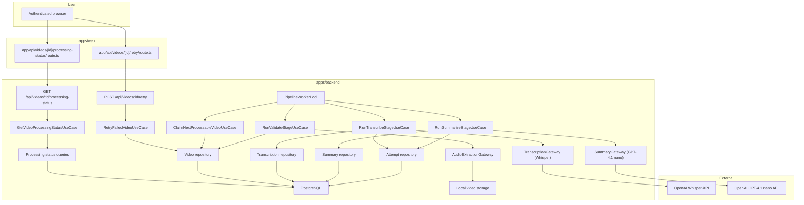

# Technical Specification: Background Processing Pipeline

## 1. Technical Overview

F07 owns the asynchronous backend pipeline that takes every video uploaded by F03 and drives it through `validate → transcribe → summarize → ready`, persisting transcription segments, a structured summary, and the per-stage status that downstream features (F04 library badge, F08 player, F09 search, F10 summary, F11 notifications) consume. The pipeline runs as long-lived in-process worker(s) inside the existing backend service: there is no external broker, no separate process, and no new runtime to deploy.

The backend remains the system of record. F07 introduces (a) a small set of new domain aggregates — `Transcription` (with ordered `TranscriptionSegment` value objects), `VideoSummary`, and `ProcessingAttempt` — alongside extensions to the existing `Video` aggregate that move it beyond `validating` into `transcribing`, `summarizing`, `ready`, and `failed`; (b) two new external gateways for OpenAI Whisper (audio transcription) and OpenAI GPT-4.1 nano (summary), each behind a domain interface so use cases are stack-agnostic; (c) a database-driven queue model (status + lease + heartbeat columns on `videos`) so worker crashes recover without a separate broker; (d) a `Worker` runtime that polls the queue, leases a video, runs a single stage, and either advances the status, re-queues for retry with the PRD-mandated backoff schedule (1m / 5m / 15m), or marks the video `failed`; (e) HTTP read endpoints for the per-video pipeline status (used by F04 and F11) and the wiring of the retry action introduced by F04 into a real pipeline restart.

Workers run in-process and are started by `src/main.ts` after the HTTP server is up; concurrency is bounded by a `WORKER_CONCURRENCY` env var (default 2). Each video's stages run sequentially; multiple videos can run in parallel up to the configured concurrency. The pipeline is idempotent at the stage level — re-running a stage either replaces the prior partial output (transcription, summary) or no-ops if the stage already succeeded — so worker crashes mid-stage simply re-enter the stage from the beginning per the PRD.

**Included:**
- New `transcription`, `transcription_segments`, `video_summaries`, and `processing_attempts` tables, plus extensions to `videos` (`current_stage`, `current_attempt`, `next_attempt_at`, `lease_owner`, `lease_expires_at`, `detected_language`).
- `Transcription` aggregate (with `TranscriptionSegment` VOs and detected language code), `VideoSummary` aggregate (overview + key topics list), and `ProcessingAttempt` aggregate (per-stage attempt log) in `apps/backend/src/domain/`.
- Extensions to the existing `Video` entity: `beginStage(stage)`, `recordTranscription()`, `recordSummary()`, `markReady()`, `recordAttemptFailure(reason)`, `scheduleRetry(at)`, `resetForUserRetry()`.
- New domain gateways: `AudioExtractionGateway` (extracts audio track for Whisper from the stored video), `TranscriptionGateway` (Whisper API adapter, returns segments + language), `SummaryGateway` (GPT-4.1 nano adapter, returns overview + key topics).
- New repositories and queries: `TranscriptionRepository`, `VideoSummaryRepository`, `ProcessingAttemptRepository`, `ProcessingStatusQueries` (read side surfacing per-video stage / attempt / retry-schedule / failure reason).
- Use cases: `RunValidateStageUseCase`, `RunTranscribeStageUseCase`, `RunSummarizeStageUseCase`, `ClaimNextProcessableVideoUseCase`, `RetryFailedVideoUseCase`, `GetVideoProcessingStatusUseCase`. F04 already exposes a no-op retry endpoint; F07 replaces its use case with `RetryFailedVideoUseCase`.
- Worker runtime: `PipelineWorker` (single concurrent slot — owns leasing, heartbeat, stage dispatch, retry scheduling) and `PipelineWorkerPool` (spawns N `PipelineWorker` instances per `WORKER_CONCURRENCY`). Workers start from `src/main.ts` after route registration.
- Backoff scheduler: a single `RetryScheduler` poller that wakes every `RETRY_POLL_INTERVAL_SECONDS` (default 30) and re-marks any video whose `next_attempt_at` has passed as eligible for the queue.
- HTTP routes: `GET /api/videos/:id/processing-status` (per-video stage / attempt / failureReason / retry schedule for F04 + F11 polling); the existing `POST /api/videos/:id/retry` is rewired through `RetryFailedVideoUseCase`.
- Fakes: `InMemoryTranscriptionGateway`, `InMemorySummaryGateway`, `InMemoryAudioExtractionGateway`, plus a `ManualClock` and a `FakePipelineWorker` driver so use case and worker tests are deterministic.
- Structured-JSON observability logs at every stage start / success / retry / final failure (`stage`, `videoId`, `attempt`, `nextAttemptAt`, `reason` when applicable).
- Crash recovery: lease expiry mechanism — a leased video whose `lease_expires_at` has passed is reclaimable by any worker; the previous in-flight stage re-enters from the beginning per the PRD.

**Deferred:**
- Real-time WebSocket / Server-Sent-Events status pushes — F11 polls the new `processing-status` endpoint on a short interval per its own scope.
- Cross-server worker coordination, distributed broker (Redis, SQS, RabbitMQ), or multi-instance backend deployment — single-instance, in-process workers are sufficient for the MVP per the PRD's single-user scope.
- Manual override of pipeline schedule (admin-triggered priority bump, pause, drain) — out of scope per PRD.
- Editing transcription segments or summary text — out of scope per PRD ("Manual editing of transcriptions or summaries").
- Multi-language summary prompts — the summary prompt is English-only; the Whisper-detected language is stored but does not change the prompt in this release.
- Cost / token-usage tracking — out of scope per PRD ("Admin metrics beyond total users and total videos").
- Retry of an individual stage without resetting the attempt counter — the user-facing retry always restarts the failed stage from attempt 1 per the PRD.

**Traceability:**
- PRD Consumes drives the input contract (video file path, duration, container format, file size, current processing status from F03).
- PRD Provides drives the new transcription / summary / status data exposed to F08, F09, F10, F11.
- PRD Capabilities drive the strict stage order, the validate-stage probe, the Whisper integration, the GPT-4.1 nano structured prompt, the 3-attempt retry with 1m/5m/15m backoff, the user-triggered retry that resets the attempt counter, and the configurable worker concurrency.
- PRD Experience drives the no-direct-user-interaction model, the real-time stage / attempt exposure (covered here at the data layer; UI consumption belongs to F04 and F11), the `Processing failed` final state with reason, and the `Retry` action.
- PRD Error Handling drives the validate-stage rejection reason, the transcribe-stage failure reason, the summarize-stage failure reason, the partial-success behavior (transcription kept, summary failed), and the worker-restart re-queue.
- PRD Section 8 limits prerequisites to F03 (and F02 transitively for authentication of the retry endpoint and the status read endpoint).

## 2. Architecture Impact

F07 adds a new server-side processing slice. The HTTP surface stays Fastify; the new runtime is the `PipelineWorkerPool` started by `src/main.ts`. The `Video` aggregate remains in `domain/video/`; new aggregates `Transcription`, `VideoSummary`, and `ProcessingAttempt` live in their own feature folders mirrored across domain, usecase, and infra.



**Observed project patterns (reused):**
- TypeScript on Node, npm workspaces, Fastify 5, Prisma 5, Zod 3, Vitest. Path alias `@/*` already in use.
- Backend follows clean architecture: `domain/` <- `usecase/` <- `infra/`; `src/main.ts` is the only composition root; `process.env` is read only in `src/config/env.ts`.
- Errors extend `AppError` and map centrally through `apps/backend/src/infra/http/error-handler.ts`.
- Tests are colocated as `*.spec.ts`; external I/O uses named fake classes (e.g., `FfmpegMediaMetadataGateway` paired with the existing F03 fakes pattern).
- Persistent contract state convention: Prisma + a TypeScript seed script per feature contract under `apps/backend/scripts/seed-<feature>-contract.ts` (precedent: `seed-auth-contract.ts`).
- Static fixture path convention: `tests/fixtures/<feature-kebab>/` (precedent: `tests/fixtures/video-upload/`); F07 uses `tests/fixtures/background-processing-pipeline/`.
- Test runtime configuration convention: backend reads through `apps/backend/.env` plus the documented test override pattern in F02/F03/F04 contracts; no `.env.test` exists and none is introduced.
- External-dependency mock convention: domain gateways with named in-memory fakes colocated under `apps/backend/src/infra/gateway/<provider>-<concept>.gateway.ts` plus a `*.spec.ts` companion (precedent: `local-video-storage.gateway.spec.ts`, `ffmpeg-thumbnail.gateway.spec.ts`).
- Project quality gates are `npm run lint`, `npm run typecheck`, `npm run build`, `npm run test`, and `./scripts/run-gates.mjs`.

## 3. Technical Decisions

| Decision | Chosen Approach | Alternative Considered | Trade-off |
|---|---|---|---|
| Queue substrate | Database-driven queue: a `videos.current_stage` + `next_attempt_at` + `lease_owner` + `lease_expires_at` columns polled by in-process workers. | External broker (Redis BullMQ, SQS, RabbitMQ). | Zero new infrastructure for the MVP and fits the single-instance backend assumption; cost is poll latency (bounded by `RETRY_POLL_INTERVAL_SECONDS`, default 30s) and contention via row-level `SELECT ... FOR UPDATE SKIP LOCKED` semantics. |
| Worker runtime location | In-process workers started by `src/main.ts` after route registration, lifecycle bound to the backend process. | Separate worker process / container. | One deploy unit; simpler local dev (`./scripts/init.sh` already starts the backend). Worker CPU competes with HTTP traffic — acceptable for the MVP's expected single-user load. |
| Worker concurrency | `WORKER_CONCURRENCY` env var (default 2); each worker holds at most one video at a time; per-video stages strictly sequential. | Fixed concurrency of 1 (simpler) or unbounded. | 2 is a conservative default that lets one Whisper call overlap with one summary call without saturating the OpenAI account; user-overridable via env. |
| Stage retry scheduling | `next_attempt_at` column polled by a `RetryScheduler` every `RETRY_POLL_INTERVAL_SECONDS` (default 30s); after a stage failure the use case writes `next_attempt_at = now + backoff(attempt)` where the backoff schedule is exactly 60s / 300s / 900s. | In-process `setTimeout` per video. | DB-driven scheduling survives crashes; `setTimeout` would be lost on restart and is incompatible with the PRD's "worker restart re-queues in-flight video" criterion. |
| Crash recovery | Each claimed video carries a `lease_owner` (worker ID) and `lease_expires_at` (now + `LEASE_TTL_SECONDS`, default 600). A worker periodically renews the lease via heartbeat (`HEARTBEAT_INTERVAL_SECONDS`, default 60); if the worker dies, lease expires and another worker can reclaim. | Crash-detection via process supervisor only. | Lease + heartbeat detect mid-stage worker death even when the process restarts cleanly; reclaim re-enters the failed stage from the beginning per PRD. |
| Whisper API choice | `audio.transcriptions` endpoint with `response_format=verbose_json`, `model=whisper-1`, no `language` parameter (auto-detect). The response's `segments[]` (with `start`, `end`, `text`) and top-level `language` (ISO 639-1) map directly to `TranscriptionSegment` and the detected language column. | `text` response format (no segment timestamps). | `verbose_json` is the only Whisper format that returns the segment timestamps required by F08 click-to-seek; trade-off is a slightly larger response payload. |
| Whisper input format | Audio extracted from the original video into a single OGG/Opus file via FFmpeg, mono, 16kHz, max ~25MB to stay under the Whisper per-request limit. | Send original video file directly. | Whisper accepts video containers but strict 25MB request limit; extracting audio guarantees we stay under the limit for 2-hour videos. |
| Summary structured-output strategy | GPT-4.1 nano (`gpt-4.1-nano`) `chat.completions` with `response_format: { type: "json_schema", json_schema: { strict: true, schema: { overview: string, key_topics: array<string> } } }` and a system prompt instructing English summarization. The use case validates the response with Zod before persisting. | Free-form prompt + post-hoc parsing. | Structured outputs guarantees the response shape and avoids brittle regex parsing; trade-off is dependence on the structured-outputs feature being enabled for `gpt-4.1-nano`. |
| Stage-level idempotency | Re-entering a stage truncates the prior partial output for that stage (transcription rows for `transcribe`; summary row for `summarize`) before running. The `validate` stage is naturally idempotent. | Append-on-retry. | Matches PRD ("re-enters the current stage from the beginning") and prevents duplicate segments. |
| User retry semantics | `POST /api/videos/:id/retry` is owned by F07's `RetryFailedVideoUseCase`: validates the actor owns a `failed` video, clears `failureReason`, resets `current_attempt = 0`, sets `current_stage` back to the failed stage, and writes `next_attempt_at = now()` so the next poller pickup runs immediately. | Restart from `validate` always. | Matches PRD ("re-enters the failed stage from the beginning"); the failed stage is preserved on the row. |
| Status read surface | `GET /api/videos/:id/processing-status` returns `{ stage, attempt, nextAttemptAt, failureReason, status }`. F04's existing `GET /api/videos` continues to return the existing status field for the badge; F11 polls the new endpoint per video for finer-grained updates. | Embed everything into `GET /api/videos`. | Keeps F04's library list cheap; F11's polling targets only watched videos and gets richer fields. |
| Observability | Structured JSON via `req.log` for HTTP routes and a dedicated `PipelineLogger` for worker stages, both writing one log line per significant transition (start/success/retry/final-failure). | Console output. | Matches the project's "structured JSON for observability" rule; unifies log shape for downstream tooling. |

**Assumptions and accepted recommendations:**
- F07 has no Core Scope / Full Scope split; the entire feature definition is in scope (Auto-Accept).
- The detected quality gates (`npm run lint`, `npm run typecheck`, `npm run build`, `npm run test`, `./scripts/run-gates.mjs`) are included unchanged in the contract.
- OpenAI Whisper and OpenAI GPT-4.1 nano are NEW external dependencies (no prior usage in the codebase). Auto-accepted; documented under contract `External dependencies` and mocked at the gateway boundary for tests.
- Whisper API choice: `audio.transcriptions` with `verbose_json` to get per-segment timestamps and the detected language code (the only response format that returns both).
- Summary structured-output: JSON schema with `{ overview: string, key_topics: string[] }`; English-only system prompt for the MVP.
- Worker concurrency default: 2 (env-overridable via `WORKER_CONCURRENCY`).
- Backoff schedule: exactly `60s, 300s, 900s` for attempts 1, 2, 3 — fixed by the PRD.
- Lease TTL default: 600s; heartbeat interval default: 60s.
- Retry-poll interval default: 30s.
- Audio extraction format: OGG/Opus, mono, 16kHz, target ≤25MB to fit Whisper's per-request limit.
- The retry endpoint shape follows the existing video routes convention: `POST /api/videos/:id/retry` (the F04 spec already declared this endpoint as a no-op; F07 rewires its use case).
- New env vars: `OPENAI_API_KEY`, `WHISPER_MODEL` (default `whisper-1`), `SUMMARY_MODEL` (default `gpt-4.1-nano`), `WORKER_CONCURRENCY`, `RETRY_POLL_INTERVAL_SECONDS`, `LEASE_TTL_SECONDS`, `HEARTBEAT_INTERVAL_SECONDS`, `AUDIO_EXTRACT_MAX_MB`.
- Static-fixture convention reused from F03: `tests/fixtures/background-processing-pipeline/` is established for F07's audio/transcription/summary fixtures.
- Persistent-state seeding convention reused from F03: a TypeScript seed script `apps/backend/scripts/seed-pipeline-contract.ts` provisions contract users and pre-staged videos.
- Test config convention reused: backend tests read `apps/backend/.env` (no separate `.env.test`); the `OPENAI_API_KEY` env var is set to `test-fake` and is honored by the in-memory gateway when `NODE_ENV !== "production"` so tests never touch the real OpenAI service.
- F07 provides a deterministic fake-mode for both Whisper and GPT-4.1 nano gateways (env flag `OPENAI_USE_FAKE=1`) so contract items run without network access.
- F07 status read (`GET /api/videos/:id/processing-status`) is exposed under the existing video route prefix and reuses the F02 session middleware.

## 4. Component Overview

**Frontend:**

| File Path | New/Modified | Purpose | Key Responsibilities |
|---|---|---|---|
| `apps/web/app/api/videos/[id]/processing-status/route.ts` | New | Status proxy | Forward authenticated `GET /api/videos/{id}/processing-status` to the backend, preserving cookies |
| `apps/web/app/api/videos/[id]/retry/route.ts` | Modified (existed via F04) | Retry proxy | Continues to forward `POST /api/videos/{id}/retry` to the backend; backend behavior is now real |
| `apps/web/lib/videos-api.ts` | Modified | API client types | Add `ProcessingStatus` type and `getProcessingStatus(videoId)` helper for F11 polling |

**Backend:**

| File Path | New/Modified | Purpose | Key Responsibilities |
|---|---|---|---|
| `apps/backend/src/config/env.ts` | Modified | Runtime configuration | Add `OPENAI_API_KEY`, `WHISPER_MODEL`, `SUMMARY_MODEL`, `WORKER_CONCURRENCY`, `RETRY_POLL_INTERVAL_SECONDS`, `LEASE_TTL_SECONDS`, `HEARTBEAT_INTERVAL_SECONDS`, `AUDIO_EXTRACT_MAX_MB`, `OPENAI_USE_FAKE` |
| `apps/backend/src/main.ts` | Modified | Composition root | Wire new repositories, queries, gateways, use cases, status route, and start the `PipelineWorkerPool` after route registration |
| `apps/backend/src/domain/video/video.entity.ts` | Modified | Video aggregate extension | Add `beginStage`, `recordTranscription`, `recordSummary`, `markReady`, `recordAttemptFailure`, `scheduleRetry`, `resetForUserRetry`, `claim`, `releaseLease`, plus state guards |
| `apps/backend/src/domain/video/video-status.vo.ts` | Modified | Status VO extension | Add `transcribing`, `summarizing`, `ready` factory methods and the corresponding state-transition guards |
| `apps/backend/src/domain/video/processing-stage.vo.ts` | New | Stage VO | Validate the `validate` / `transcribe` / `summarize` / `done` enum; expose `next()` and `isTerminal()` |
| `apps/backend/src/domain/video/video.repository.ts` | Modified | Repository interface | Add `claimNextProcessable(workerId, leaseUntil)`, `findByLease(workerId)`, `findDueForRetry(now)`, `releaseLease(id)` |
| `apps/backend/src/domain/transcription/transcription.entity.ts` | New | Transcription aggregate | Hold ordered `TranscriptionSegment[]` and the detected language code; immutable after `complete()` |
| `apps/backend/src/domain/transcription/transcription-segment.vo.ts` | New | Segment VO | Validate `startSeconds <= endSeconds`, non-empty text |
| `apps/backend/src/domain/transcription/detected-language.vo.ts` | New | Language VO | Validate ISO 639-1 code (or `null` when Whisper returns nothing recognizable) |
| `apps/backend/src/domain/transcription/transcription.repository.ts` | New | Transcription repo interface | `findByVideoId`, `replaceForVideo` (idempotent stage re-entry) |
| `apps/backend/src/domain/transcription/errors.ts` | New | Transcription errors | `InvalidTranscriptionSegmentError`, `EmptyTranscriptionError` |
| `apps/backend/src/domain/video-summary/video-summary.entity.ts` | New | Summary aggregate | Hold `overview` and ordered `keyTopics[]` |
| `apps/backend/src/domain/video-summary/video-summary.repository.ts` | New | Summary repo interface | `findByVideoId`, `replaceForVideo` |
| `apps/backend/src/domain/video-summary/errors.ts` | New | Summary errors | `InvalidSummaryError`, `MalformedSummaryResponseError` |
| `apps/backend/src/domain/processing-attempt/processing-attempt.entity.ts` | New | Attempt aggregate | Per-stage attempt record with `attemptNumber`, `outcome`, `failureReason`, `startedAt`, `endedAt` |
| `apps/backend/src/domain/processing-attempt/processing-attempt.repository.ts` | New | Attempt repo interface | `append`, `countForVideoStage` |
| `apps/backend/src/domain/processing-attempt/errors.ts` | New | Attempt errors | `InvalidAttemptOutcomeError` |
| `apps/backend/src/domain/video/audio-extraction.gateway.ts` | New | Audio gateway interface | Extract a Whisper-ready audio file from a stored video; return path + size |
| `apps/backend/src/domain/video/transcription.gateway.ts` | New | Transcription gateway interface | `transcribe(audioPath)` returns `{ segments, language }` |
| `apps/backend/src/domain/video/summary.gateway.ts` | New | Summary gateway interface | `summarize(transcriptionText)` returns `{ overview, keyTopics }` |
| `apps/backend/src/domain/video/errors.ts` | Modified | Pipeline errors | Add `VideoNotFailedError`, `VideoNotProcessableError`, `LeaseNotHeldError`, `TranscriptionServiceUnavailableError`, `SummaryGenerationFailedError`, `AudioExtractionFailedError`, `InvalidStageTransitionError` |
| `apps/backend/src/usecase/pipeline/claim-next-processable-video.usecase.ts` | New | Worker pickup | Atomically claim the next eligible video (status in pipeline + `next_attempt_at <= now` + lease expired or null), set `lease_owner` and `lease_expires_at` |
| `apps/backend/src/usecase/pipeline/run-validate-stage.usecase.ts` | New | Validate stage | Probe duration / readability / extract audio; advance stage to `transcribing` on success, mark `failed` on >2h or unreadable |
| `apps/backend/src/usecase/pipeline/run-transcribe-stage.usecase.ts` | New | Transcribe stage | Call `TranscriptionGateway`, persist `Transcription`, advance to `summarizing` on success; on failure record attempt + schedule retry or mark failed |
| `apps/backend/src/usecase/pipeline/run-summarize-stage.usecase.ts` | New | Summarize stage | Call `SummaryGateway`, persist `VideoSummary`, advance to `ready` on success; on failure record attempt + schedule retry or mark failed (transcription preserved) |
| `apps/backend/src/usecase/pipeline/retry-failed-video.usecase.ts` | New | User-triggered retry | Validate ownership + `failed` status, clear `failureReason`, reset `current_attempt = 0`, requeue at the failed stage |
| `apps/backend/src/usecase/pipeline/get-video-processing-status.usecase.ts` | New | Status read | Validate ownership, return `{ stage, status, attempt, nextAttemptAt, failureReason, detectedLanguage }` |
| `apps/backend/src/usecase/pipeline/*.dto.ts` | New | DTOs for the above | Input/output types per use case |
| `apps/backend/src/usecase/pipeline/*.spec.ts` | New | Use case tests | Cover happy path, retry-with-backoff, terminal failure, lease semantics, partial-success transcription preservation |
| `apps/backend/src/infra/repository/transcription/transcription.prisma-repository.ts` | New | Persistence | Replace-on-write strategy for transcription + segments |
| `apps/backend/src/infra/repository/transcription/transcription.in-memory-repository.ts` | New | Fake | In-memory implementation for tests |
| `apps/backend/src/infra/repository/transcription/transcription.mapper.ts` | New | Mapper | Aggregate ↔ Prisma rows |
| `apps/backend/src/infra/repository/video-summary/video-summary.prisma-repository.ts` | New | Persistence | Upsert summary row per video |
| `apps/backend/src/infra/repository/video-summary/video-summary.in-memory-repository.ts` | New | Fake | In-memory implementation |
| `apps/backend/src/infra/repository/video-summary/video-summary.mapper.ts` | New | Mapper | Aggregate ↔ Prisma row |
| `apps/backend/src/infra/repository/processing-attempt/processing-attempt.prisma-repository.ts` | New | Persistence | Append-only attempt log |
| `apps/backend/src/infra/repository/processing-attempt/processing-attempt.in-memory-repository.ts` | New | Fake | In-memory implementation |
| `apps/backend/src/infra/repository/video/video.prisma-repository.ts` | Modified | Persistence extension | Implement new claim / lease / due-for-retry methods using `SELECT ... FOR UPDATE SKIP LOCKED` |
| `apps/backend/src/infra/repository/video/video.in-memory-repository.ts` | Modified | Fake extension | Implement the new methods deterministically for tests |
| `apps/backend/src/infra/queries/processing-status/processing-status.prisma-queries.ts` | New | Read model | Cheap status snapshot for the HTTP read endpoint |
| `apps/backend/src/infra/queries/processing-status/processing-status.in-memory-queries.ts` | New | Fake | In-memory queries |
| `apps/backend/src/infra/gateway/ffmpeg-audio-extraction.gateway.ts` | New | FFmpeg adapter | Extract OGG/Opus mono 16kHz audio under the size cap |
| `apps/backend/src/infra/gateway/openai-whisper-transcription.gateway.ts` | New | Whisper adapter | Call `audio.transcriptions` with `verbose_json`, parse segments + language; throws `TranscriptionServiceUnavailableError` on provider error |
| `apps/backend/src/infra/gateway/openai-summary.gateway.ts` | New | GPT-4.1 nano adapter | Call `chat.completions` with structured-output JSON schema, parse with Zod |
| `apps/backend/src/infra/gateway/in-memory-transcription.gateway.ts` | New | Fake | Deterministic transcription fixture for tests / fake-mode |
| `apps/backend/src/infra/gateway/in-memory-summary.gateway.ts` | New | Fake | Deterministic summary fixture for tests / fake-mode |
| `apps/backend/src/infra/gateway/in-memory-audio-extraction.gateway.ts` | New | Fake | No-op audio gateway for tests |
| `apps/backend/src/infra/gateway/*.spec.ts` | New | Gateway tests | One spec per new gateway covering happy path + provider error |
| `apps/backend/src/infra/worker/pipeline-worker.ts` | New | Worker runtime | Owns one slot: claim video, dispatch stage use case, heartbeat, release lease |
| `apps/backend/src/infra/worker/pipeline-worker-pool.ts` | New | Worker pool | Spawns N workers per `WORKER_CONCURRENCY`, exposes `start()` / `stop()` |
| `apps/backend/src/infra/worker/retry-scheduler.ts` | New | Backoff poller | Periodically wakes due-for-retry videos so the next worker pickup is immediate |
| `apps/backend/src/infra/worker/clock.ts` | New | Clock interface + system impl | Inject a clock so tests can use `ManualClock` for deterministic backoff verification |
| `apps/backend/src/infra/worker/pipeline-logger.ts` | New | Structured logger | One JSON entry per stage start / success / retry / final failure |
| `apps/backend/src/infra/worker/*.spec.ts` | New | Worker tests | Cover lease, heartbeat, crash recovery (via `ManualClock`), pool concurrency |
| `apps/backend/src/infra/http/pipeline/get-processing-status.handler.ts` | New | Status handler | Auth + parse `:id`, call use case, map output |
| `apps/backend/src/infra/http/pipeline/retry-failed-video.handler.ts` | New | Retry handler (replaces F04 no-op) | Auth + parse `:id`, call `RetryFailedVideoUseCase`, return updated status |
| `apps/backend/src/infra/http/pipeline/pipeline.routes.ts` | New | Routes | Register `GET /api/videos/:id/processing-status` and rewire `POST /api/videos/:id/retry` |
| `apps/backend/src/infra/http/pipeline/pipeline.routes.spec.ts` | New | Route tests | Auth, ownership, happy path, error mapping |
| `apps/backend/src/infra/http/error-handler.ts` | Modified | Error mapping | Map new pipeline errors to HTTP responses |
| `apps/backend/scripts/seed-pipeline-contract.ts` | New | Contract seed | Provision pipeline contract users and pre-staged videos in each PRD-relevant state |

**Database:**

| Migration File | Tables Affected | Operation | Notes |
|---|---|---|---|
| `apps/backend/prisma/migrations/<timestamp>_add_pipeline/migration.sql` | `videos`, `transcriptions`, `transcription_segments`, `video_summaries`, `processing_attempts` | ALTER + CREATE | Adds queue/lease columns to `videos`, creates the three new tables |
| `apps/backend/prisma/schema.prisma` | `Video`, `Transcription`, `TranscriptionSegment`, `VideoSummary`, `ProcessingAttempt` | Modified | Adds the new models and their relations |

## 5. API Contracts

All browser-facing routes live on the web origin under `/api/videos/[id]/...` and proxy to equivalent backend routes while preserving the authenticated `session_token` cookie.

### Endpoint: Get Processing Status

- **Method:** GET
- **Backend Path:** `/api/videos/:id/processing-status`
- **Web Proxy Path:** `/api/videos/{id}/processing-status`
- **Authentication:** Required session cookie

**Request:** no body.

**Response (Success - 200):**

| Field | Type | Description |
|---|---|---|
| `status` | `string` | One of `validating`, `transcribing`, `summarizing`, `ready`, `failed` |
| `stage` | `string` or `null` | Current stage (`validate`, `transcribe`, `summarize`, `done`); `null` once `status === "ready"` |
| `attempt` | `integer` | Attempts completed for the current stage (0 when not yet started) |
| `nextAttemptAt` | `string` or `null` | ISO timestamp of the scheduled next pickup; `null` when not waiting on a retry |
| `failureReason` | `string` or `null` | Populated when `status === "failed"` |
| `detectedLanguage` | `string` or `null` | ISO 639-1 code populated after the transcribe stage succeeds |

**Response Example:**

```json
{
  "status": "transcribing",
  "stage": "transcribe",
  "attempt": 1,
  "nextAttemptAt": "2026-05-02T22:01:00.000Z",
  "failureReason": null,
  "detectedLanguage": null
}
```

**Error Codes:**

| Code | HTTP Status | Description |
|---|---|---|
| `unauthenticated` | 401 | Missing or invalid session cookie |
| `video_not_found` | 404 | The id does not exist or does not belong to the actor |

### Endpoint: Retry Failed Video

- **Method:** POST
- **Backend Path:** `/api/videos/:id/retry`
- **Web Proxy Path:** `/api/videos/{id}/retry`
- **Authentication:** Required session cookie

**Request:** no body.

**Response (Success - 200):**

| Field | Type | Description |
|---|---|---|
| `status` | `string` | New status (`validating`, `transcribing`, or `summarizing` — whichever stage was failed) |
| `stage` | `string` | The stage that will run on the next worker pickup |
| `attempt` | `integer` | Always `0` after retry |
| `nextAttemptAt` | `string` | ISO timestamp; effectively now |
| `failureReason` | `null` | Cleared on retry |

**Response Example:**

```json
{
  "status": "transcribing",
  "stage": "transcribe",
  "attempt": 0,
  "nextAttemptAt": "2026-05-02T22:00:00.000Z",
  "failureReason": null
}
```

**Error Codes:**

| Code | HTTP Status | Description |
|---|---|---|
| `unauthenticated` | 401 | Missing or invalid session cookie |
| `video_not_found` | 404 | The id does not exist or does not belong to the actor |
| `video_not_failed` | 409 | The target video is not in `failed` status; nothing to retry |

## 6. Data Model

### Table: `videos` (extended)

| Column | Type | Nullable | Default | Description |
|---|---|---|---|---|
| `current_stage` | `varchar(20)` | Yes | `'validate'` | One of `validate`, `transcribe`, `summarize`, `done`; `null` not used (default to `validate` on row creation) |
| `current_attempt` | `integer` | No | `0` | Attempts completed for the current stage (0 = not yet started) |
| `next_attempt_at` | `timestamptz` | Yes | `NOW()` | When the next worker pickup may happen; `NULL` when not eligible |
| `lease_owner` | `varchar(64)` | Yes | `NULL` | Worker ID currently holding the row |
| `lease_expires_at` | `timestamptz` | Yes | `NULL` | When the lease becomes reclaimable |
| `detected_language` | `varchar(8)` | Yes | `NULL` | ISO 639-1 code populated after transcribe |

**Indexes (added):**

| Index Name | Columns | Type | Purpose |
|---|---|---|---|
| `ix_videos_pipeline_pickup` | `next_attempt_at`, `current_stage`, `status` | btree | Worker pickup query without table scan |
| `ix_videos_lease_owner` | `lease_owner` | btree | Worker reclaim / heartbeat queries |

**Constraints (added):**

| Constraint | Type | Definition | Purpose |
|---|---|---|---|
| `ck_videos_current_stage` | CHECK | `current_stage IN ('validate', 'transcribe', 'summarize', 'done')` | Stage vocabulary safety |
| `ck_videos_current_attempt_range` | CHECK | `current_attempt >= 0 AND current_attempt <= 3` | Bounded by PRD retry budget |
| `ck_videos_lease_pair` | CHECK | `(lease_owner IS NULL AND lease_expires_at IS NULL) OR (lease_owner IS NOT NULL AND lease_expires_at IS NOT NULL)` | Lease columns move together |

### Table: `transcriptions`

| Column | Type | Nullable | Default | Description |
|---|---|---|---|---|
| `id` | `uuid` | No | generated in domain | Primary key |
| `video_id` | `uuid` | No | - | FK to `videos.id`, unique (one transcription per video) |
| `detected_language` | `varchar(8)` | Yes | `NULL` | ISO 639-1 code returned by Whisper |
| `created_at` | `timestamptz` | No | `NOW()` | When the transcription was persisted |
| `updated_at` | `timestamptz` | No | `NOW()` | Last replacement timestamp (idempotent re-entry rewrites) |

**Indexes:**

| Index Name | Columns | Type | Purpose |
|---|---|---|---|
| `ux_transcriptions_video` | `video_id` | unique btree | One transcription per video |

**Constraints:**

| Constraint | Type | Definition | Purpose |
|---|---|---|---|
| `pk_transcriptions` | PRIMARY KEY | `id` | Unique identifier |
| `fk_transcriptions_video` | FOREIGN KEY | `video_id REFERENCES videos(id) ON DELETE CASCADE` | Cascade delete with video |

### Table: `transcription_segments`

| Column | Type | Nullable | Default | Description |
|---|---|---|---|---|
| `id` | `uuid` | No | generated in domain | Primary key |
| `transcription_id` | `uuid` | No | - | FK to `transcriptions.id` |
| `segment_index` | `integer` | No | - | 0-based ordering within the transcription |
| `start_seconds` | `numeric(12,3)` | No | - | Segment start (seconds) |
| `end_seconds` | `numeric(12,3)` | No | - | Segment end (seconds) |
| `text` | `text` | No | - | Segment text |

**Indexes:**

| Index Name | Columns | Type | Purpose |
|---|---|---|---|
| `ix_segments_tx_index` | `transcription_id`, `segment_index` | btree | Stable iteration order |
| `ux_segments_tx_index` | `transcription_id`, `segment_index` | unique btree | Prevent duplicate ordinals |

**Constraints:**

| Constraint | Type | Definition | Purpose |
|---|---|---|---|
| `pk_segments` | PRIMARY KEY | `id` | Unique identifier |
| `fk_segments_tx` | FOREIGN KEY | `transcription_id REFERENCES transcriptions(id) ON DELETE CASCADE` | Cascade with transcription |
| `ck_segments_range` | CHECK | `start_seconds >= 0 AND end_seconds >= start_seconds` | Range sanity |
| `ck_segments_text_nonempty` | CHECK | `length(trim(text)) > 0` | No empty segments |

### Table: `video_summaries`

| Column | Type | Nullable | Default | Description |
|---|---|---|---|---|
| `id` | `uuid` | No | generated in domain | Primary key |
| `video_id` | `uuid` | No | - | FK to `videos.id`, unique (one summary per video) |
| `overview` | `text` | No | - | Plain-text overview paragraph |
| `key_topics` | `jsonb` | No | `'[]'::jsonb` | Ordered array of strings |
| `created_at` | `timestamptz` | No | `NOW()` | When the summary was persisted |
| `updated_at` | `timestamptz` | No | `NOW()` | Last replacement timestamp |

**Indexes:**

| Index Name | Columns | Type | Purpose |
|---|---|---|---|
| `ux_summaries_video` | `video_id` | unique btree | One summary per video |

**Constraints:**

| Constraint | Type | Definition | Purpose |
|---|---|---|---|
| `pk_summaries` | PRIMARY KEY | `id` | Unique identifier |
| `fk_summaries_video` | FOREIGN KEY | `video_id REFERENCES videos(id) ON DELETE CASCADE` | Cascade with video |
| `ck_summaries_overview_nonempty` | CHECK | `length(trim(overview)) > 0` | No empty overview |

### Table: `processing_attempts`

| Column | Type | Nullable | Default | Description |
|---|---|---|---|---|
| `id` | `uuid` | No | generated in domain | Primary key |
| `video_id` | `uuid` | No | - | FK to `videos.id` |
| `stage` | `varchar(20)` | No | - | `validate`, `transcribe`, or `summarize` |
| `attempt_number` | `integer` | No | - | 1-indexed within the stage's current cycle (a user retry resets and starts at 1 again) |
| `outcome` | `varchar(16)` | No | - | `succeeded`, `failed`, or `transient_failed` |
| `failure_reason` | `text` | Yes | `NULL` | Populated for `failed`/`transient_failed` outcomes |
| `started_at` | `timestamptz` | No | `NOW()` | Stage execution start |
| `ended_at` | `timestamptz` | Yes | `NULL` | Set when the attempt concludes |

**Indexes:**

| Index Name | Columns | Type | Purpose |
|---|---|---|---|
| `ix_attempts_video_stage` | `video_id`, `stage`, `started_at` | btree | Per-video / per-stage lookup |

**Constraints:**

| Constraint | Type | Definition | Purpose |
|---|---|---|---|
| `pk_attempts` | PRIMARY KEY | `id` | Unique identifier |
| `fk_attempts_video` | FOREIGN KEY | `video_id REFERENCES videos(id) ON DELETE CASCADE` | Cascade with video |
| `ck_attempts_outcome` | CHECK | `outcome IN ('succeeded', 'failed', 'transient_failed')` | Outcome vocabulary |
| `ck_attempts_stage` | CHECK | `stage IN ('validate', 'transcribe', 'summarize')` | Stage vocabulary |
| `ck_attempts_number_range` | CHECK | `attempt_number >= 1 AND attempt_number <= 3` | Bounded by retry budget |

**Migration notes:**
- Use `NUMERIC(12,3)` for second-precision timestamps (already established by F03).
- Use `JSONB` for `key_topics` (Postgres-native; SQLite portability is not required for F07's worker storage).
- Worker pickup query uses `SELECT ... FOR UPDATE SKIP LOCKED` against `videos` to safely claim with multiple workers.
- Cascading deletes from `videos` keep cleanup atomic when F04 deletes a video.

### Prisma model excerpts

```prisma
model Video {
  // ... existing F03/F04 fields ...
  currentStage     String?  @default("validate") @map("current_stage") @db.VarChar(20)
  currentAttempt   Int      @default(0) @map("current_attempt")
  nextAttemptAt    DateTime? @default(now()) @map("next_attempt_at") @db.Timestamptz
  leaseOwner       String?  @map("lease_owner") @db.VarChar(64)
  leaseExpiresAt   DateTime? @map("lease_expires_at") @db.Timestamptz
  detectedLanguage String?  @map("detected_language") @db.VarChar(8)
  transcription    Transcription?
  summary          VideoSummary?
  attempts         ProcessingAttempt[]
}

model Transcription {
  id               String   @id @db.Uuid
  videoId          String   @unique @map("video_id") @db.Uuid
  detectedLanguage String?  @map("detected_language") @db.VarChar(8)
  createdAt        DateTime @default(now()) @map("created_at") @db.Timestamptz
  updatedAt        DateTime @default(now()) @updatedAt @map("updated_at") @db.Timestamptz
  video            Video    @relation(fields: [videoId], references: [id], onDelete: Cascade)
  segments         TranscriptionSegment[]

  @@map("transcriptions")
}

model TranscriptionSegment {
  id              String   @id @db.Uuid
  transcriptionId String   @map("transcription_id") @db.Uuid
  segmentIndex    Int      @map("segment_index")
  startSeconds    Decimal  @map("start_seconds") @db.Decimal(12, 3)
  endSeconds      Decimal  @map("end_seconds") @db.Decimal(12, 3)
  text            String
  transcription   Transcription @relation(fields: [transcriptionId], references: [id], onDelete: Cascade)

  @@unique([transcriptionId, segmentIndex], map: "ux_segments_tx_index")
  @@index([transcriptionId, segmentIndex], map: "ix_segments_tx_index")
  @@map("transcription_segments")
}

model VideoSummary {
  id        String   @id @db.Uuid
  videoId   String   @unique @map("video_id") @db.Uuid
  overview  String
  keyTopics Json     @default("[]") @map("key_topics")
  createdAt DateTime @default(now()) @map("created_at") @db.Timestamptz
  updatedAt DateTime @default(now()) @updatedAt @map("updated_at") @db.Timestamptz
  video     Video    @relation(fields: [videoId], references: [id], onDelete: Cascade)

  @@map("video_summaries")
}

model ProcessingAttempt {
  id            String   @id @db.Uuid
  videoId       String   @map("video_id") @db.Uuid
  stage         String   @db.VarChar(20)
  attemptNumber Int      @map("attempt_number")
  outcome       String   @db.VarChar(16)
  failureReason String?  @map("failure_reason")
  startedAt     DateTime @default(now()) @map("started_at") @db.Timestamptz
  endedAt       DateTime? @map("ended_at") @db.Timestamptz
  video         Video    @relation(fields: [videoId], references: [id], onDelete: Cascade)

  @@index([videoId, stage, startedAt], map: "ix_attempts_video_stage")
  @@map("processing_attempts")
}
```

## 7. Testing Strategy

Backend tests are colocated as `*.spec.ts`. External I/O uses named in-memory fakes; the worker time loop uses an injected `Clock` so tests are deterministic.

**Domain tests:**
- `apps/backend/src/domain/transcription/transcription.entity.spec.ts`
  - `creates_transcription_with_ordered_segments`
  - `rejects_transcription_with_overlapping_segments`
  - `replaces_segments_idempotently_on_re_entry`
- `apps/backend/src/domain/transcription/transcription-segment.vo.spec.ts`
  - `accepts_valid_range_and_text`
  - `rejects_negative_start`
  - `rejects_end_before_start`
  - `rejects_empty_text`
- `apps/backend/src/domain/transcription/detected-language.vo.spec.ts`
  - `accepts_iso_639_1_codes`
  - `accepts_null`
  - `rejects_invalid_codes_with_offending_value`
- `apps/backend/src/domain/video-summary/video-summary.entity.spec.ts`
  - `creates_summary_with_overview_and_topics`
  - `rejects_empty_overview`
  - `preserves_topic_order`
- `apps/backend/src/domain/processing-attempt/processing-attempt.entity.spec.ts`
  - `records_succeeded_attempt`
  - `records_failed_attempt_with_reason`
- `apps/backend/src/domain/video/processing-stage.vo.spec.ts`
  - `accepts_known_stages`
  - `next_returns_subsequent_stage`
  - `rejects_unknown_stage_with_offending_value`
- `apps/backend/src/domain/video/video.entity.spec.ts` (extended)
  - `begin_stage_advances_status`
  - `record_attempt_failure_increments_counter`
  - `schedule_retry_sets_next_attempt_at`
  - `reset_for_user_retry_clears_failure_and_attempts`
  - `mark_ready_only_after_summarize`

**Use case tests (pipeline):**
- `apps/backend/src/usecase/pipeline/run-validate-stage.usecase.spec.ts`
  - `validates_supported_video_and_extracts_audio`
  - `marks_failed_when_duration_exceeds_limit`
  - `marks_failed_when_audio_unreadable`
  - `transitions_status_to_transcribing_on_success`
- `apps/backend/src/usecase/pipeline/run-transcribe-stage.usecase.spec.ts`
  - `persists_transcription_segments_and_language`
  - `transitions_status_to_summarizing_on_success`
  - `schedules_retry_with_one_minute_backoff_on_first_failure`
  - `schedules_retry_with_five_minute_backoff_on_second_failure`
  - `schedules_retry_with_fifteen_minute_backoff_on_third_failure`
  - `marks_failed_with_reason_after_third_attempt`
  - `replaces_prior_partial_transcription_on_re_entry`
- `apps/backend/src/usecase/pipeline/run-summarize-stage.usecase.spec.ts`
  - `persists_overview_and_key_topics`
  - `transitions_status_to_ready_on_success`
  - `keeps_transcription_when_summary_fails_finally`
  - `marks_failed_with_summary_reason_after_third_attempt`
- `apps/backend/src/usecase/pipeline/claim-next-processable-video.usecase.spec.ts`
  - `claims_due_video_with_no_lease`
  - `skips_videos_with_active_lease`
  - `reclaims_videos_with_expired_lease`
  - `does_not_claim_videos_whose_next_attempt_at_is_future`
- `apps/backend/src/usecase/pipeline/retry-failed-video.usecase.spec.ts`
  - `resets_failed_video_to_failed_stage_with_attempt_zero`
  - `rejects_retry_on_non_failed_video`
  - `rejects_retry_for_other_users_video_with_not_found`
- `apps/backend/src/usecase/pipeline/get-video-processing-status.usecase.spec.ts`
  - `returns_current_stage_attempt_and_schedule`
  - `returns_failure_reason_when_failed`
  - `rejects_for_other_users_video_with_not_found`

**Infra tests:**
- `apps/backend/src/infra/repository/transcription/transcription.mapper.spec.ts`
- `apps/backend/src/infra/repository/transcription/transcription.in-memory-repository.spec.ts`
- `apps/backend/src/infra/repository/video-summary/video-summary.mapper.spec.ts`
- `apps/backend/src/infra/repository/video-summary/video-summary.in-memory-repository.spec.ts`
- `apps/backend/src/infra/repository/processing-attempt/processing-attempt.in-memory-repository.spec.ts`
- `apps/backend/src/infra/repository/video/video.prisma-repository.spec.ts` (claim / lease / due-for-retry semantics)
- `apps/backend/src/infra/queries/processing-status/processing-status.in-memory-queries.spec.ts`
- `apps/backend/src/infra/gateway/openai-whisper-transcription.gateway.spec.ts` (uses a stub OpenAI client; verifies request shape, segment parsing, language parsing, error mapping)
- `apps/backend/src/infra/gateway/openai-summary.gateway.spec.ts` (uses a stub OpenAI client; verifies structured-output schema, parsing, error mapping)
- `apps/backend/src/infra/gateway/ffmpeg-audio-extraction.gateway.spec.ts` (verifies command shape against a fake spawn)
- `apps/backend/src/infra/gateway/in-memory-transcription.gateway.spec.ts`
- `apps/backend/src/infra/gateway/in-memory-summary.gateway.spec.ts`
- `apps/backend/src/infra/worker/pipeline-worker.spec.ts`
  - `runs_validate_then_transcribe_then_summarize_for_a_fresh_video`
  - `releases_lease_after_each_stage`
  - `does_not_advance_when_stage_use_case_throws`
- `apps/backend/src/infra/worker/pipeline-worker-pool.spec.ts`
  - `spawns_configured_concurrency`
  - `processes_distinct_videos_in_parallel`
  - `recovers_from_worker_crash_via_lease_expiry`
- `apps/backend/src/infra/worker/retry-scheduler.spec.ts`
  - `wakes_videos_whose_next_attempt_at_has_passed`
  - `does_not_wake_videos_with_future_schedule`
- `apps/backend/src/infra/http/pipeline/pipeline.routes.spec.ts`
  - `status_requires_authenticated_session`
  - `status_returns_current_stage_attempt_and_schedule`
  - `status_rejects_other_users_video_with_404`
  - `retry_requires_authenticated_session`
  - `retry_succeeds_for_failed_video`
  - `retry_rejects_non_failed_video_with_409`
  - `retry_rejects_other_users_video_with_404`

**Frontend tests:**
- `apps/web/lib/videos-api.test.ts` (extended)
  - `parses_processing_status_response`
  - `surfaces_processing_status_error_codes`

**Navigation verification with `playwright-cli`:**
- Start the project with `./scripts/init.sh`.
- Authenticate as a seeded `pipeline-user`.
- Confirm a freshly uploaded video transitions through the stages by polling `/api/videos/{id}/processing-status` (the UI consumption belongs to F04/F11; the navigation check exercises the data plane only).
- Trigger a retry on a seeded `failed` video and confirm the status endpoint reports `attempt: 0` and the previously failed stage as the current stage.

**Contract fixtures:**
- `tests/fixtures/background-processing-pipeline/short-clip.mp4` — a small valid MP4 the in-memory fakes treat as the canonical input for end-to-end pipeline runs.
- `tests/fixtures/background-processing-pipeline/unreadable-audio.mp4` — a video whose audio extraction is driven into a deterministic failure via the fake audio-extraction gateway.
- `tests/fixtures/background-processing-pipeline/whisper-segments.json` — canonical segments + language Whisper response used by the in-memory transcription fake.
- `tests/fixtures/background-processing-pipeline/summary-response.json` — canonical structured GPT response used by the in-memory summary fake.
