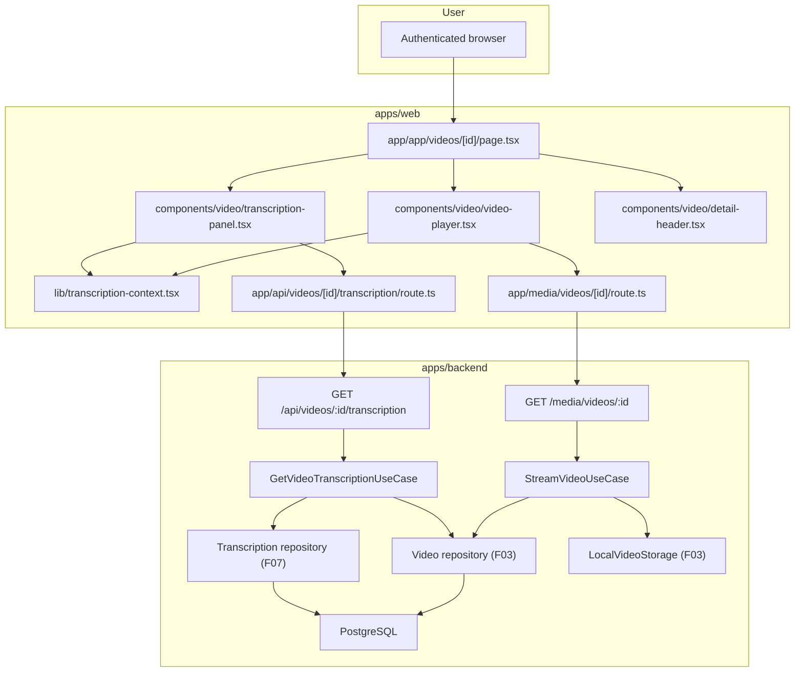

# Technical Specification: Video Player with Transcription Panel

## 1. Technical Overview

F08 owns the video detail page at `/app/videos/{id}`: the three-region layout (video player on the left, transcription panel on the right, summary slot below the player), the actual video player with its full control surface (play/pause, seek, volume, fullscreen, playback-speed menu, keyboard shortcuts), the transcription panel that lists every Whisper-produced segment with click-to-seek, the playhead-driven highlight + auto-scroll behavior with a manual-scroll suspend rule, the detected-language label, the processing-stage placeholder for still-processing videos, and the inline title / description / folder / tags / delete / retry header that wraps the player.

The detail page is a Next.js authenticated route inside the existing `apps/web/app/app/` segment, mirroring the conventions established by F04 (`apps/web/app/app/page.tsx`) and the auth pattern that gates every `/app/*` route by the `session_token` cookie. The video itself is streamed from the backend through a new authenticated proxy under `/media/videos/{id}` so the `<video>` element sees a same-origin URL while the original file remains owned by the F03 storage root. The transcription is fetched from a new backend read endpoint `GET /api/videos/{id}/transcription` that returns the persisted F07 segments (each with `startSeconds`, `endSeconds`, `text`, plus the segment ordinal) and the detected language code; the same endpoint also surfaces the current pipeline stage so the panel can render the processing placeholder without a second round-trip. The player itself is the browser's native HTMLMediaElement controlled by a small client component; F08 does not introduce a player library.

F08 builds two reusable interfaces that downstream features (F09 search, F10 summary) plug into without F08 depending on either:
- A **rendered transcription panel** that exposes the segment list and current playhead position via a typed React context; F09 renders its own search input and overlays match highlights on this panel.
- A **seek controller** — the same context exposes a `seekTo(seconds)` function backed by the player ref so F09's match-jump button and any other consumer can drive the playhead from outside the player component.

The summary block beneath the player is a layout slot only; F10 owns the rendered content. F08 reserves the slot with a stable container element and exports it as a typed prop / slot interface; F10's content rendering is verified by F10's own contract.

**Included:**
- New Next.js authenticated detail route at `/app/videos/{id}` (`apps/web/app/app/videos/[id]/page.tsx`) and its loading / not-found boundaries, gated by the existing session middleware.
- New page-level layout component that arranges the player, transcription panel, summary slot, and detail header in the documented three-region structure with responsive breakpoints (~60% / ~40% on wide screens, stacked on narrow).
- `<VideoPlayer>` client component wrapping the native `<video>` element with controls for play/pause, seek bar (with current/total time), volume + mute, fullscreen, and a playback-speed menu (`0.5x`, `0.75x`, `1x`, `1.25x`, `1.5x`, `2x`); supports keyboard shortcuts when the player area has focus (space toggles play, ArrowLeft/ArrowRight seek ±5s).
- `<TranscriptionPanel>` client component listing every segment with `MM:SS` start time + segment text, click-to-seek, current-segment highlight, auto-scroll-to-center, manual-scroll suspend / resume rules, and a small detected-language label near the panel title.
- `<ProcessingPlaceholder>` rendered inside the panel when the video is not yet `ready`, showing the current pipeline stage and the message "Transcription will appear here when processing completes".
- `<DetailHeader>` rendering title (click-to-rename inline, F04-compatible), description (click-to-edit modal, F04-compatible), current folder (display only at this stage; F05 owns the assign/edit flow), tag list (display only; F06 owns the assign/edit flow), delete action (F04-owned use case), and retry action (F07-owned use case, visible only when `status = "failed"`).
- `<TranscriptionContext>` provider that exposes `{ segments, currentSegmentIndex, detectedLanguage, seekTo(seconds) }` to descendants — this is the typed surface F09 will plug into.
- Backend HTTP route `GET /api/videos/:id/transcription` returning the persisted transcription segments (ordered, one transcription per video) plus the detected language code and the current processing stage (so the panel can branch on still-processing videos in a single round-trip).
- Backend HTTP route `GET /media/videos/:id` streaming the original video file with HTTP `Range` support so the browser `<video>` element can seek without downloading the full file; returns `404` when the video is not owned by the actor.
- Backend `GetVideoTranscriptionUseCase` validating the actor owns the video and reading the persisted transcription via the existing `TranscriptionRepository` from F07; returns the transcription state plus the current stage when the video is still processing.
- Backend `StreamVideoUseCase` validating the actor owns the video and producing a Range-honouring stream descriptor consumed by the streaming handler; the file is read through the existing F03 `LocalVideoStorage` gateway interface.
- Web API proxies `app/api/videos/[id]/transcription/route.ts` and `app/media/videos/[id]/route.ts` forwarding cookies and `Range` headers to the backend while preserving response status, body, and `Content-Range` / `Accept-Ranges` headers.
- Web client helper `getVideoTranscription(videoId)` in `apps/web/lib/videos-api.ts` typed against the new endpoint shape.
- Frontend persistent-state preservation: when the user navigates between `/app/videos/{id}` and the library, the transcription panel scroll position and player playhead are not preserved across visits; that scoping is documented and matches the PRD ("page reloads start from the beginning").
- Subjective visual identity (HubSpot-inspired minimalism per the existing F01/F04 design system) tracked as a manual-review contract item.

**Deferred:**
- In-video transcription search (F09) — F08 exposes the `<TranscriptionContext>` it consumes; the search input, match counter, debounce, and highlight overlay belong to F09.
- AI summary section content rendering (F10) — F08 reserves the layout slot; the `<SummaryBlock>` component is F10's deliverable.
- In-app processing notifications panel (F11) — F08 does not embed it; F11 mounts itself globally on every authenticated page.
- Picture-in-picture, AirPlay / Cast, captions / subtitles UI, chapter markers, multi-track audio — out of scope per PRD.
- Editable transcription segments — out of scope per PRD ("Manual editing of transcriptions or summaries").
- Downloadable transcription / video — out of scope per PRD.
- Mobile-specific gestures (swipe to seek, pinch to zoom) — out of scope per PRD ("web-only in this release").
- Persistent per-user playback preferences (default volume, default speed) — out of scope; the player resets defaults on every visit.

**Traceability:**
- PRD Consumes drives the input contract: F03 video file path (consumed via the new authenticated stream proxy), F07 transcription segments + detected language code (consumed via the new transcription read endpoint).
- PRD Provides drives the public interfaces F08 exports for F09: the rendered transcription panel and the seek controller, both surfaced through `<TranscriptionContext>`.
- PRD Capabilities drive the three-region layout, the player control set, the segment list shape, the click-to-seek behavior, the highlight + auto-scroll behavior, the keyboard shortcuts, the playback-speed menu, the processing placeholder, and the detected-language label.
- PRD Experience drives the lazy video load (browser-native streaming), the panel's own scroll container, the manual-scroll suspend / resume rule, and the focus-gated keyboard shortcuts.
- PRD Section 8 limits the dependency closure to F03 (video file + ownership) and F07 (transcription + status), with F02 reachable transitively for authentication.

## 2. Architecture Impact

F08 adds a new client-rendered detail page on the web app and two new authenticated read surfaces on the backend. The transcription endpoint is a thin read-side use case over the F07 `TranscriptionRepository`; the video stream endpoint is a thin read-side use case over the F03 `LocalVideoStorage` gateway with HTTP Range handling added at the Fastify reply layer.



**Observed project patterns (reused):**
- TypeScript on Node, npm workspaces, Fastify 5, Prisma 5, Zod 3, Vitest. Path alias `@/*` already in use across both apps.
- Backend follows clean architecture (`domain/` <- `usecase/` <- `infra/`); `src/main.ts` is the only composition root; `process.env` is read only in `src/config/env.ts`.
- Errors extend `AppError` and map centrally through `apps/backend/src/infra/http/error-handler.ts`.
- Tests are colocated as `*.spec.ts`; external I/O uses named fake classes (e.g., `LocalVideoStorage`, `InMemoryTranscriptionRepository`).
- Existing media-streaming pattern: `apps/backend/src/infra/http/media/media.routes.ts` already serves `/media/thumbnails/:filename` through an authenticated handler — F08's video stream route reuses the same routing module.
- Existing web proxy pattern: `apps/web/app/media/thumbnails/[filename]/route.ts` already forwards cookies and `cache-control` between Next.js and the backend — F08's stream and transcription proxies follow the same shape, extended to forward `Range` and respond with `Content-Range`.
- Existing detail-page-style routing pattern: F12 admin uses dynamic Next.js segments under `apps/web/app/admin/`; F08 mirrors that structure under `apps/web/app/app/videos/[id]/`.
- Persistent contract state convention: Prisma + a TypeScript seed script per feature contract under `apps/backend/scripts/seed-<feature>-contract.ts` (precedent: `seed-pipeline-contract.ts`, `seed-video-library-contract.ts`); F08 adds `seed-video-player-contract.ts`.
- Static fixture path convention: `tests/fixtures/<feature-kebab>/` (precedent: `tests/fixtures/background-processing-pipeline/`); F08 uses `tests/fixtures/video-player-transcription-panel/`.
- Test runtime configuration convention: backend reads `apps/backend/.env`; no `.env.test` is introduced (precedent: F02 / F03 / F04 / F07).
- Quality gates (auto-detected from the project): `npm run lint`, `npm run typecheck`, `npm run build`, `npm run test`, and `./scripts/run-gates.mjs` (consolidating wrapper for backend architecture gates).

## 3. Technical Decisions

| Decision | Chosen Approach | Alternative Considered | Trade-off |
|---|---|---|---|
| Player implementation | Browser-native `<video>` element wrapped by a thin React client component that owns custom controls (play / pause, seek bar, volume, fullscreen, playback speed). | Embed a third-party player library (Video.js, Plyr, react-player). | Zero new runtime dependency; full control over the visual identity; native HTMLMediaElement covers every PRD-required control. Trade-off: F08 owns the per-control implementation rather than inheriting battle-tested edge-case handling. |
| Video delivery | Authenticated backend route `GET /media/videos/:id` streaming the original file with HTTP `Range` support, proxied by `apps/web/app/media/videos/[id]/route.ts`. | Generate a pre-signed temporary URL pointing directly at storage. | Files live on local disk owned by the backend process — there is no signed-URL provider. The proxied route reuses the existing F02 session cookie and the F03 ownership rule without any new auth surface. |
| Range support | Fastify response with `Accept-Ranges: bytes`, parses the inbound `Range: bytes=start-end` header, returns `206 Partial Content` with `Content-Range` and the requested slice; falls back to `200` when no `Range` header is present. | Always stream the full file. | Native `<video>` seeking only works correctly when the server honours Range; the PRD calls out "playback can start before the full file is buffered" and seek behavior. |
| Transcription endpoint shape | Single `GET /api/videos/:id/transcription` returning `{ status, stage, detectedLanguage, segments: [{ index, startSeconds, endSeconds, text }] }`; the `segments` array is empty when the video is not yet `ready`. | Two endpoints (one for status, one for transcription). | One round-trip for the page, simpler client cache. The status field is duplicated with F07's `/api/videos/:id/processing-status` endpoint by design — that endpoint is polling-oriented (used by F11), this one is page-load-oriented. |
| Page rendering strategy | Server component fetches the transcription on the server (using the request cookie) and hydrates the client components with the segments + detected language; the player and panel are client components because they need refs, event handlers, and animation. | Pure client-side fetching after mount. | Server-side fetch shows the transcription on first paint (no spinner flash) for `ready` videos and avoids a client-side waterfall. |
| Click-to-seek + currentSegmentIndex | The player component emits `timeupdate` events into `<TranscriptionContext>`; the context computes `currentSegmentIndex` by binary-searching the sorted `segments` array on each tick (debounced to ~100 ms). The transcription panel subscribes via `useTranscriptionContext()`. | Recompute the index in every component that needs it. | Single source of truth; F09 reuses the same context to know which match is "current". Binary search keeps the per-tick cost O(log n) for very long videos. |
| Auto-scroll mechanism | The panel calls `element.scrollIntoView({ block: "center", behavior: "smooth" })` whenever `currentSegmentIndex` changes AND auto-scroll is not suspended. Manual scroll inside the panel sets a `scrollSuspended` flag (detected via a `scroll` listener that distinguishes user gestures from programmatic scrolls); the flag clears when the user clicks a segment or playback transitions from paused to playing. | Hard-pin the current segment to the top regardless of user action. | Matches the PRD's "temporarily suspended when the user manually scrolls inside the panel" rule and avoids fighting the user's scroll. |
| Keyboard shortcut scope | Shortcuts (space, ArrowLeft, ArrowRight) attach to the player container's `keydown` handler and only fire when `document.activeElement` is inside that container; clicking the player focuses the container via `tabIndex={0}`. | Global window-level shortcuts. | Matches the PRD's "active only when the player has focus"; avoids hijacking space when the user is typing in the (deferred) F09 search box. |
| Detail page header (title / description / folder / tags / delete / retry) | Render with the existing F04 components (`rename-video-dialog`, `edit-description-dialog`, `delete-video-dialog`) and the F07-rewired retry endpoint; folder + tag display are read-only labels in F08 (F05 / F06 own the assign / edit flows). | Re-implement title / description / delete inside F08. | Reuse already-tested F04 components; folder / tag write paths are documented as "deferred to F05/F06" so F08 does not lock in their UI. |
| Summary slot | Render an empty `<section data-slot="summary">` placeholder; F10 will mount its `<SummaryBlock>` into this slot via composition (passed as a child or rendered conditionally based on the loaded summary). F08's contract verifies the slot exists; F10's contract verifies the summary content. | Render the summary block ourselves with placeholder text. | Honors the dependency boundary — F08 does not consume F07's summary; F10 does. The slot makes the layout shape testable from F08 without leaking F10's responsibility. |
| `<TranscriptionContext>` API | Typed React context exposing `{ segments, currentSegmentIndex, detectedLanguage, seekTo(seconds), registerScrollSuspended(boolean) }`. F09 imports `useTranscriptionContext()` to read segments and call `seekTo`. | Pass props down through every level. | Stable extension point for F09 (and future consumers); avoids prop-drilling through the panel. |
| Processing placeholder | When the loaded transcription's `status !== "ready"`, the panel renders `<ProcessingPlaceholder stage={...}/>` with the literal copy "Transcription will appear here when processing completes" plus the current pipeline stage label. The video player still renders so the user can see the file is uploaded (a placeholder poster is shown if no thumbnail is available). | Hide the player entirely until `ready`. | Matches the PRD "the panel shows the current pipeline stage instead of the transcription" — the player area still belongs to the page; only the panel content swaps. |
| Detected language label | Small uppercase label adjacent to the panel title (e.g., "EN", "PT"); rendered only when `detectedLanguage` is non-null. | Inline in the panel title text. | Easier to scan; matches the PRD example "for example, 'EN', 'PT'". |
| Time display format | All visible timestamps render as `MM:SS` for videos under one hour and `HH:MM:SS` for videos one hour or longer; the PRD specifies `MM:SS` for segment timestamps but the player's elapsed/total display extends naturally. | Always `MM:SS`. | Avoids a confusing `99:30` style for long videos; falls back to PRD literal for segment list. |

**Assumptions and accepted recommendations (Auto-Accept Policy applied):**

- **Scope (Core vs Core+Full):** F08's PRD has neither a `Core Scope` block nor a `Full Scope additions` block; the entire feature definition is in scope. (Auto-Accept policy row "Scope (Core vs Core+Full, when both blocks exist)" — both absent so the question does not apply; rows for `(full scope — no Core/Full split)` confirmed.)
- **Quality gates clarification (detected gates):** `npm run lint`, `npm run typecheck`, `npm run build`, `npm run test`, and `./scripts/run-gates.mjs` were detected from `package.json` and from prior contracts (F02, F03, F04, F07, F12). Auto-included unchanged in the contract per Auto-Accept policy row "Quality gates clarification (detected gates)".
- **Static-fixture path convention:** Reused project convention `tests/fixtures/<feature-kebab>/`; F08 uses `tests/fixtures/video-player-transcription-panel/` per Auto-Accept policy row "Multiple conflicting patterns in the codebase" (no conflict detected; reused unchanged).
- **Persistent-state seeding convention:** Reused project convention — TypeScript seed script `apps/backend/scripts/seed-video-player-contract.ts` provisions contract users, videos with persisted transcription segments, and pre-staged status / stage state per Auto-Accept policy row.
- **Test config convention:** Reused — backend tests read `apps/backend/.env`; no `.env.test` introduced.
- **Mock convention:** Reused — domain-level interfaces with named in-memory fakes colocated under `apps/backend/src/infra/repository/<entity>/<entity>.in-memory-repository.ts` and gateway fakes under `apps/backend/src/infra/gateway/in-memory-*.gateway.ts`.
- **Range header semantics:** Standard HTTP/1.1 RFC 7233 semantics (`Range: bytes=start-end`, `206 Partial Content`, `Accept-Ranges: bytes`, `Content-Range: bytes start-end/total`); only single-range requests are supported (multi-range `Range: bytes=0-499,1000-1499` returns `416 Range Not Satisfiable`). Industry-standard default applied per Auto-Accept policy row "Partial PRD specifications".
- **Transcription endpoint URL:** `GET /api/videos/:id/transcription` follows the existing video-route prefix convention established by F03 / F04 / F07.
- **Video stream URL:** `GET /media/videos/:id` follows the existing `/media/*` namespace established by F04's thumbnail route; the `/media` prefix indicates "binary asset, authenticated, not JSON" and reuses the existing `mediaRoutes` module on the backend.
- **`<TranscriptionContext>` interface:** The exact shape (`segments`, `currentSegmentIndex`, `detectedLanguage`, `seekTo`, `registerScrollSuspended`) is auto-accepted as F08's published API for F09; documented here so F09's spec can rely on it.
- **Surface set for the contract:** F08 has both HTTP signals (transcription read endpoint, video stream endpoint) and UI signals (the entire detail page). Per Auto-Accept policy row "Contract surface set ambiguous", every surface with at least one PRD signal is emitted: `## HTTP API`, `## UI`, `## E2E`. No `## Service` because no consumer outside F08 invokes its functions in-process. (F09 consumes a published React context, which is verified through F09's own UI surface — not through a programmatic call from outside this feature.)
- **Empty / partial transcription rendering:** When `status === "ready"` but `segments` is empty (legitimate edge case — silent video, Whisper returned nothing), the panel renders the message "No transcription available for this video". Industry-standard default applied per Auto-Accept policy row.
- **Auto-scroll suspend gesture detection:** A single `wheel` / `touchmove` / `keydown` listener on the panel marks the next `scroll` event as user-initiated; programmatic `scrollIntoView` calls flip a brief `isProgrammaticScroll` flag that the listener observes. Industry-standard default applied per Auto-Accept policy row.
- **Visual identity:** HubSpot-inspired minimalism per the existing F01 / F04 design system; covered by a single subjective contract item with `notes: subjective; manual review only`.

## 4. Component Overview

**Frontend:**

| File Path | New/Modified | Purpose | Key Responsibilities |
|---|---|---|---|
| `apps/web/app/app/videos/[id]/page.tsx` | New | Detail page | Server-side fetch transcription + video metadata; render the three-region layout; pass data into client components |
| `apps/web/app/app/videos/[id]/loading.tsx` | New | Loading boundary | Skeleton matching the three-region layout |
| `apps/web/app/app/videos/[id]/not-found.tsx` | New | 404 boundary | Renders when the actor does not own the video |
| `apps/web/app/api/videos/[id]/transcription/route.ts` | New | Transcription proxy | Forward authenticated `GET` to the backend; preserve cookies |
| `apps/web/app/media/videos/[id]/route.ts` | New | Video stream proxy | Forward authenticated `GET` (with `Range`) to the backend; preserve cookies, `Range`, `Accept-Ranges`, `Content-Range`, `Content-Type`, status |
| `apps/web/components/video/video-player.tsx` | New | Player client component | Wrap `<video>` element; render custom controls; emit `timeupdate` into context; handle keyboard shortcuts when focused |
| `apps/web/components/video/video-player-controls.tsx` | New | Controls bar | Play/pause toggle, seek bar with current/total time, volume + mute, fullscreen, playback-speed menu |
| `apps/web/components/video/transcription-panel.tsx` | New | Transcription list | Render every segment as a row with `MM:SS` start time + text; click handler calls `seekTo`; subscribes to `currentSegmentIndex` for highlight + auto-scroll |
| `apps/web/components/video/processing-placeholder.tsx` | New | Stage placeholder | Render the literal "Transcription will appear here..." copy + current stage label when video is not yet `ready` |
| `apps/web/components/video/detail-header.tsx` | New | Title / description / folder / tags / delete / retry header | Compose the existing F04 dialogs; show retry button only when `status === "failed"` |
| `apps/web/components/video/language-label.tsx` | New | Detected-language label | Small uppercase label rendered when `detectedLanguage` is non-null |
| `apps/web/components/video/summary-slot.tsx` | New | Summary slot placeholder | Empty `<section data-slot="summary">` element used by F10 to mount its content |
| `apps/web/lib/transcription-context.tsx` | New | React context | Expose `{ segments, currentSegmentIndex, detectedLanguage, seekTo, registerScrollSuspended }` for the panel and downstream features (F09) |
| `apps/web/lib/videos-api.ts` | Modified | API client | Add `VideoTranscription` type and `getVideoTranscription(videoId, cookie?)` helper |
| `apps/web/components/video/video-player.test.tsx` | New | Player critical test | Cover keyboard shortcuts firing only when focused; speed menu changes `playbackRate`; `timeupdate` updates the context |
| `apps/web/components/video/transcription-panel.test.tsx` | New | Panel critical test | Cover click-to-seek; current-segment highlight; auto-scroll on context change; manual-scroll suspend; resume on click and on play after pause |

**Backend:**

| File Path | New/Modified | Purpose | Key Responsibilities |
|---|---|---|---|
| `apps/backend/src/main.ts` | Modified | Composition root | Wire `GetVideoTranscriptionUseCase`, `StreamVideoUseCase`, the new handlers, and register the new routes |
| `apps/backend/src/usecase/video/get-video-transcription.usecase.ts` | New | Transcription read | Validate ownership; load transcription via F07 repo; combine with current stage |
| `apps/backend/src/usecase/video/get-video-transcription.dto.ts` | New | DTO | Input/output types for the use case |
| `apps/backend/src/usecase/video/get-video-transcription.usecase.spec.ts` | New | Use case test | Cover happy path (ready), still-processing, failed, foreign-user 404 |
| `apps/backend/src/usecase/video/stream-video.usecase.ts` | New | Video stream read | Validate ownership; resolve internal storage path via F03 video repo + storage gateway; produce a stream descriptor `{ totalSize, contentType, openRange(start, end) }` |
| `apps/backend/src/usecase/video/stream-video.dto.ts` | New | DTO | Input/output types |
| `apps/backend/src/usecase/video/stream-video.usecase.spec.ts` | New | Use case test | Cover happy path; foreign-user 404; missing-file error mapping |
| `apps/backend/src/infra/http/video/get-transcription.handler.ts` | New | Transcription handler | Auth + parse `:id`; call use case; return `{ status, stage, detectedLanguage, segments }` |
| `apps/backend/src/infra/http/video/get-transcription.handler.spec.ts` | New | Handler test | Auth, ownership, payload shape |
| `apps/backend/src/infra/http/media/stream-video.handler.ts` | New | Stream handler | Auth + parse `:id`; parse inbound `Range`; call use case; pipe selected byte range with `206`/`200` and the `Accept-Ranges` / `Content-Range` headers |
| `apps/backend/src/infra/http/media/stream-video.handler.spec.ts` | New | Handler test | No-Range `200` full body; valid `Range` `206` partial; malformed Range `416`; non-owner `404` |
| `apps/backend/src/infra/http/video/video.routes.ts` | Modified | Routes | Register `GET /api/videos/:id/transcription` |
| `apps/backend/src/infra/http/media/media.routes.ts` | Modified | Routes | Register `GET /media/videos/:id` |
| `apps/backend/src/infra/http/error-handler.ts` | Modified | Error mapping | Map any new errors raised by the use cases (e.g., `VideoFileMissingError`) to HTTP responses |
| `apps/backend/scripts/seed-video-player-contract.ts` | New | Contract seed | Provision `player-user`, `other-player-user`, plus videos in `ready` (with persisted transcription + detected language), `transcribing`, and `failed` states for the F08 contract items |

**Database:**

F08 introduces no new tables and no schema changes — it consumes the existing `videos`, `transcriptions`, and `transcription_segments` tables created by F03 and F07. No migration is needed.

## 5. API Contracts

All browser-facing routes live on the web origin and proxy to the equivalent backend route while preserving the authenticated `session_token` cookie.

### Endpoint: Get Video Transcription

- **Method:** GET
- **Backend Path:** `/api/videos/:id/transcription`
- **Web Proxy Path:** `/api/videos/{id}/transcription`
- **Authentication:** Required session cookie

**Request:** no body.

**Response (Success - 200):**

| Field | Type | Description |
|---|---|---|
| `status` | `string` | One of `validating`, `transcribing`, `summarizing`, `ready`, `failed` |
| `stage` | `string` or `null` | Current pipeline stage (`validate`, `transcribe`, `summarize`, `done`); `null` when `status === "ready"` |
| `detectedLanguage` | `string` or `null` | ISO 639-1 code; populated only after the transcribe stage succeeds |
| `segments` | `array` | Empty when not yet `ready`; otherwise ordered by `index` |
| `segments[].index` | `integer` | 0-based ordinal within the transcription |
| `segments[].startSeconds` | `number` | Segment start time (seconds, three decimal places) |
| `segments[].endSeconds` | `number` | Segment end time (seconds, three decimal places) |
| `segments[].text` | `string` | Segment text |

**Response Example (ready video):**

```json
{
  "status": "ready",
  "stage": null,
  "detectedLanguage": "en",
  "segments": [
    { "index": 0, "startSeconds": 0.000, "endSeconds": 4.520, "text": "Hello and welcome." },
    { "index": 1, "startSeconds": 4.520, "endSeconds": 9.880, "text": "Today we will explore the topic." }
  ]
}
```

**Response Example (still processing):**

```json
{
  "status": "transcribing",
  "stage": "transcribe",
  "detectedLanguage": null,
  "segments": []
}
```

**Error Codes:**

| Code | HTTP Status | Description |
|---|---|---|
| `unauthenticated` | 401 | Missing or invalid session cookie |
| `video_not_found` | 404 | The id does not exist or does not belong to the actor |

### Endpoint: Stream Video File

- **Method:** GET
- **Backend Path:** `/media/videos/:id`
- **Web Proxy Path:** `/media/videos/{id}`
- **Authentication:** Required session cookie

**Request Headers:**

| Header | Required | Description |
|---|---|---|
| `Range` | No | When present, must be a single byte range `bytes=start-end` (or `bytes=start-`); multi-range is not supported |

**Response (Success - 200, full body):**

| Header | Description |
|---|---|
| `Accept-Ranges` | `bytes` |
| `Content-Type` | The video's stored container MIME type (e.g., `video/mp4`) |
| `Content-Length` | Total file size in bytes |

**Response (Success - 206, partial content):**

| Header | Description |
|---|---|
| `Accept-Ranges` | `bytes` |
| `Content-Type` | The video's stored container MIME type |
| `Content-Range` | `bytes start-end/total` |
| `Content-Length` | The slice length in bytes |

**Response Body:** The raw bytes of the requested range (or the full file when no `Range` header is present).

**Error Codes:**

| Code | HTTP Status | Description |
|---|---|---|
| `unauthenticated` | 401 | Missing or invalid session cookie |
| `video_not_found` | 404 | The id does not exist or does not belong to the actor |
| `range_not_satisfiable` | 416 | `Range` header is malformed, multi-range, or requests bytes beyond the file length |

## 6. Data Model

F08 does not introduce new tables, columns, indexes, or constraints. It reads from the existing F07 `transcriptions` and `transcription_segments` tables and the existing F03 `videos` table.

## 7. Testing Strategy

Backend tests are colocated as `*.spec.ts`. Frontend critical tests follow the project's "only critical ones that can change business rules or important behavior on the UI" rule (per CLAUDE.md).

**Use case tests:**
- `apps/backend/src/usecase/video/get-video-transcription.usecase.spec.ts`
  - `returns_segments_and_language_for_ready_video`
  - `returns_empty_segments_with_current_stage_for_still_processing_video`
  - `returns_empty_segments_for_failed_video_when_no_transcription_persisted`
  - `returns_segments_for_failed_video_when_partial_success_kept_transcription`
  - `rejects_for_other_users_video_with_not_found`
  - `requires_authenticated_actor`
- `apps/backend/src/usecase/video/stream-video.usecase.spec.ts`
  - `returns_stream_descriptor_for_owned_video`
  - `rejects_for_other_users_video_with_not_found`
  - `raises_video_file_missing_error_when_storage_path_does_not_exist`

**Handler / route tests:**
- `apps/backend/src/infra/http/video/get-transcription.handler.spec.ts`
  - `requires_authenticated_session`
  - `returns_transcription_payload_for_ready_video`
  - `returns_processing_payload_for_still_processing_video`
  - `rejects_other_users_video_with_404`
- `apps/backend/src/infra/http/media/stream-video.handler.spec.ts`
  - `requires_authenticated_session`
  - `returns_full_body_with_200_when_no_range_header`
  - `returns_partial_content_with_206_for_valid_range`
  - `rejects_malformed_range_with_416`
  - `rejects_multi_range_with_416`
  - `rejects_other_users_video_with_404`
- `apps/backend/src/infra/http/video/video.routes.spec.ts` (extended)
  - `transcription_route_registered_under_video_prefix`
- `apps/backend/src/infra/http/media/media.routes.spec.ts` (extended)
  - `video_stream_route_registered_under_media_prefix`

**Frontend critical tests:**
- `apps/web/components/video/video-player.test.tsx`
  - `space_toggles_play_when_player_is_focused`
  - `space_does_not_toggle_play_when_player_is_not_focused`
  - `arrow_keys_seek_plus_minus_five_seconds_when_focused`
  - `playback_speed_menu_updates_playback_rate`
  - `timeupdate_event_publishes_current_time_to_context`
- `apps/web/components/video/transcription-panel.test.tsx`
  - `clicking_a_segment_calls_seek_to_with_segment_start`
  - `current_segment_is_highlighted_when_context_currentSegmentIndex_changes`
  - `panel_auto_scrolls_to_keep_current_segment_centered`
  - `manual_scroll_suspends_auto_scroll_until_segment_click`
  - `manual_scroll_suspends_auto_scroll_until_play_after_pause`
  - `processing_placeholder_renders_when_status_is_not_ready`
  - `detected_language_label_renders_when_language_is_present`

**Navigation verification with `playwright-cli`:**
- Start the project with `./scripts/init.sh`.
- Authenticate as a seeded `player-user`.
- Navigate to `/app/videos/{ready-player-video.id}`; confirm the player, transcription panel, summary slot, and detail header all render.
- Click a transcription segment and confirm the playhead moves to that timestamp.
- Press space inside the player and confirm play / pause toggles; press inside an unfocused area and confirm nothing happens.
- Navigate to `/app/videos/{processing-player-video.id}` and confirm the processing placeholder is shown instead of the segment list.
- Navigate to `/app/videos/{foreign-player-video.id}` (owned by `other-player-user`) and confirm the not-found boundary is shown.

**Contract fixtures:**
- `tests/fixtures/video-player-transcription-panel/sample-ready.mp4` — small valid MP4 used as the playable file for the `ready` contract video; small enough that a single Range request can cover the whole file but multiple Range slices can be exercised.
- `tests/fixtures/video-player-transcription-panel/transcription-segments.json` — canonical Whisper-shaped segment list (with `start`, `end`, `text`, plus a top-level ISO 639-1 `language`) the seed script writes into the `transcriptions` + `transcription_segments` tables for the `ready` contract video.
