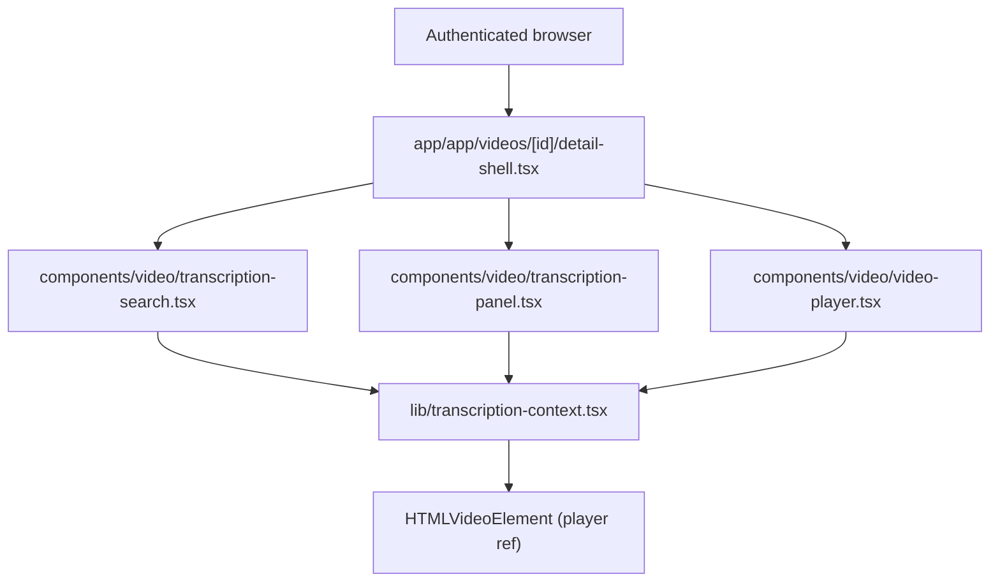

# Technical Specification: In-Video Transcription Search

## 1. Technical Overview

F09 adds a single-video, in-page transcription search experience that overlays the existing F08 transcription panel at `/app/videos/{id}` for any `ready` video. The user types a query in a search input rendered above the panel; F09 performs a case-insensitive substring scan across the transcription segments already loaded by F08, highlights every matching segment in place, surfaces a "N of M" match counter with previous/next navigation, and seeks the player to the active match's start time when the user steps through hits or clicks a highlighted segment. Clearing the input restores the unfiltered panel; an empty result set replaces the highlight overlay with the literal copy "No matches for '{query}'".

F09 is purely a frontend feature: no new backend endpoint, no new persistence, no new HTTP surface. The PRD's Section 8 dependency closure for F09 is `{F09, F08, F07, F03, F02}`, and F09 reuses every piece of infrastructure F08 already published — the rendered transcription panel and the seek controller — through the typed `<TranscriptionContext>` (`apps/web/lib/transcription-context.tsx`) F08 declared exactly for this consumer. The search runs entirely inside React state in the existing client tree, so server rendering, fetching, and authentication remain F08's job.

The detail page composition (`apps/web/app/app/videos/[id]/detail-shell.tsx`) is extended in one place: a new `<TranscriptionSearch>` client component is inserted into the transcription column above `<TranscriptionPanel>`, sharing the same `<TranscriptionContextProvider>` so the search input, the panel's segment rendering, and the player ref all see the same source of truth. F09 also extends `<TranscriptionContext>` with a small published surface — current matches, current match index, navigation helpers, and the active query — so the panel knows which substrings to mark and which row carries the "active match" style without a parallel state tree. F08's existing current-segment highlight (driven by `currentSegmentIndex`) coexists with the F09 active-match highlight; the two share the panel but never conflict because they target distinct DOM attributes and class hooks.

**Included:**
- New `<TranscriptionSearch>` client component (`apps/web/components/video/transcription-search.tsx`) rendered above the transcription panel on every `ready` video. The component owns the search input, the debounce timer (~150 ms, per PRD), the match counter "N of M", the previous/next arrow buttons, the no-match copy, and the keyboard shortcuts (`Enter` advances to the next match, `Shift+Enter` steps back) when the input is focused.
- Extension to `<TranscriptionContext>` (`apps/web/lib/transcription-context.tsx`) adding `query`, `matches`, `activeMatchIndex`, `setQuery(query)`, `goToNextMatch()`, `goToPrevMatch()`, and `clearSearch()`. The context computes `matches` (the ordered list of `{ segmentIndex, occurrenceCount }` for segments containing the query substring, case-insensitive) whenever `query` or `segments` change. `activeMatchIndex` is an integer pointing into `matches`; null when the list is empty or the query is empty.
- Extension to `<TranscriptionPanel>` (`apps/web/components/video/transcription-panel.tsx`) adding inline `<mark>` rendering inside each matched segment's text (case-preserved, all occurrences inside the segment text are wrapped) and a distinct "active match" style (a CSS hook `data-active-match="true"` plus the existing accent color from `globals.css` token `--vm-accent-low`) on the segment row currently highlighted by `activeMatchIndex`.
- Wiring: when `goToNextMatch()` / `goToPrevMatch()` updates `activeMatchIndex`, F09 calls `seekTo(matches[activeMatchIndex].startSeconds)` (the same seek controller F08 publishes), then scrolls the active segment into view by reusing F08's existing `scrollIntoView({ block: "center", behavior: "smooth" })` mechanism, then resumes auto-scroll (`registerScrollSuspended(false)`) so the active match becomes the new "current" anchor.
- Hook into the panel's segment click: clicking a highlighted segment row continues to call F08's `seekTo(segment.startSeconds)` AND sets `activeMatchIndex` to the match whose `segmentIndex` equals the clicked row's index, so the counter and arrow controls stay coherent with the user's click.
- Empty / unmatched copy and accessibility: when `query !== ""` and `matches.length === 0`, the panel renders the literal "No matches for '{query}'" message **inside the panel** (between the search input and the unfiltered segment list), the segment list itself remains rendered (per PRD: "All segments remain visible even when a search is active"), and the counter shows `0 of 0`.
- Critical Vitest test colocated as `apps/web/components/video/transcription-search.test.tsx` covering: case-insensitive substring matching across multiple segments, debounce produces a single highlight pass for rapid keystrokes, "N of M" reflects the matched segment count, next/previous wrap around the match list, clearing the input restores the unfiltered view, no-match state renders the literal copy, and clicking a highlighted segment moves `activeMatchIndex` and triggers `seekTo`.
- Visual fidelity to the design system reference page `docs/design/design-system-pages/components/library2.jsx` (the in-page detail mock that already shows a "Search transcript…" input, an "N of M" counter with chevron arrows, and `<mark>` highlights using the accent color), restricted to the dark **B · Signal** option per CLAUDE.md.

**Deferred:**
- Cross-video / library-wide transcription search — out of scope per PRD ("Search is scoped to the currently open video; no cross-video search in this release"), and explicitly listed under PRD Section 7 "Out of scope: Global search across all of a user's videos".
- Regex search, fuzzy match, whole-word match toggle — PRD specifies "Case-insensitive substring search"; nothing else.
- Persistent search history per video or per user — out of scope (no persistence, search state lives only on the open page).
- Search inside the AI summary or the video title/description — out of scope; the search target is the transcription segment text only.
- Search analytics, popular-query tracking — out of scope.
- Server-side full-text search backend, search indexing — not needed; the loaded transcription is already in client memory and bounded by the per-video transcription size produced by F07.
- Streaming / paginated results — not needed; segments are already fully loaded by F08.
- Highlighting matches inside the seek bar / timeline scrubber — out of scope; the PRD only mentions panel highlighting and the player seek when stepping.

**Traceability:**
- PRD Consumes drives the input contract: F08 rendered transcription panel segments + seek controller, both consumed via `useTranscriptionContext()` from `apps/web/lib/transcription-context.tsx`.
- PRD Provides — F09 publishes nothing to a downstream feature (it is the leaf of its branch in PRD Section 8); the `<TranscriptionContext>` extension is purely an internal coordination surface between F09's own components.
- PRD Capabilities drive the search input shape, the case-insensitive substring algorithm, the inline highlight style, the "N of M" counter, the next/previous navigation, the click-to-seek-on-active-match behavior, the clear-restore behavior, the per-video scope, and the no-match copy.
- PRD Experience drives the input position (above the panel), the ~150 ms debounce, the "all segments remain visible" rule, and the no-match copy formatting.
- PRD Section 8 dependency closure {F09, F08, F07, F03, F02} drives the prerequisites: F09 reuses the F08 contract's seed mechanism (`apps/backend/scripts/seed-video-player-contract.ts`) and its fixtures (`tests/fixtures/video-player-transcription-panel/`) — the same `ready-player-video` and `transcription-segments.json` that F08 ships are sufficient to exercise every F09 contract item.

## 2. Architecture Impact

F09 is frontend-only and adds one new client component plus an extension to two existing client modules. No backend route, use case, repository, or database change is introduced.

**Observed project patterns (reused):**
- Frontend test runner Vitest with `*.test.tsx` colocated next to components; React Server-Side rendering verified via `renderToStaticMarkup` plus interaction tests for client-only behavior (precedent: `apps/web/components/video/transcription-panel.test.tsx`).
- Path alias `@/*` already in use across `apps/web`.
- Tailwind v4 with CSS variables defined in `apps/web/app/globals.css` (`--vm-accent`, `--vm-accent-low`, `--vm-ink`, `--vm-line`, `--vm-panel`, `--vm-ink-muted`, `--vm-ink-faint`); F09 reuses these tokens for the highlight, the active-match emphasis, and the input shell.
- Existing transcription panel idiom: `data-testid` hooks on every interactive element (precedent: `transcription-segment-${index}`, `transcription-seek-${index}`, `transcription-list`).
- Existing context idiom: `<TranscriptionContext>` exposes both state and stable callback refs through `useMemo`-wrapped value objects so consumers do not re-render unnecessarily.
- Quality gates (already in this codebase, mirrored from the F08 contract): `./scripts/run-gates.mjs` (the wrapper that chains TypeScript, ESLint, Dependency Cruiser, Architecture, Madge, Knip), workspace-scoped `npm run typecheck`, `npm run lint`, `npm run test` for both the backend and the frontend, and the playwright-cli skill for navigation E2E (per `CLAUDE.md`).
- Existing F08 contract conventions reused verbatim: persistent state seeded via `apps/backend/scripts/seed-video-player-contract.ts`, fixtures under `tests/fixtures/video-player-transcription-panel/`, no `.env.test` (backend reads `apps/backend/.env`), and the test-only `?test_seek=<seconds>` query parameter that F08 honors at the page level for deterministic player time.

**Visual fidelity (design-system reference):**

F09's rendered surface re-uses the existing component primitives already encoded in `apps/web/components/video/` plus the design tokens declared in `apps/web/app/globals.css`. The reference mock for the in-page experience is `docs/design/design-system-pages/components/library2.jsx` (which shows the search input, the "N of M" pill, the chevron prev/next arrows, and the `<mark>`-style accent highlight). Specifically:

- The search input shell mirrors `VMInput` from `docs/design/design-system-pages/components/ui.jsx` — leading search icon, `var(--vm-panel)` background, `var(--vm-line)` border, `var(--vm-ink-muted)` placeholder, monospace-friendly content typography.
- The match counter ("3 of 7" in the mock) reuses the same monospace pill style as the existing `VMBadge` mono variant — `font-mono text-xs` over `var(--vm-ink-muted)`. F09 emits this counter even when the query is empty (showing nothing) and when there are zero matches (showing `0 of 0`).
- The previous/next arrows reuse the chevron icon from `ui.jsx` `I.chev`; the previous arrow rotates 180°. They share the existing `<button>`/icon-button styling already used by `apps/web/components/ui/icon-button.tsx`.
- Highlight color: the inline `<mark>` element wraps each substring match using `bg-[var(--vm-accent)]` with `text-white` (mirrors the `library2.jsx` mock that paints the substring in solid accent). The active match's segment row keeps the existing F08 highlight (`bg-[var(--vm-accent-low)]`) AND adds a thin left border `border-l-2 border-[var(--vm-accent)]` to differentiate it from a passive match — this also mirrors the mock that uses a left accent bar.
- "No matches for '{query}'" copy renders inside the same panel column as the (still-rendered) segment list, as a small panel-aligned message with `text-sm text-[var(--vm-ink-muted)]`, anchored above the unchanged segment list.
- Brand identity confirmed via `docs/design/design-system-pages/Videomax Identity.html`: F09 uses the dark **B · Signal** palette only (CLAUDE.md).

## 3. Technical Decisions

| Decision | Chosen Approach | Alternative Considered | Trade-off |
|---|---|---|---|
| Search location | Pure client-side, in-memory substring scan over the segments array already loaded by F08, computed inside `<TranscriptionContext>` whenever `query` or `segments` changes. | Add a backend endpoint `GET /api/videos/:id/transcription/search?q=...` that returns matching segment indices. | The full transcription is already client-side; an extra network round-trip would add latency without any benefit. Trade-off: very large transcriptions (a 2-hour video at Whisper's typical segment density still yields a few thousand segments at most) run a substring scan on every keystroke — we keep cost predictable by debouncing the query. |
| Debounce | A single `setTimeout(150)` per keystroke; the timer resets on every change to the input value. The committed `query` is what `<TranscriptionContext>` exposes. | Use a third-party debounce hook (`use-debounce`). | Zero new dependency; the implementation is one `useEffect` and one `useRef`. Trade-off: a few lines of inline code to maintain. |
| Match data shape | `matches: { segmentIndex: number; startSeconds: number; segmentText: string; occurrenceCount: number }[]` ordered by `segmentIndex`. The active match is identified by an integer index into this array, not by the segment id. | Match every individual occurrence (one entry per substring hit, even when several hits live in the same segment). | The PRD's "N of M" counter is described as "matching segments" in Capabilities ("Every matching segment is visually highlighted") and the panel highlights the segment as a whole; counting per-segment matches keeps prev/next navigation intuitive (each step lands on a new segment). Trade-off: a long monologue segment with many occurrences counts as "1 match" — documented under Assumptions. |
| Highlight rendering | Split each matched segment's text on the case-insensitive query and wrap each hit with `<mark>...</mark>`; preserve the original case of the matched substring. | Use a global CSS-only highlight via `::selection` or a JS overlay layer over the segment row. | Native `<mark>` is accessible by default, semantic, and survives copy/paste. Trade-off: each render builds new React nodes — fine for the bounded segment count. |
| Active match style | Add `data-active-match="true"` plus a left accent border to the active segment row; keep the existing F08 `data-current` (currentSegmentIndex driven by playhead) untouched. | Repurpose `data-current` for the active match. | F08's existing playhead highlight has its own meaning and an existing test depends on it; F09's "active match" is a distinct concept (it follows search navigation, not playback). Trade-off: the panel can momentarily show two distinct row marks (one playhead, one active match) — the design intentionally separates them. |
| Navigation key bindings | When the search input is focused: `Enter` advances to the next match (or stays at the last and wraps to first); `Shift+Enter` steps back; `Escape` clears the query. | Bind global keys (e.g., `Cmd+G`) for next/previous. | Matches familiar in-page-find behavior; avoids hijacking shortcuts that the player owns (space toggles play). Trade-off: the user must focus the input to navigate — acceptable because the prev/next buttons remain clickable at any time. |
| Wrap behavior | After the last match, the next-match action wraps to the first match; previous before the first wraps to the last. | Stop at the boundaries with a disabled button state. | Matches typical find-in-page behavior; keeps the controls always-active so the user does not have to inspect a disabled state to know they reached the end. |
| Active match seek + scroll | Calling `goToNextMatch` / `goToPrevMatch` (or clicking a highlighted segment) immediately calls `seekTo(matches[activeMatchIndex].startSeconds)` AND `registerScrollSuspended(false)` so F08's existing auto-scroll mechanism brings the row into view. | Add a separate scrollIntoView call inside F09. | Reuses F08's already-tested auto-scroll behavior; one place to maintain. Trade-off: the scroll relies on F08's `scrollIntoView({ block: "center", behavior: "smooth" })` semantics — documented under Assumptions. |
| Counter format | "N of M" rendered as plain text (e.g., `3 of 7`) inside a monospace pill; when `M === 0`, show `0 of 0`; when `query === ""`, hide the counter (and the prev/next buttons). | Use "N / M" with a slash. | Matches the PRD verbatim ("Match counter shows 'N of M'") and the design mock (`library2.jsx` uses "3 of 7"). |
| Empty-query state | When the input is empty, F09 hides the counter and the prev/next buttons; the segment list renders unchanged (no highlights, no active match, no message). | Always show the counter as `0 of 0`. | The PRD says clearing the query "restores the full transcription view" — hiding the counter avoids visual noise when there is no active search. |
| Per-segment scope | Substring search runs against `segment.text` only. The segment's start/end timestamps and other metadata are not searched. | Include the timestamp text or the detected language label. | PRD calls out searching the transcription itself; metadata search is not requested. |
| Page boundary | F09 reads `<TranscriptionContext>` only when the video status is `ready` (the panel itself already renders the processing placeholder otherwise). When status `!== "ready"`, `<TranscriptionSearch>` does not render at all (PRD: "Search input is visible above the transcription panel on every `ready` video"). | Always render the search input but disable it for non-ready videos. | The PRD wording is conditional on `ready`; hiding the input matches the placeholder UX. |

**Assumptions and accepted recommendations (Auto-Accept Policy applied):**

- **Scope (Core vs Core+Full):** F09's PRD has neither a `Core Scope` block nor a `Full Scope additions` block; the entire feature definition is in scope. (Auto-Accept policy row "Scope (Core vs Core+Full, when both blocks exist)" — both absent so the question does not apply.)
- **Quality gates clarification (detected gates):** The project's gates were detected by inspecting `scripts/run-gates.mjs`, `apps/backend/package.json`, and `apps/web/package.json` plus `CLAUDE.md`. The contract enumerates the backend wrapper, backend tests, frontend typecheck/lint/tests, and the CLAUDE.md-mandated playwright-cli E2E gate. Auto-included unchanged per Auto-Accept policy row "Quality gates clarification (detected gates)".
- **Static-fixture path convention:** Reused project convention `tests/fixtures/<feature-kebab>/`; F09 reuses the existing `tests/fixtures/video-player-transcription-panel/` directory because the F08 fixtures already provide everything needed (`sample-ready.mp4` for the playable file, `transcription-segments.json` for the segments). No new fixture file is introduced.
- **Persistent-state seeding convention:** Reused project convention — TypeScript seed scripts under `apps/backend/scripts/seed-<feature>-contract.ts`. F09 reuses `seed-video-player-contract.ts` because it already provisions `ready-player-video` with a persisted transcription matching the canonical `transcription-segments.json` and a `player-user` with an active session — exactly the state F09 needs. No new seed script is introduced.
- **Test config convention:** Reused — backend tests read `apps/backend/.env`; no `.env.test` introduced.
- **Surface set for the contract:** F09 has UI signals (search input, highlights, counter, prev/next, no-match copy) and E2E signals (search-driven seek). No new HTTP surface is introduced (F09 reuses F08's existing transcription endpoint). Per Auto-Accept policy row "Contract surface set ambiguous", the contract emits `## UI` and `## E2E` only — no `## HTTP API`, no `## Service`. (The published `<TranscriptionContext>` extension is internal coordination between F09's own components, not a programmatic interface for an outside consumer.)
- **Match unit:** Counted per segment (not per occurrence). Industry-standard default applied per Auto-Accept policy row "Partial PRD specifications" — the PRD says "Every matching segment is visually highlighted" and "N of M" without specifying whether M counts occurrences or segments; per-segment counting matches the segment-list visual model.
- **Wrap-around behavior:** Next from the last match wraps to the first and vice versa. Industry-standard default applied per Auto-Accept policy row.
- **Empty / fully-matching query:** The empty input clears every highlight and hides the counter. A query that returns zero matches shows the no-match copy and `0 of 0` counter. Industry-standard default applied per Auto-Accept policy row.
- **Highlight markup:** Native `<mark>` element with accent background. Industry-standard default applied per Auto-Accept policy row.
- **Substring boundaries:** No word-boundary enforcement (a query "tion" matches "transcription" and "attention"); case-insensitive comparison via `String.prototype.toLowerCase()` on both sides. Per the PRD literal "Case-insensitive substring search".
- **Search input keyboard shortcuts:** `Enter` advances; `Shift+Enter` steps back; `Escape` clears. Industry-standard default applied per Auto-Accept policy row "Partial PRD specifications" — the PRD does not specify input-level shortcuts, only the visible buttons.
- **Debounce duration:** `150` ms verbatim from the PRD ("Typing incrementally filters highlights with a ~150 ms debounce"). The constant lives in `transcription-search.tsx` as `SEARCH_DEBOUNCE_MS = 150` for testability.
- **Visual identity:** Dark **B · Signal** option only per CLAUDE.md; covered by a single subjective contract item with `notes: subjective; manual review only`.
- **F08 test mechanism reuse:** F09's contract items that need to drive the player to a specific time reuse the F08-provided `?test_seek=<seconds>` URL parameter (already honored by `<VideoPlayer>` via the `testInitialSeek` prop). No new test mechanism is introduced.

## 4. Component Overview

**Frontend:**

| File Path | New/Modified | Purpose | Key Responsibilities |
|---|---|---|---|
| `apps/web/components/video/transcription-search.tsx` | New | Search input + counter + prev/next arrows | Owns the input value and debounce; renders the counter and arrow buttons; calls `setQuery`, `goToNextMatch`, `goToPrevMatch`, `clearSearch` on the context; renders the `Enter` / `Shift+Enter` / `Escape` keyboard shortcuts; only renders when video status is `ready` |
| `apps/web/components/video/transcription-search.test.tsx` | New | Critical tests for F09 search behaviors | Substring matching across segments; debounce coalescing; "N of M" counter values; next/prev wrap; clear-restores-list; no-match copy; click-on-active-match seeks |
| `apps/web/components/video/no-match-message.tsx` | New | Render the "No matches for '{query}'" copy inside the panel between the search and the segment list | Pure presentational component; one line of copy with the panel-aligned styling |
| `apps/web/lib/transcription-context.tsx` | Modified | Extend the published context with search state | Add `query`, `matches`, `activeMatchIndex` state; add `setQuery`, `goToNextMatch`, `goToPrevMatch`, `clearSearch` actions; recompute `matches` when `query` or `segments` change; on every match step call `seekTo(...)` + `registerScrollSuspended(false)` |
| `apps/web/components/video/transcription-panel.tsx` | Modified | Render `<mark>` highlights inside matched segment text + "active match" row style | When `query` is non-empty, split each segment's text on the lowercased query and wrap occurrences in `<mark>`; add `data-active-match="true"` plus the active-match border on the row whose `segmentIndex === matches[activeMatchIndex].segmentIndex`; render the `<NoMatchMessage>` above the segment list when `query !== "" && matches.length === 0` |
| `apps/web/app/app/videos/[id]/detail-shell.tsx` | Modified | Mount `<TranscriptionSearch>` above `<TranscriptionPanel>` inside the existing transcription column | One additional JSX node; no behavior change to the player or summary slot |

**Backend:**

F09 introduces no backend changes. The transcription endpoint (`GET /api/videos/:id/transcription`), the video stream endpoint (`GET /media/videos/:id`), and the persistence schema are all owned by F08 and F07 and remain unchanged.

**Database:**

F09 introduces no new tables, columns, indexes, or constraints. It reads from the in-memory transcription already loaded by F08.

## 5. API Contracts

F09 introduces no new HTTP endpoints. The search runs entirely against the segments returned by F08's existing `GET /api/videos/:id/transcription` endpoint (documented in F08's spec), so no new request/response shape, no new error codes, and no new auth surface are needed.

## 6. Data Model

F09 introduces no schema changes. Match results live in client-side React state for the duration of the page; the source segments come from `<TranscriptionContext>`'s `segments` array.

## 7. Testing Strategy

Frontend critical tests follow the project's "only critical ones that can change business rules or important behaviour on the UI" rule (per `CLAUDE.md`). Backend changes: none, so no new backend tests.

**Frontend critical tests:**
- `apps/web/components/video/transcription-search.test.tsx`
  - `case_insensitive_substring_match_highlights_every_matching_segment`
  - `match_counter_shows_n_of_m_with_correct_totals`
  - `next_button_advances_active_match_and_wraps_at_end`
  - `previous_button_steps_back_and_wraps_at_start`
  - `clicking_a_highlighted_segment_sets_it_as_active_match`
  - `clearing_the_input_restores_the_full_transcription_view_with_no_highlights`
  - `no_match_state_shows_literal_copy_and_keeps_segments_visible`
  - `debounce_coalesces_rapid_keystrokes_into_a_single_match_pass`
  - `enter_advances_match_and_shift_enter_steps_back_when_input_focused`
- `apps/web/components/video/transcription-panel.test.tsx` (extended)
  - `renders_mark_highlight_inside_matched_segment_text_when_query_is_active`
  - `applies_active_match_marker_to_segment_row_pointed_to_by_active_match_index`
  - `renders_no_match_message_when_query_present_and_matches_empty`

**Navigation verification with `playwright-cli` (per `CLAUDE.md`):**
- Start the project with `./scripts/init.sh`.
- Authenticate as the seeded `player-user` (from the F08 seed script).
- Navigate to `/app/videos/{ready-player-video.id}` and confirm `<TranscriptionSearch>` is visible above `<TranscriptionPanel>`.
- Type a substring known to match multiple segments in `transcription-segments.json`; confirm every matching segment carries a `<mark>` element and the counter reports the correct `N of M`.
- Click the next-arrow; confirm the player's `currentTime` advances to the next active match's start time and the active-match marker moves to the corresponding row.
- Click a highlighted segment row; confirm the `currentTime` jumps to that segment's start.
- Clear the input; confirm every highlight and the counter disappear and the segment list returns to its unfiltered state.
- Type a query that matches no segment; confirm "No matches for '{query}'" appears and the segment list still renders.

**Contract fixtures and seed:**

F09 reuses the existing F08 contract artifacts verbatim. No new file is added.
- Seed: `apps/backend/scripts/seed-video-player-contract.ts` (already provisions `player-user`, `ready-player-video`, and the persisted transcription matching the canonical `transcription-segments.json`).
- Static fixtures: `tests/fixtures/video-player-transcription-panel/sample-ready.mp4` and `tests/fixtures/video-player-transcription-panel/transcription-segments.json` (already exist; F09 references them by path).
