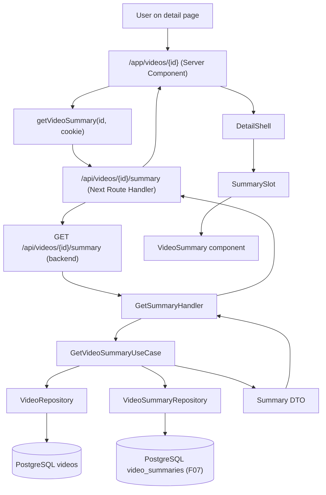

# Technical Specification: AI Summary Display

## 1. Technical Overview

**What:** Render the AI-generated summary (overview paragraph + bulleted key topics) inside the layout slot that F08 (Video Player with Transcription Panel) reserves below the video player on `/app/videos/{id}`. The feature is a read-only display that turns the summary produced by F07's summarize stage into a visible block in the existing detail page.

**Why:** F07 already persists `VideoSummary` rows (overview + key_topics) through the `RunSummarizeStageUseCase`, and F08 already mounts a `<SummarySlot>` with `data-slot="summary"` below the player; what is still missing is the wiring that fetches and renders that summary, plus the failure-mode message when summarization exhausts retries. F10 closes that gap so users get a reading-based entry point into the video without watching it.

**Scope:**

**Included:**
- A new backend HTTP endpoint `GET /api/videos/{id}/summary` that returns a JSON payload describing the current summary state for the requested video (status of the summarize stage, overview text, key topics, failure reason when applicable). The endpoint enforces that the requesting user owns the video.
- A new use case `GetVideoSummaryUseCase` in `apps/backend/src/usecase/video/` that loads the video and the persisted `VideoSummary`, then composes the output DTO. The use case relies on the existing `VideoRepository` and `VideoSummaryRepository` ports.
- A new HTTP handler `GetSummaryHandler` and a route registration on `/api/videos/:id/summary` wired through `apps/backend/src/main.ts`.
- A new web API client function `getVideoSummary(videoId, cookie?)` in `apps/web/lib/videos-api.ts` plus a JSON shape guard.
- A new Next.js Route Handler at `apps/web/app/api/videos/[id]/summary/route.ts` that proxies the request to the backend and forwards the request cookie (mirroring the existing transcription proxy).
- A new client component `VideoSummary` in `apps/web/components/video/video-summary.tsx` that renders the Overview paragraph, the Key topics bulleted list, the failure callout when summarization failed permanently, and the hidden state while the summarize stage is still processing.
- Wiring inside `apps/web/app/app/videos/[id]/page.tsx` and `apps/web/app/app/videos/[id]/detail-shell.tsx` to fetch the summary and pass it to the `<SummarySlot>` so the slot's children become the rendered `<VideoSummary>` content.
- Visual design follows the dark **B · Signal** option (`docs/design/design-system-pages/components/library2.jsx` Summary block), using the existing OKLCH tokens already in `apps/web/app/globals.css`.
- Test coverage at the unit level (use case, handler, summary component) plus an end-to-end navigation test exercising the rendered summary on a `ready` video.

**Excluded:**
- Any inline editing, copy-to-clipboard, or summary regeneration affordance (the section is read-only per PRD §6 F10 Capabilities).
- Any in-summary search or highlighting.
- Any retry button inside the summary block — the existing detail header `Retry` button (owned by F07/F08) is the single retry surface; F10 only references it through the failure-state copy.
- Changes to the summarize stage itself (`RunSummarizeStageUseCase`), the `VideoSummary` entity, the `VideoSummaryRepository`, or the Prisma schema; F07 already produces the data F10 consumes.
- Cross-video aggregation, summary export, or summary analytics.

## 2. Architecture Impact

**Affected components:**

- `apps/backend/src/usecase/video/get-video-summary.usecase.ts` (new) — orchestrates loading the video and the persisted `VideoSummary`, returns a status-aware DTO.
- `apps/backend/src/usecase/video/get-video-summary.dto.ts` (new) — input/output types for the use case.
- `apps/backend/src/usecase/video/get-video-summary.usecase.spec.ts` (new) — unit tests covering the four observable outcomes (ready with summary, still processing, failed with summary missing, foreign-user 404).
- `apps/backend/src/infra/http/video/get-summary.handler.ts` (new) — Zod-validated route handler that resolves the current user, parses the path param, and delegates to the use case.
- `apps/backend/src/infra/http/video/get-summary.handler.spec.ts` (new) — handler-level tests with a fake use case.
- `apps/backend/src/infra/http/video/video.routes.ts` (modified) — adds an optional `getSummaryHandler` dep and registers `GET /api/videos/:id/summary`.
- `apps/backend/src/main.ts` (modified) — instantiates `GetVideoSummaryUseCase` and `GetSummaryHandler`, wires them into `videoRoutes()`.
- `apps/web/app/api/videos/[id]/summary/route.ts` (new) — Route Handler that proxies `GET /api/videos/{id}/summary` to the backend, preserving the `cookie` header and the response status/content type (mirrors the transcription proxy).
- `apps/web/lib/videos-api.ts` (modified) — exports `getVideoSummary()` with a server-side overload that accepts a cookie header (used by the page server component) and a client-side overload (used inside `useEffect` if needed).
- `apps/web/components/video/video-summary.tsx` (new) — client component that renders the summary content, the failure callout, or null while still processing.
- `apps/web/components/video/video-summary.test.tsx` (new) — Vitest test covering the four UI states.
- `apps/web/app/app/videos/[id]/page.tsx` (modified) — fetches the summary alongside the video list and transcription, passes it to `DetailShell`.
- `apps/web/app/app/videos/[id]/detail-shell.tsx` (modified) — accepts a `summary` prop and renders `<SummarySlot><VideoSummary summary={summary} /></SummarySlot>`.

**Data flow:**



## 3. Technical Decisions

| Decision | Chosen Approach | Alternative Considered | Trade-off |
|---|---|---|---|
| Where the summary lives in the API surface | A dedicated `GET /api/videos/{id}/summary` endpoint that mirrors `GET /api/videos/{id}/transcription` | Embed the summary inside the existing `GET /api/videos` list payload, or extend a hypothetical `GET /api/videos/{id}` detail payload | A dedicated endpoint stays consistent with how F08 already exposes the transcription; the list payload would balloon with text the library page does not need, and there is no detail endpoint to extend yet. |
| Component placement | A dedicated client component `VideoSummary` mounted as the child of the existing `<SummarySlot>` | Inline the markup inside `detail-shell.tsx` | A dedicated component keeps the file small per the project's SRP rule and isolates the four observable states (loading, ready, processing, failed) in one place that is also unit-testable. |
| When to render content | Server-fetch the summary in the Page server component and pass it to `DetailShell` as a prop, mirroring the transcription pattern | Fetch on the client inside `useEffect` | Server fetch removes a flash of empty state on first paint and matches the existing transcription pattern (parallel `Promise.all` of video list + transcription); F10 adds a third entry to the same `Promise.all`. |
| Failure copy | Render the literal copy "Summary could not be generated — retry from the header" when `status === "failed"` AND there is no persisted `VideoSummary` row | Show the error block whenever `failureReason === "Summary generation failed"` regardless of whether a partial summary exists | The PRD scopes the failure message to the case where summarization itself failed permanently; the chosen condition (failed + no summary row) is the correct invariant — a successful prior summary that gets a later failure on a different stage should still be visible. |
| Visual fidelity source | Reuse the AI Summary block layout from `docs/design/design-system-pages/components/library2.jsx` (lines 161–194) under the dark **B · Signal** tokens already exposed via `apps/web/app/globals.css` | Design from scratch | The reference mock already encodes the exact subsection hierarchy ("Overview" body / "Key topics" bulleted list), the section label ("AI Summary"), the badge accent, and the spacing the rest of the app already uses. |

## 4. Component Overview

**Backend:**

| File Path | New/Modified | Purpose | Key Responsibilities |
|---|---|---|---|
| `apps/backend/src/usecase/video/get-video-summary.dto.ts` | New | Input/output DTO for the new use case | Declare `GetVideoSummaryInput { actorId, videoId }` and `GetVideoSummaryOutput { status, stage, overview, keyTopics, failureReason }` shapes. |
| `apps/backend/src/usecase/video/get-video-summary.usecase.ts` | New | Read-only orchestration | Load the video, enforce ownership, load the persisted `VideoSummary`, compose the output mirroring the `GetVideoTranscriptionUseCase` shape. |
| `apps/backend/src/usecase/video/get-video-summary.usecase.spec.ts` | New | Unit tests | Cover the four observable cases (ready+summary, still processing, failed without summary, foreign owner). |
| `apps/backend/src/infra/http/video/get-summary.handler.ts` | New | HTTP entrypoint | Validate path params with Zod, resolve current user from the auth middleware, delegate to the use case, return `200` with the DTO. |
| `apps/backend/src/infra/http/video/get-summary.handler.spec.ts` | New | Handler tests | Verify request validation, unauthenticated rejection, success body shape. |
| `apps/backend/src/infra/http/video/video.routes.ts` | Modified | Route table | Register `GET /api/videos/:id/summary` when `getSummaryHandler` is provided, preserving the existing optional-handler pattern. |
| `apps/backend/src/main.ts` | Modified | Composition root | Build `GetVideoSummaryUseCase` from the Prisma video and summary repositories, build `GetSummaryHandler`, pass to `videoRoutes`. |

**Frontend:**

| File Path | New/Modified | Purpose | Key Responsibilities |
|---|---|---|---|
| `apps/web/app/api/videos/[id]/summary/route.ts` | New | Next.js Route Handler proxy | Forward `GET` with the request cookie to `/api/videos/{id}/summary` on the backend; relay status, body, and content type. |
| `apps/web/lib/videos-api.ts` | Modified | API client | Add `getVideoSummary(videoId, cookie?)` and a `VideoSummaryContent` type guard; export both. |
| `apps/web/components/video/video-summary.tsx` | New | Summary renderer | Render the Overview paragraph and Key topics list when content is present, the failure callout when the summarize stage failed permanently, and `null` while still processing. |
| `apps/web/components/video/video-summary.test.tsx` | New | Component tests | Cover the four states (ready, processing, failed, empty key topics). |
| `apps/web/app/app/videos/[id]/page.tsx` | Modified | Page server component | Fetch the summary alongside the video list and transcription via `Promise.all`; pass to `DetailShell`. |
| `apps/web/app/app/videos/[id]/detail-shell.tsx` | Modified | Detail composition | Accept a `summary` prop and render `<SummarySlot><VideoSummary summary={summary} /></SummarySlot>`. |

## 5. API Contracts

### Endpoint: Get Video Summary

- **Method:** GET
- **Path:** `/api/videos/{id}/summary`
- **Authentication:** Session cookie (`session_token`); the resolved user must own the video.

**Request:**

| Field | Type | Required | Validation | Description |
|---|---|---|---|---|
| `id` (path) | `uuid` | Yes | valid UUID v4 | Video identifier |

**Response (Success - 200):**

| Field | Type | Description |
|---|---|---|
| `status` | `string` | Current video status: `validating`, `transcribing`, `summarizing`, `ready`, or `failed`. |
| `stage` | `string \| null` | Current pipeline stage when `status` is not `ready`; `null` for `ready`. |
| `overview` | `string \| null` | Summary overview paragraph; non-null when a summary row exists, `null` otherwise. |
| `keyTopics` | `string[]` | Ordered key topics list; empty array when no summary exists. |
| `failureReason` | `string \| null` | The persisted failure reason when the summarize stage failed permanently; `null` otherwise. |

**Response Example (ready video with summary):**
```json
{
  "status": "ready",
  "stage": null,
  "overview": "Week four of the NLP series covers the attention mechanism end-to-end...",
  "keyTopics": [
    "Why attention is just a matmul + softmax",
    "Q / K / V projections",
    "Parallelism advantage vs RNN",
    "Gradient flow through the softmax layer",
    "Positional encodings"
  ],
  "failureReason": null
}
```

**Response Example (still processing):**
```json
{
  "status": "transcribing",
  "stage": "transcribe",
  "overview": null,
  "keyTopics": [],
  "failureReason": null
}
```

**Response Example (summarize stage failed):**
```json
{
  "status": "failed",
  "stage": "summarize",
  "overview": null,
  "keyTopics": [],
  "failureReason": "Summary generation failed"
}
```

**Error Codes:**

| Code | HTTP Status | Description |
|---|---|---|
| `unauthenticated` | 401 | No active session cookie. |
| `video_not_found` | 404 | The video does not exist or is owned by a different user. |
| `validation_failed` | 422 | The path parameter is not a valid UUID. |

## 6. Data Model

No schema changes. F10 reads the existing `video_summaries` table created by F07.

**Table: `video_summaries`** (no changes; documented for reference)

| Column | Type | Nullable | Default | Description |
|---|---|---|---|---|
| `id` | `uuid` | No | — | Primary key |
| `video_id` | `uuid` | No | — | Unique FK to `videos.id` (`ux_summaries_video`) |
| `overview` | `text` | No | — | Overview paragraph |
| `key_topics` | `jsonb` | No | `'[]'` | Ordered list of strings |
| `created_at` | `timestamptz` | No | `now()` | Insertion timestamp |
| `updated_at` | `timestamptz` | No | `now()` | Last update timestamp |

Existing `videos.status`, `videos.current_stage`, and `videos.failure_reason` columns are queried alongside the summary row to determine the section's UI state.

## 7. Testing Strategy

**Test File Structure:**

| Test File | Test Type | Target | Coverage Goal |
|---|---|---|---|
| `apps/backend/src/usecase/video/get-video-summary.usecase.spec.ts` | Unit | `GetVideoSummaryUseCase` | All four observable outcomes |
| `apps/backend/src/infra/http/video/get-summary.handler.spec.ts` | Unit | `GetSummaryHandler` | Happy path, unauthenticated, validation failure |
| `apps/web/components/video/video-summary.test.tsx` | Unit | `<VideoSummary>` | All four UI states |
| `apps/web/app/api/videos/[id]/summary/route.test.ts` (optional, follow proxy convention) | Unit | Route Handler proxy | Status passthrough |

**Backend test functions:**

| Test Function | Description | Assertions |
|---|---|---|
| `returns_overview_and_key_topics_for_ready_video_with_summary` | Ready video with persisted summary returns DTO with overview + topics | Output contains overview text, `keyTopics` length matches, `status: "ready"`, `stage: null`, `failureReason: null` |
| `returns_empty_payload_with_current_stage_for_still_processing_video` | Video in `summarizing` stage with no persisted summary | Output `status: "summarizing"`, `stage: "summarize"`, `overview: null`, `keyTopics: []`, `failureReason: null` |
| `returns_failure_reason_when_summarize_stage_failed_permanently` | Video with `status: "failed"`, `current_stage: "summarize"`, no summary row | Output `status: "failed"`, `failureReason: "Summary generation failed"` |
| `throws_video_not_found_when_owner_mismatches` | Video belongs to another user | Throws `VideoNotFoundError` |
| `handler_returns_200_with_use_case_payload` | Handler success path | Response status 200, body equals use case output |
| `handler_throws_unauthenticated_without_session` | No session cookie | Throws `UnauthenticatedError` |
| `handler_throws_validation_when_id_is_not_uuid` | Bad UUID | Zod parse throws |

**Frontend test functions:**

| Test Function | Description | Assertions |
|---|---|---|
| `renders_overview_and_key_topics_when_summary_present` | Ready video with content | Headings "Overview" and "Key topics" render, paragraph text matches, `<li>` count matches `keyTopics.length` |
| `renders_failure_callout_when_summarize_stage_failed_permanently` | Failed status with `failureReason: "Summary generation failed"` | Element with `data-testid="summary-failure"` renders the documented copy; no Overview heading |
| `renders_nothing_while_summarize_stage_still_in_progress` | `status: "summarizing"` with `overview: null` | Component returns `null` (no Overview heading rendered) |
| `tolerates_empty_key_topics_array_without_breaking` | Ready summary with `keyTopics: []` | Overview still renders, the Key topics block is present but the list is empty (or absent) without throwing |

**E2E (playwright-cli) scenarios:**

| Scenario | Description | Assertions |
|---|---|---|
| `summary block appears on a ready video` | Open `/app/videos/{ready-video.id}` for a video whose summarize stage produced overview + key_topics | Page contains an "Overview" heading inside `[data-slot="summary"]` plus the canonical paragraph text, and the Key topics list renders the seeded items in order |
| `summary block shows failure copy on a permanently failed summarize stage` | Open `/app/videos/{summary-failed-video.id}` for a video whose summarize stage exhausted retries | Page contains the documented failure copy inside `[data-slot="summary"]` and does NOT contain an "Overview" heading |

## 8. Decisions / Assumptions

- **Auto-Accept default applied:** Scope = full feature scope (PRD has no Core/Full split for F10).
- **Auto-Accept default applied (surface set):** Surfaces emitted in the contract are HTTP API + UI + E2E. PRD signals: UI (Overview + Key topics rendering, failure state) and E2E (summary appears post-summarize-stage transition). HTTP API was added because inspection of `apps/web/app/api/videos/[id]/route.ts` confirmed the existing detail payload does NOT include the summary; F10 must add a `/api/videos/{id}/summary` endpoint mirroring the transcription pattern (`/api/videos/{id}/transcription`).
- **Auto-Accept default applied (failure copy):** PRD §6 F10 says `"Summary could not be generated — retry from the header"`. F10 adopts this verbatim.
- **Auto-Accept default applied (test conventions):** Reuse `tests/fixtures/<feature-slug>/` per the established convention from F07 and F08; persistent state is seeded via a script under `apps/backend/scripts/` named `seed-ai-summary-display-contract.ts` following the existing `seed-pipeline-contract.ts` shape.
- **Auto-Accept default applied (visual identity):** B · Signal dark variant per `apps/web/app/globals.css` tokens; the AI Summary block layout, heading hierarchy ("Overview" h3 + body paragraph; "Key topics" h3 + `<ul>`), section label, and accent badge are sourced from `docs/design/design-system-pages/components/library2.jsx` (Summary block, lines 161–194). Failure callout uses the existing error tokens (`--vm-error`, `--vm-error-bg`) already in `globals.css`.
- **Auto-Accept default applied (quality gates):** Auto-include every detected gate without further user prompt — see contract `## Quality gates`.
- **Auto-Accept default applied (issue creation):** `create-issue` flag forwarded by orchestrator; the skill creates the GitHub issue per Step 6.

## 9. PRD Traceability

| PRD Block | Spec Destination |
|---|---|
| Consumes (F07: summary overview + key topics) | Section 1 Scope (Included), Section 5 API Contracts |
| Capabilities (Summary section below player; Overview + Key topics; read-only; hidden while processing; failure copy) | Section 1 Scope, Section 4 Component Overview, Section 7 Testing Strategy |
| Experience (heading typography for subsections, body typography for content; long summaries scroll; always expanded) | Section 4 Component Overview (`video-summary.tsx`), Section 8 Decisions (visual identity) |

## 10. Visual Fidelity Notes

The implementer should mirror the AI Summary block in `docs/design/design-system-pages/components/library2.jsx` (lines 161–194) under the dark **B · Signal** palette already wired in `apps/web/app/globals.css`:

- Outer card: `border border-[var(--vm-line)] bg-[var(--vm-panel)] rounded-lg p-5` (the existing `<SummarySlot>` already provides this — `<VideoSummary>` should render its content inside the slot, NOT a duplicate card).
- Section eyebrow label: small uppercase mono `font-mono text-[10px] uppercase tracking-[0.2em] text-[var(--vm-ink-faint)]` reading "AI SUMMARY" (mirrors `<VMSectionLabel>` from `docs/design/design-system-pages/components/ui.jsx`).
- "Overview" heading: 13px semibold ink (`text-sm font-semibold text-[var(--vm-ink)]`) with the existing detail header rhythm.
- Overview paragraph: 14px body, line-height generous, muted ink (`text-sm leading-[1.62] text-[var(--vm-ink-muted)]`).
- "Key topics" heading: same H3 treatment as Overview.
- Bulleted list: standard `<ul>` with `list-disc pl-4 space-y-1.5`, items in muted ink.
- Failure callout: error tokens (`bg-[var(--vm-error-bg)] text-[var(--vm-error)]`), small icon optional, copy verbatim.

These tokens are confirmed present in `apps/web/app/globals.css`; no new token additions are required.
