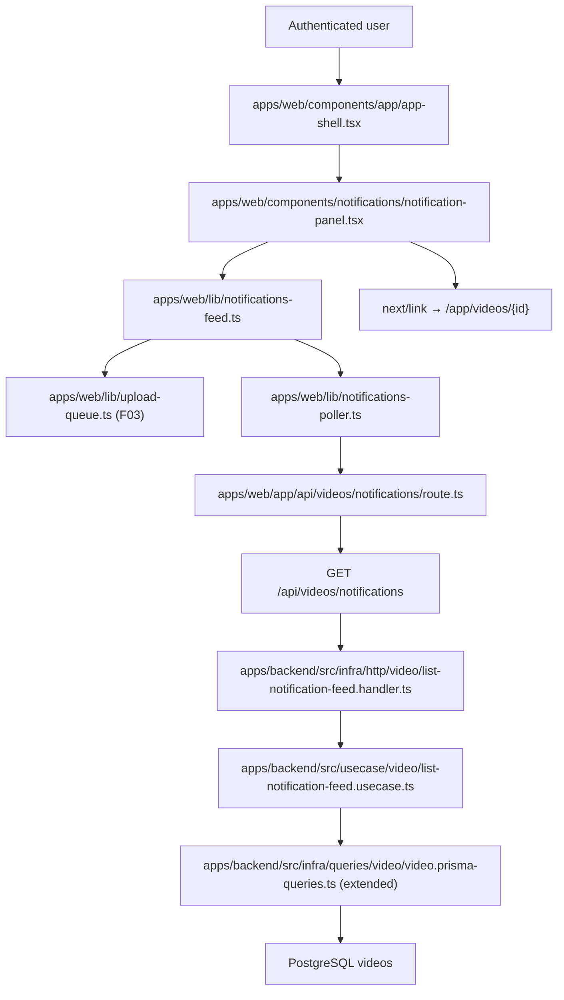

# Technical Specification: In-App Processing Notifications

## 1. Technical Overview

F11 introduces an unobtrusive, persistent notification panel anchored to the bottom-right corner of every authenticated page in the web app. The panel surfaces a rolling list of the user's videos that are currently uploading or processing, plus videos that completed (`ready`) or failed within the last 60 minutes, so the user has continuous visibility into the upload-to-insight workflow without having to revisit the library or the per-video detail page.

Two distinct data sources feed the panel. (a) **In-flight browser uploads** are surfaced from the browser's own upload queue (the F03 `UploadQueueModel`) — only the browser knows the per-byte upload progress until the multipart POST completes. (b) **Server-side processing state** is surfaced from a new authenticated `GET /api/videos/notifications` endpoint that returns every video for the current user whose status is non-terminal (`validating`, `transcribing`, `summarizing`) plus every video whose terminal transition (`ready` or `failed`) happened within the last 60 minutes. The panel merges the two streams by video id (the in-flight upload entry is replaced by the server-side entry as soon as the upload POST returns the persisted video id), polls the endpoint on a short interval (3 seconds by default) while there are active or recent items, and stops polling when the merged list is empty.

The panel's collapsed/expanded state and the per-entry "dismissed" state are scoped to the authenticated browser session via `sessionStorage` keyed by user id. Dismissal hides the entry from the panel for the rest of the session; it never deletes the video, never hits the backend, and never affects what the library or detail page shows. The panel auto-expands on the user's first successful upload of a session as a one-time onboarding cue (also tracked in `sessionStorage`). Navigating between pages does not interrupt uploads or processing because the panel is mounted in the authenticated app shell — the browser-side upload queue and the panel both live above the per-route boundary and survive route changes inside the same app.

The backend changes are intentionally small: one new authenticated read endpoint, one new use case (`ListNotificationFeedUseCase`), and one new query method on the existing video query interface. No new tables, no new domain aggregates, no migrations. F11 reuses the F03 thumbnail URL convention, the F07 processing status vocabulary, and the F02 cookie-bearing proxy pattern.

**Included:**
- Persistent `NotificationPanel` component mounted inside the authenticated app shell (`apps/web/components/app/app-shell.tsx`), anchored to the bottom-right corner of every authenticated page (the `/app/*` and `/admin/*` route subtrees).
- Backend endpoint `GET /api/videos/notifications` that returns the per-user notification feed: every video for the authenticated user in `validating`, `transcribing`, or `summarizing`, plus every video in `ready` or `failed` whose terminal transition timestamp is within the last 60 minutes. Each entry carries `id`, `title`, `thumbnailUrl`, `thumbnailState`, `status`, `stage` (or `null` when the status is `ready`/`failed`), `progressPercent` (server-side stage progress; 0 for `validating`/`transcribing`/`summarizing` until F07 emits finer detail, 100 for `ready`, the persisted last percent for `failed`), `failureReason` (when `failed`), and `terminalAt` (when `ready` or `failed`).
- Web Route Handler `apps/web/app/api/videos/notifications/route.ts` that proxies `GET` requests to the backend while preserving the `session_token` cookie.
- Browser-side `NotificationFeedModel` class that combines the server-side feed with the in-flight browser upload queue introduced by F03, deduplicates by video id, sorts by recency, and exposes the merged list to the panel.
- Polling driver scoped to the panel: starts when the panel mounts and the merged list contains at least one active or recent item; uses an interval read at module load from the public env var `NEXT_PUBLIC_NOTIF_POLL_INTERVAL_MS` (positive integer in milliseconds, defaults to 3000); pauses when the browser tab is hidden (`document.visibilityState === "hidden"`); resumes on visibility change. When the configured interval is below the 3000 ms default (used by contract/test runs), the driver also fires its first tick synchronously on mount instead of waiting for the first interval, so seeded server-side state surfaces in the panel within one polling interval of mount.
- Test override of the merged feed: when `sessionStorage` key `notif:test-force-empty:{userId}` is set to the literal string `"1"` for the authenticated user, the polling driver still fetches the server feed but treats every response as an empty `entries` array before merging with the in-flight upload queue. Read on every tick so the override takes effect on the next tick after being toggled. Defaults to absent. Used exclusively by the contract's empty-collapse path to drive the merged feed to empty without mutating persisted seed rows.
- Per-entry rendering: thumbnail (or placeholder when the upload is in flight or the thumbnail is `placeholder`), video title (truncated to one line with overflow), status label (`uploading`, `validating`, `transcribing`, `summarizing`, `ready`, `failed`), progress indicator (percent for `uploading`, indeterminate spinner for the three processing stages, no indicator for `ready`/`failed`), failure reason chip on `failed`, and a dismiss "x" button that appears only on `ready` and `failed` entries.
- Per-entry click handler that navigates to `/app/videos/{id}` (the video detail page is owned by F08, but F11 navigates to the route regardless of whether F08 is implemented yet).
- Header showing the panel title "Processing", an active-count badge, and a collapse/expand chevron. The active count is the number of entries whose status is `uploading`, `validating`, `transcribing`, or `summarizing`.
- Auto-collapse rule: when the merged list is empty, the panel renders as a small floating bell-icon toggle button anchored to the bottom-right; clicking the button expands an empty-state panel (and resumes polling on the next non-empty feed).
- Auto-expand rule: on the first successful upload of an authenticated browser session, the panel transitions to expanded once and a `sessionStorage` flag prevents the auto-expansion from firing again in the same session.
- Per-entry session-scoped dismissal: clicking the "x" on a `ready` or `failed` entry hides it for the rest of the session; the dismissal is persisted in `sessionStorage` keyed by `notif:dismissed:{userId}`. Active items (`uploading`/`validating`/`transcribing`/`summarizing`) cannot be dismissed.
- Structured-JSON observability log in the backend handler when an unauthenticated request is rejected and when the feed is served (no PII beyond the user id).

**Deferred:**
- WebSocket / Server-Sent-Events push for status changes — F07's spec already deferred this; F11 polls explicitly per its PRD wording ("a few seconds at most").
- Per-stage fine-grained progress percent (e.g., 47% transcribed) — F07 does not yet expose intra-stage progress; F11 uses an indeterminate spinner for `validating`/`transcribing`/`summarizing` until F07 surfaces finer detail. The wire format leaves `progressPercent` available for that future enhancement.
- Notification panel on unauthenticated pages (landing, register, login) — the panel is part of the authenticated app shell only, per the PRD wording "every authenticated page".
- Cross-device synchronization of dismissed entries — dismissal is `sessionStorage`-scoped per the PRD wording "dismissed individually". A new browser session sees every entry until the user dismisses each again.
- Toast-style notifications, sound effects, badge counts in the browser tab title, and OS-level notifications (Notification API) — out of scope per PRD and the broader project's minimal-surface direction.
- Cancel-an-upload affordance from inside the panel — the F03 upload model does not currently expose cancellation; out of scope here.
- Pagination of the notification feed — the per-user notification feed is bounded by definition (active processing + last 60 minutes of terminals); a non-paginated response is sufficient.
- Per-entry retry button inside the panel — retry already lives on the library card and the detail page (owned by F04 + F07); F11 navigates to the detail page when the entry is clicked instead of duplicating the action.

**Traceability:**
- PRD Consumes drives the per-entry rendering of `title` and `thumbnail` from F03's video record, plus the per-video processing status surface from F07.
- PRD Capabilities drive the persistent bottom-right anchoring on every authenticated page, the rolling list contents (currently uploading/processing + completed/failed in last 60 minutes), the per-entry shape (thumbnail/title/stage/progress), the auto-add-on-upload-start, the click-to-detail navigation, the per-entry dismissal restricted to completed/failed, the active-count header badge, the empty-state collapse to a toggle button, and the persistence-across-navigation.
- PRD Experience drives the expanded-while-active default, the auto-expand on first successful upload, and the polling interval ("a few seconds at most" → 3 seconds).
- PRD Section 8 limits prerequisites to F03 (video record + thumbnail + title) and F07 (processing status + stage transitions); transitively F02 (authentication of the read endpoint and the panel mount inside the authenticated app shell).
- The Cross-Feature Integration AC "Video title and thumbnail provided by upload (F03), together with processing status updates from the pipeline (F07), appear in the notification panel (F11) in real time" is owned by F11 and verified in F11's contract.

## 2. Architecture Impact

F11 adds one frontend slice (the notification panel and its supporting model) and one tiny backend slice (the notification feed read path). The existing F03 upload flow and the F07 worker pool are unchanged; F11 only consumes their public artifacts (the upload queue model and the persisted video status).



**Observed project patterns (reused):**
- TypeScript on Node with npm workspaces; backend (`@videomax/backend`) and web (`@videomax/web`) are separate workspaces.
- Frontend uses Next.js 16 App Router with React 19, Server Components by default, Tailwind CSS 4, Geist fonts, path alias `@/*`, and component-level `"use client"` for interactive widgets.
- Frontend backend access is routed through Next.js Route Handlers (`apps/web/app/api/**`) so cookies stay first-party on the web origin.
- Frontend automated tests use Vitest for component/business assertions; navigation-level checks use the `playwright-cli` skill against the project started via `./scripts/init.sh`.
- Frontend design uses Option B "Signal" dark references in `docs/design/design-system-pages/`; F11 follows `docs/design/design-system-pages/components/notif.jsx`.
- Backend uses Fastify 5, Prisma 5, Zod 3, TypeScript strict mode, Vitest, and explicit `HttpRoute` records.
- Backend follows clean architecture: `domain/` <- `usecase/` <- `infra/`; `src/main.ts` is the only composition root; `process.env` is read only in `src/config/env.ts`.
- Backend handlers validate input via request parser output, call one use case, map output to HTTP, and do not catch errors.
- Errors extend `AppError` from `apps/backend/src/domain/_shared/errors.ts` and map centrally through `apps/backend/src/infra/http/error-handler.ts`.
- Tests are colocated as `*.spec.ts`; external I/O uses named fake classes rather than inline stubs.
- Persistent contract state convention: Prisma + a TypeScript seed script per feature contract under `apps/backend/scripts/seed-<feature-kebab>-contract.ts` (precedents: `seed-auth-contract.ts`, `seed-pipeline-contract.ts`, `seed-video-library-contract.ts`).
- Static fixture path convention: `tests/fixtures/<feature-kebab>/` (precedents: `tests/fixtures/video-upload/`, `tests/fixtures/background-processing-pipeline/`, `tests/fixtures/video-library/`, `tests/fixtures/admin-panel/`); F11 introduces `tests/fixtures/in-app-processing-notifications/`.
- Test runtime configuration convention: backend reads through `apps/backend/.env`; no `.env.test` exists and none is introduced.
- External-dependency mock convention: domain gateways with named in-memory fakes colocated under `apps/backend/src/infra/gateway/<provider>-<concept>.gateway.ts` plus a `*.spec.ts` companion.
- Project quality gates are `npm run lint`, `npm run typecheck`, `npm run build`, `npm run test`, and `./scripts/run-gates.mjs`.

## 3. Technical Decisions

| Decision | Chosen Approach | Alternative Considered | Trade-off |
|---|---|---|---|
| Status delivery to the panel | Polling `GET /api/videos/notifications` on a configurable interval while the merged list contains at least one active or recent entry; pause when the tab is hidden | WebSocket / Server-Sent-Events push from F07 to the browser | Polling matches the PRD wording ("a few seconds at most"), avoids introducing a real-time transport that F07 explicitly deferred, and keeps the failure mode a simple HTTP retry on the next tick |
| Polling cadence configuration | Read at module load from `NEXT_PUBLIC_NOTIF_POLL_INTERVAL_MS` (positive integer ms), default 3000 in production. Contract runs set this to 250 so timing assertions can use a tight 1-second upper bound | Hard-coded 3-second constant | The PRD says "a few seconds at most" without naming a value; a public env var preserves the production cadence while giving the contract a deterministic short cadence without per-test mocking |
| Empty-feed test override | `sessionStorage` key `notif:test-force-empty:{userId}` set to `"1"` makes the polling driver treat every server response as empty entries; read on every tick so toggling takes effect immediately | Backend env flag, request header, or query parameter | Frontend-only toggle keeps the override in the layer that consumes the feed, requires no backend changes, integrates cleanly with the dismiss-then-collapse flow which already lives in `sessionStorage`, and is trivially set by the contract runner before the relevant assertion |
| Upload progress source | Read directly from the F03 browser-side upload queue model; merge into the panel feed by video id once the upload POST returns | Have F03 publish upload progress to the backend and have the panel read it from the server | The browser is the only source of byte-level upload progress; routing it through the server adds latency and a write surface for transient client data; the in-flight + server-side merge is a one-line `Map`-keyed deduplication |
| "Recent" terminal window | Last 60 minutes of `ready` or `failed` transitions (filter by a `terminalAt` server-computed timestamp) | Show the last N terminals regardless of age, or never show terminals (only active items) | The PRD wording is explicit ("completed or failed within the last 60 minutes"); a time window keeps the list bounded without per-user state |
| `terminalAt` source | Compute server-side from `videos.updated_at` filtered to rows whose status is `ready` or `failed`; return as ISO string in the feed | Add a dedicated `terminal_at` column to `videos` | The existing `updated_at` is already advanced on every status transition by F07 and on F04 metadata updates; for `ready`/`failed` rows that have not been renamed/described, `updated_at === terminalAt`. Renamed/described terminal rows would briefly drift; that drift is acceptable for a 60-minute notification window. No migration needed |
| Per-entry dismissal scope | Stored in `sessionStorage` under `notif:dismissed:{userId}`; cleared when the browser session ends | Persist on the backend per user | The PRD says "dismissing does not affect the video itself"; persisting per-session matches the panel's session-scoped purpose, avoids a write endpoint, and keeps dismissals private to the device that did them |
| Active-only dismissal block | Dismiss button is rendered only for `ready` and `failed` entries; active entries (`uploading`/`validating`/`transcribing`/`summarizing`) cannot be dismissed | Allow dismissal of any entry | The PRD wording is "Completed or failed entries can be dismissed individually"; active entries are the user's own in-flight work and dismissing them silently would hide live progress |
| Auto-expand on first upload | One-shot per session, tracked in `sessionStorage` under `notif:auto-expanded:{userId}` | Auto-expand on every successful upload | The PRD wording is "On the first successful upload, the panel opens automatically to introduce the feature"; once-per-session honors the introduction intent without becoming intrusive |
| Anchor scope | Mount the panel inside the existing `AppShell` so it appears on `/app/*` and `/admin/*` (every authenticated page); do not mount on landing/register/login | Mount on every page including unauthenticated ones | The PRD wording is "every authenticated page"; the unauthenticated pages have no `userId` to scope storage and no session to call the feed endpoint with |
| Backend feed shape | One denormalized array of entries per call; each entry self-contained with the data the panel needs to render and route | Stream-of-deltas API or per-entry endpoints | One read endpoint matches the existing F04 list pattern, is trivially cacheable on the wire when needed, and the per-call payload is small (active processing + recent terminals for one user) |
| Client-side merge order | Sort by recency: active entries first ordered by `uploadedAt` descending, then terminal entries by `terminalAt` descending | Group by stage | Newest first matches the panel's purpose ("what just happened?") and matches the F04 library default sort |

**Assumptions and accepted recommendations (Auto-Accept Policy):**
- F11 has neither a Core Scope nor a Full Scope additions block in the PRD; the entire feature is in scope. Auto-Accept Policy row: "Scope (Core vs Core+Full, when both blocks exist) — Core only" — does not apply because there are no scope blocks. Treated as full scope.
- The detected project quality gates (`npm run lint`, `npm run typecheck`, `npm run build`, `npm run test`, and `./scripts/run-gates.mjs`) are auto-included unchanged in the behavior contract per Auto-Accept Policy row "Quality gates clarification (Step 2 — detected gates) — Auto-include every detected gate without asking; document the list under Assumptions". The detection comes from `package.json` and the existing `docs/F03-*/`, `docs/F04-*/`, `docs/F07-*/`, `docs/F12-*/` contracts which all declare the same gate set.
- Polling interval defaults to 3 seconds in production via `NEXT_PUBLIC_NOTIF_POLL_INTERVAL_MS`. The PRD says "a few seconds at most"; 3 seconds is the established default applied by the Auto-Accept Policy row "Partial PRD specifications — Apply an industry-standard default for the missing detail; document it as an explicit assumption". Contract runs override the var to 250 ms so timing assertions in `UI-POLLING-01`, `E2E-CROSS-FEATURE-01`, and `UI-COLLAPSE-01` can use a deterministic 1-second upper bound (4 polling intervals at 250 ms cadence).
- The empty-feed override `sessionStorage` key `notif:test-force-empty:{userId}` is the deterministic mechanism the contract uses to drive the merged feed to empty for the panel's collapse path. Setting it to `"1"` causes the polling driver to ignore server feed entries on the next tick. It is read but never written by production code — only the contract runner sets it.
- The "recent terminal" window is 60 minutes per the PRD's explicit wording.
- Polling pauses when the tab is hidden (`document.visibilityState === "hidden"`) and resumes on `visibilitychange`. The PRD does not specify; this default falls under "Apply an industry-standard default" per the Auto-Accept Policy and is documented here for review. Rationale: avoid burning the user's bandwidth and the backend's CPU when the tab is not visible.
- The notification panel is mounted on every authenticated page (the `/app/*` and `/admin/*` subtrees), per the PRD wording. The Auto-Accept Policy row "Contract surface set ambiguous — Emit every surface with at least one PRD signal" applies to the contract: F11 emits `## HTTP API`, `## UI`, and `## E2E`. No `## Service` surface (no consumer outside the feature).
- Per-entry dismissal scope is the authenticated browser session via `sessionStorage`, keyed by user id. Cross-device or cross-session dismissal is deferred (documented under Deferred).
- The contract uses the project's discovered conventions reused verbatim: persistent state via Prisma + a TypeScript seed script under `apps/backend/scripts/seed-in-app-processing-notifications-contract.ts`; static fixtures under `tests/fixtures/in-app-processing-notifications/`; configuration via `apps/backend/.env` (no `.env.test`).
- Fixtures introduced by F11 are minimal. The notification feed uses video records that already exist on the user (seeded similarly to F04/F07's pattern). One small placeholder JPEG is reused (or duplicated under the F11 fixture folder) for the seed script's thumbnail file.
- The retry action is not duplicated inside the panel; clicking an entry navigates to `/app/videos/{id}`. The detail page (F08) is not required for F11's contract — `/app/videos/{id}` resolves to a Next.js route regardless of whether F08 has rendered the player; the contract verifies the navigation target, not the rendered detail page.
- "Real-time" in the cross-feature AC is interpreted as "polled at the configured 3-second interval"; the F11 contract verifies that a status change persisted by F07 (or seeded directly) is reflected in the feed and the panel within the polling cadence.

## 4. Component Overview

**Frontend:**

| File Path | New/Modified | Purpose | Key Responsibilities |
|---|---|---|---|
| `apps/web/components/app/app-shell.tsx` | Modified | Authenticated app shell | Mount the `NotificationPanel` once at the shell level so it persists across `/app/*` and `/admin/*` route changes |
| `apps/web/components/notifications/notification-panel.tsx` | New | Persistent panel component | Render the bottom-right anchored panel with header, body, and collapsed-toggle modes; subscribe to the notification feed model; handle expand/collapse and dismiss interactions |
| `apps/web/components/notifications/notification-entry.tsx` | New | Per-entry row | Render thumbnail, title, stage label, progress indicator, failure reason, and the dismiss button; navigate to `/app/videos/{id}` on click |
| `apps/web/components/notifications/notification-toggle.tsx` | New | Collapsed bell button | Render the floating bell-icon toggle when the panel is collapsed; clicking expands the panel |
| `apps/web/lib/notifications-api.ts` | New | Browser feed client | Type the feed entry shape; expose `fetchNotificationFeed()` that calls the `/api/videos/notifications` proxy and parses the response |
| `apps/web/lib/notifications-feed.ts` | New | Feed merge model | Merge the F03 upload queue items with the server-side feed entries by video id; sort by recency; expose subscribe/unsubscribe and current snapshot |
| `apps/web/lib/notifications-poller.ts` | New | Polling driver | Read interval from `NEXT_PUBLIC_NOTIF_POLL_INTERVAL_MS` (default 3000 ms) at module load; start/stop polling; fire the first tick synchronously on mount when the configured interval is below 3000 ms; pause on `visibilitychange` (hidden); resume on visible; on every tick read `notif:test-force-empty:{userId}` and treat the server response as empty entries when the value is `"1"`; expose the current feed model to consumers |
| `apps/web/lib/notifications-session.ts` | New | Session-scoped state | Read/write `notif:dismissed:{userId}`, `notif:auto-expanded:{userId}`, and `notif:test-force-empty:{userId}` in `sessionStorage` with safe SSR guards (the test-force-empty key is read-only from the production code path and only written by the contract runner) |
| `apps/web/app/api/videos/notifications/route.ts` | New | Web proxy | Forward authenticated `GET /api/videos/notifications` to the backend, preserving the session cookie and the response body |
| `apps/web/components/notifications/notification-panel.test.tsx` | New | Panel tests | Cover the active-count header, dismiss-only-on-terminal restriction, empty-state collapse to toggle, auto-expand-on-first-upload, and click-to-detail navigation |
| `apps/web/lib/notifications-feed.test.ts` | New | Feed merge tests | Cover dedup by video id when an upload completes, recency sort, dismissal filter, and the empty-merged-list signal |

**Backend:**

| File Path | New/Modified | Purpose | Key Responsibilities |
|---|---|---|---|
| `apps/backend/src/main.ts` | Modified | Composition root | Wire `ListNotificationFeedUseCase` and `ListNotificationFeedHandler`, register the new HTTP route |
| `apps/backend/src/usecase/video/list-notification-feed.usecase.ts` | New | Feed use case | Resolve the actor, query active and recent terminal videos, return the feed shape |
| `apps/backend/src/usecase/video/list-notification-feed.dto.ts` | New | Feed DTO | Define the `actorId` input and the `entries: NotificationFeedEntry[]` output |
| `apps/backend/src/usecase/video/list-notification-feed.usecase.spec.ts` | New | Use case tests | Cover the active set, the 60-minute terminal cutoff, the per-user isolation, and the empty-feed case |
| `apps/backend/src/domain/video/notification-feed.queries.ts` | New | Feed query interface | Declare `findNotificationFeedForUser(actorId, now): Promise<NotificationFeedEntry[]>` so the use case stays infra-agnostic |
| `apps/backend/src/infra/queries/video/video.prisma-queries.ts` | Modified | Video read model | Implement `findNotificationFeedForUser` using a single Prisma query with `OR(status in active, AND(status in terminal, updatedAt >= now - 60m))` |
| `apps/backend/src/infra/queries/video/video.in-memory-queries.ts` | Modified | Video fake queries | Mirror the new feed query for use case tests |
| `apps/backend/src/infra/queries/video/video.in-memory-queries.spec.ts` | Modified | Fake query tests | Cover the active filter, the 60-minute cutoff, and per-user isolation |
| `apps/backend/src/infra/http/video/list-notification-feed.handler.ts` | New | Feed handler | Resolve the authenticated actor, call the use case, return the feed payload as JSON |
| `apps/backend/src/infra/http/video/video.routes.ts` | Modified | Video routes | Register `GET /api/videos/notifications` alongside the existing video routes |
| `apps/backend/src/infra/http/video/video.routes.spec.ts` | Modified | Route tests | Cover the 200 happy path, the 401 unauthenticated path, and the per-user isolation of the feed |
| `apps/backend/scripts/seed-in-app-processing-notifications-contract.ts` | New | Contract seed | Provision `notif-user`, `other-notif-user`, `admin-notif-user` (admin), and a fixed set of videos covering active processing states, recent terminals, an old terminal that must NOT appear in the feed, an admin-owned active video for the `/admin/*` anchor item, and a foreign-user active video for the per-user-isolation item |

## 5. API Contracts

All browser-facing routes live on the web origin and proxy to the equivalent backend routes while preserving the authenticated `session_token` cookie. Backend responses use JSON.

### Endpoint: List Notification Feed

- **Method:** GET
- **Backend Path:** `/api/videos/notifications`
- **Web Proxy Path:** `/api/videos/notifications`
- **Authentication:** Required session cookie

**Request:** no body, no query parameters.

**Response (Success - 200):**

| Field | Type | Description |
|---|---|---|
| `entries[].id` | `uuid` | Video id |
| `entries[].title` | `string` | Video title at this moment |
| `entries[].thumbnailUrl` | `string \| null` | Thumbnail URL when `thumbnailState === "ready"`; null otherwise |
| `entries[].thumbnailState` | `string` | One of `placeholder` or `ready` |
| `entries[].status` | `string` | One of `validating`, `transcribing`, `summarizing`, `ready`, `failed` |
| `entries[].stage` | `string \| null` | One of `validate`, `transcribe`, `summarize` for active states; null for `ready`/`failed` |
| `entries[].progressPercent` | `integer` | 0 for active stages until F07 emits finer detail; 100 for `ready`; persisted last percent for `failed` |
| `entries[].failureReason` | `string \| null` | Persisted failure reason when `status === "failed"`; null otherwise |
| `entries[].terminalAt` | `string \| null` | ISO 8601 timestamp of the terminal transition for `ready`/`failed`; null for active states |
| `entries[].uploadedAt` | `string` | ISO 8601 upload timestamp (used for client-side recency sort) |

**Response Example:**

```json
{
  "entries": [
    {
      "id": "660e8400-e29b-41d4-a716-446655440010",
      "title": "Lecture 05 - RNN vs Attention",
      "thumbnailUrl": null,
      "thumbnailState": "placeholder",
      "status": "transcribing",
      "stage": "transcribe",
      "progressPercent": 0,
      "failureReason": null,
      "terminalAt": null,
      "uploadedAt": "2026-05-02T22:00:00.000Z"
    },
    {
      "id": "660e8400-e29b-41d4-a716-446655440011",
      "title": "Standup 04-17 backend",
      "thumbnailUrl": "/media/thumbnails/660e8400-e29b-41d4-a716-446655440011.jpg",
      "thumbnailState": "ready",
      "status": "ready",
      "stage": null,
      "progressPercent": 100,
      "failureReason": null,
      "terminalAt": "2026-05-02T22:30:00.000Z",
      "uploadedAt": "2026-05-02T21:45:00.000Z"
    },
    {
      "id": "660e8400-e29b-41d4-a716-446655440012",
      "title": "Onboarding walkthrough v2",
      "thumbnailUrl": null,
      "thumbnailState": "placeholder",
      "status": "failed",
      "stage": null,
      "progressPercent": 0,
      "failureReason": "Transcription service unavailable",
      "terminalAt": "2026-05-02T22:15:00.000Z",
      "uploadedAt": "2026-05-02T21:30:00.000Z"
    }
  ]
}
```

**Error Codes:**

| Code | HTTP Status | Description |
|---|---|---|
| `unauthenticated` | 401 | Missing or invalid session cookie |

## 6. Data Model

F11 introduces no new tables and no migrations. The notification feed query reads against the existing `videos` table:

- `videos.user_id` — filter to the authenticated actor.
- `videos.status` — filter to the active set (`validating`, `transcribing`, `summarizing`) OR the recent terminal set (`ready`, `failed`).
- `videos.updated_at` — for terminal rows, require `updated_at >= now() - INTERVAL '60 minutes'`.
- `videos.title`, `videos.thumbnail_state`, plus the F07 columns `current_stage`, `failure_reason` — projected into each feed entry.
- `videos.id`, `videos.uploaded_at` — projected for navigation and client-side recency sort.

The thumbnail URL is derived from the thumbnail file path the same way the F04 library entry derives it (the existing F03/F04 thumbnail URL convention).

## 7. Testing Strategy

Backend tests remain colocated under `apps/backend/src/**` and use named fakes for queries.

**Use case tests:**
- `apps/backend/src/usecase/video/list-notification-feed.usecase.spec.ts`
  - `returns_active_processing_videos_for_actor`
  - `returns_terminal_videos_within_last_sixty_minutes`
  - `excludes_terminal_videos_older_than_sixty_minutes`
  - `excludes_other_users_videos`
  - `returns_empty_array_when_actor_has_no_eligible_videos`

**Infra tests:**
- `apps/backend/src/infra/queries/video/video.in-memory-queries.spec.ts` (extended)
  - `notification_feed_includes_validating_transcribing_summarizing`
  - `notification_feed_includes_ready_within_sixty_minutes`
  - `notification_feed_includes_failed_within_sixty_minutes`
  - `notification_feed_excludes_terminal_older_than_sixty_minutes`
  - `notification_feed_excludes_other_users`
- `apps/backend/src/infra/http/video/video.routes.spec.ts` (extended)
  - `get_notifications_returns_feed_for_authenticated_user`
  - `get_notifications_returns_401_for_unauthenticated_request`
  - `get_notifications_excludes_other_users_videos`

**Frontend tests:**
- `apps/web/lib/notifications-api.test.ts`
  - `fetch_returns_parsed_entries`
  - `fetch_returns_empty_entries_on_unauthenticated`
- `apps/web/lib/notifications-feed.test.ts`
  - `merges_in_flight_upload_with_server_entry_by_video_id`
  - `sorts_by_recency_active_first_then_terminals`
  - `filters_dismissed_terminal_entries`
  - `does_not_filter_active_entries_even_when_dismissed_id_matches`
- `apps/web/components/notifications/notification-panel.test.tsx`
  - `renders_collapsed_toggle_when_feed_is_empty`
  - `renders_active_count_badge_in_header`
  - `dismiss_button_only_appears_on_terminal_entries`
  - `dismissing_a_terminal_entry_hides_it_until_session_ends`
  - `clicking_an_entry_navigates_to_detail_route`
  - `auto_expands_on_first_successful_upload_per_session`

**Navigation verification with `playwright-cli`:**
- Start the project with `./scripts/init.sh`.
- Authenticate as the `notif-user` test account through the UI.
- Visit `/app` and verify the panel renders in the bottom-right with the seeded active and recent-terminal entries.
- Trigger a dismiss on a `ready` entry and verify it disappears for the rest of the session; verify the entry is back after a session restart.
- Reload `/app` while polling is active; verify the panel persists across navigation and the entries do not duplicate.
- Click an entry and verify the navigation lands on `/app/videos/{id}`.

**Contract fixtures:**
- `tests/fixtures/in-app-processing-notifications/seed-thumbnail.jpg` — small placeholder JPEG used by the seed script as the thumbnail file for the seeded `ready` videos.
- `tests/fixtures/in-app-processing-notifications/seed-original.bin` — small binary placeholder used by the seed script as the original file at the per-video storage path.
- `tests/fixtures/in-app-processing-notifications/upload-sample.mp4` — small valid MP4 file (between 2 MB and 5 MB) accepted by the F03 upload pipeline; selected by the file picker in `E2E-PERSISTENCE-02` so an in-flight upload exists during in-app navigation.
