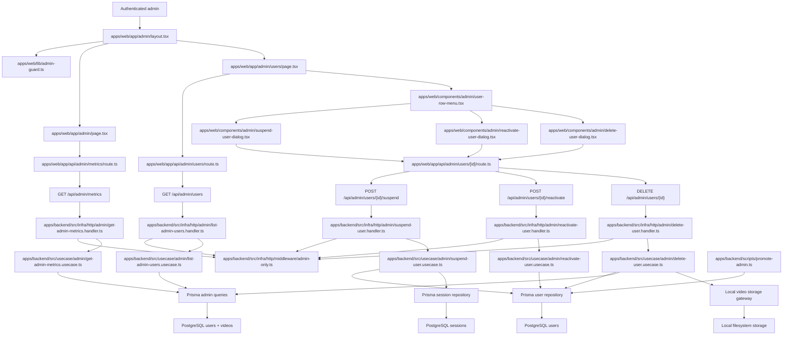

# Technical Specification: Administration Panel

## 1. Technical Overview

F12 introduces the dedicated `/admin` area used by the product owner to oversee accounts and aggregate platform usage. The area is gated by the existing `is_admin` flag on the `users` table (already provisioned by F02) and exposes a small dashboard with two top-level metrics, a paginated and searchable user list, and per-user actions to suspend, reactivate, or delete accounts. Admin-only resources are hidden from non-admins by returning 404 on every admin surface (UI route and HTTP API), consistent with the PRD requirement to avoid disclosing the admin area's existence.

The backend extends the existing `User` aggregate with `suspend()` and `reactivate()` operations that flip the existing `status` column between `active` and `suspended`. A new admin slice (`domain/admin/`, `usecase/admin/`, `infra/http/admin/`) hosts the admin-only use cases: list users with search/sort/pagination, fetch dashboard metrics, suspend, reactivate, and delete. Every admin use case enforces the `actor.isAdmin === true` precondition; the suspend and delete use cases also enforce two domain-level guardrails inside the same transaction — `actor.id !== target.id` (no self-action) and, for delete, "at least one admin must remain" (the last admin cannot be deleted). Suspending a user cascades through F02's session revocation flow inside the same transaction so any in-flight session for that user is invalidated immediately. Deleting a user relies on Prisma `onDelete: Cascade` foreign keys defined on every user-owned table (`sessions` and `videos` are already cascading; F12 ships an explicit cascade-invariant test that documents the architectural constraint for every future user-owned table) plus a best-effort filesystem cleanup pass for video files and thumbnails owned by the deleted user.

The web app keeps using F02's first-party Next.js Route Handler proxy pattern. New `/api/admin/*` Route Handlers forward the authenticated `session_token` cookie to the backend; the new `/admin` and `/admin/users` pages are server-rendered with an admin guard that calls the existing session endpoint and translates a non-admin (or anonymous) session into Next.js `notFound()`. The admin UI follows the Option B "Signal" dark references in `docs/design/design-system-pages/` and reuses the existing dialog and button primitives where possible.

A small bootstrap CLI (`apps/backend/scripts/promote-admin.ts`) is included so the first admin can be created out-of-band: registration never exposes `is_admin`, so seeding the first admin must happen at the operator level (CLI run by the deployer).

**Included:**
- Admin guard middleware on the backend that returns 404 for any `/api/admin/*` request whose authenticated user is not an admin (or is unauthenticated).
- Admin guard helper on the web that turns a non-admin or anonymous session into `notFound()` for `/admin` and `/admin/users`.
- Dashboard metrics endpoint (`GET /api/admin/metrics`) returning `{ totalUsers, totalVideos }` using the existing user/video projections.
- User list endpoint (`GET /api/admin/users?search=&sortBy=&sortDir=&page=&perPage=`) returning paginated rows with `id`, `name`, `email`, `createdAt`, `lastLoginAt`, `videoCount`, and `status`. Default `perPage=50`. Search is a case-insensitive substring across `name` and `email`. Sortable columns: `name`, `email`, `createdAt`, `lastLoginAt`, `videoCount`, `status`. Default sort is `createdAt desc`.
- Suspend endpoint (`POST /api/admin/users/{id}/suspend`) that flips `status` to `suspended` and revokes every session for that user in the same transaction. Returns the updated row.
- Reactivate endpoint (`POST /api/admin/users/{id}/reactivate`) that flips `status` back to `active` (sessions are not restored — the user re-authenticates).
- Delete endpoint (`DELETE /api/admin/users/{id}`) that requires the request body to contain a `confirmEmail` string equal to the target user's email; on success removes the user row, which cascades to `sessions` and `videos` rows via Prisma FK cascades. After the row is removed, the use case best-effort deletes the on-disk video files and thumbnail files owned by that user; filesystem failures are logged as structured-JSON warnings and do not roll back the database delete.
- Delete and suspend guards: an admin attempting to act on their own account receives `400 admin_self_action_forbidden` ("You cannot suspend or delete your own admin account"). An admin attempting to delete the last admin receives `409 last_admin_cannot_be_deleted` ("The system always keeps at least one admin account").
- Admin pages: `/admin` (dashboard with two metric cards and top navigation linking to "Dashboard" and "Users") and `/admin/users` (table with search input, column sort affordances, pagination controls, and per-row actions to suspend/reactivate/delete). The delete action opens a confirmation modal whose Delete button is disabled until the admin types the target user's email exactly into a confirmation input.
- Bootstrap CLI `apps/backend/scripts/promote-admin.ts` that takes an email argument and toggles the `isAdmin` flag for that user, used to create the first admin. The CLI fails clearly if the email does not exist.
- Cascade-invariant test asserting that every user-owned Prisma model has `onDelete: Cascade` declared on its `userId` foreign key, so the delete-user use case continues to cascade correctly as future features (F05, F06, F07, etc.) add new tables.

**Deferred:**
- A separate per-user detail page is out of scope; all per-user actions are inline in the list (per PRD).
- Soft-delete or trash for deleted users is out of scope per the PRD ("delete is irreversible").
- Aggregate analytics beyond `totalUsers` and `totalVideos` (processed hours, failure counts, per-day trends) are explicitly out of scope per PRD §7.
- Admin-side editing of user profile fields (rename, email change, password reset) is not in F12; only suspend/reactivate/delete per PRD.
- Email notification to the user on suspend/delete is out of scope (no email infrastructure is present in F02 either).
- Bulk actions (multi-select suspend/delete) are out of scope.
- The admin area's design fidelity to the Signal dark references is part of F12 but the design itself is a reference, not a binding pixel-perfect mirror.

**Traceability:**
- PRD Capabilities drive: the `is_admin` gate, the dashboard metrics, the user list with search/sort/pagination at 50 per page, the suspend/reactivate/delete actions and their cascading semantics, the typed-email delete confirmation, and the admin top navigation.
- PRD Experience drives: the inline per-user actions (no separate detail page), the clear suspend-vs-delete reversibility messaging, and the dashboard layout with metric cards.
- PRD Error Handling drives: the all-or-nothing delete behavior with operator-visible errors on partial failure, the self-action guardrail, and the last-admin guardrail.
- PRD Section 8 limits prerequisites to F02 (authentication, sessions, `is_admin` flag) and F03 (videos for the per-user `videoCount` and the platform-wide total, plus the on-disk artifacts the cascade cleans up).
- The Cross-Feature Integration AC "Video records provided by upload (F03) are aggregated into the total-videos metric on `/admin` and into the per-user video count on `/admin/users` (F12)" is owned by F12 and verified in this contract.

## 2. Architecture Impact

F12 adds an admin slice to the backend, an `/admin/*` route group to the web app, and a small bootstrap CLI. The existing F02 session boundary and F03 video boundary are unchanged; F12 only consumes the read models that already exist plus the existing `User` aggregate.



**Observed project patterns:**
- TypeScript on Node with npm workspaces; backend and web are separate workspaces.
- Frontend uses Next.js 16 App Router with React 19, Server Components by default, Tailwind CSS 4, Geist fonts, path alias `@/*`, and component-level `"use client"` for interactive widgets.
- Frontend backend access is routed through Next.js Route Handlers so cookies remain first-party on the web origin.
- Frontend automated tests use Vitest for component/business assertions; navigation-level checks use the `playwright-cli` skill against the project started via `./scripts/init.sh`.
- Frontend design uses Option B "Signal" dark references from `docs/design/design-system-pages/`.
- Backend uses Fastify 5, Prisma 5, Zod 3, TypeScript strict mode, Vitest, and explicit `HttpRoute` records.
- Backend follows clean architecture: `domain/` imports nothing outer, `usecase/` only inward, `infra/` adapts HTTP and persistence, and `src/main.ts` is the only composition root.
- `process.env` is read only in `apps/backend/src/config/env.ts`.
- Backend handlers validate input via Zod, call one use case, map output to HTTP, and do not catch errors; errors extend `AppError` and map centrally through `infra/http/error-handler.ts`.
- Tests are colocated as `*.spec.ts`; external I/O uses named fake classes rather than inline stubs.
- Persistent contract state is provisioned by a colocated seed script (precedents: `apps/backend/scripts/seed-auth-contract.ts`).
- Static fixture convention is `tests/fixtures/<feature-slug>/`, established by F03.
- Project quality gates are `npm run lint`, `npm run typecheck`, `npm run build`, `npm run test`, and `./scripts/run-gates.mjs`.
- Pagination convention: `domain/_shared/pagination.ts` exposes `PageInput { page, pageSize }` and `PageOutput<T> { items, page, pageSize, total }`.

## 3. Technical Decisions

| Decision | Chosen Approach | Alternative Considered | Trade-off |
|---|---|---|---|
| Admin route protection | Backend admin middleware returns 404 for non-admin or anonymous requests on every `/api/admin/*` route; web layout calls `notFound()` for non-admin sessions on `/admin/*` | Return 401/403 with a body, or hide only the UI | Matches the PRD ("non-admins receive 404 to avoid disclosing the admin area"); making the API behave the same way prevents an inadvertent UI-only leak |
| Suspension representation | Reuse the existing `User.status: "active" \| "suspended"` column from F02; no new `suspended_at` column | Add a new `suspended_at` timestamp column | The existing `status` field already represents the state the PRD requires; adding a redundant timestamp column is gold-plating without an AC asking for it. `updatedAt` already records when the change happened |
| Session invalidation on suspend | Inside the same transaction that flips `status`, delete (or revoke) every session row for the target user via the existing session repository | Rely on the auth middleware to re-check `status` on every request and reject suspended users at session resolution | Both work, but invalidating sessions matches the PRD ("active sessions are invalidated") literally; checking `status` at resolution time is a defense-in-depth addition that F12 also ships in `GetCurrentSessionUseCase`. Doing both keeps the behavior unambiguous |
| Cascade strategy on user delete | Rely on Prisma `onDelete: Cascade` declared on every user-owned table's `userId` FK (already present on `sessions` and `videos`); the `delete-user.usecase` then best-effort cleans up the user's video files and thumbnails on disk | Orchestrate explicit per-table delete calls inside a use case transaction | DB-level cascade is robust to future tables — every new user-owned table inherits the contract by following the cascade-invariant test that F12 ships. The use case still handles filesystem cleanup since Prisma cannot reach disk |
| Filesystem cleanup tolerance | Filesystem failures during the post-delete cleanup are logged as structured-JSON warnings; the database delete is not rolled back | Roll back the delete on any filesystem failure | Matches the PRD ("either the full cascade succeeds or nothing changes visibly" applies to user-visible state — orphaned files are an operator concern, surfaced by the warning log). The user is gone from the admin's view either way |
| Self-action guardrail | Enforced inside `suspend-user.usecase` and `delete-user.usecase` against `actor.id === target.id`, raising `AdminSelfActionForbiddenError` (400) | Enforce in the handler with a guard clause | Use case is the right layer (PRD invariant); handler stays focused on shape validation and calling one use case per the clean-arch rule |
| Last-admin guardrail | Enforced inside `delete-user.usecase` by counting remaining admins (excluding the target) inside the same transaction; raises `LastAdminCannotBeDeletedError` (409) | Enforce in DB with a partial constraint or trigger | Use case + transaction-level count is portable and visible in the domain code; DB-side enforcement would scatter the rule across two layers |
| Email confirmation on delete | The HTTP DELETE body must contain `{ confirmEmail: string }` equal to the target user's email; mismatch returns `400 confirm_email_mismatch` | Pass through a query string, or trust the UI alone | The HTTP-level check guarantees the guardrail even if the UI is bypassed; the UI dialog enforces the same rule client-side for UX |
| Admin list pagination | `GET /api/admin/users?page=N&perPage=50&search=&sortBy=&sortDir=` using the existing `PageInput/PageOutput<T>` shape from `domain/_shared/pagination.ts`; `perPage` defaults to 50 and is bounded to `[1,200]`; unknown `sortBy` falls back to `createdAt`, unknown `sortDir` falls back to `desc` | Server-side cursor pagination | Page-based pagination matches the PRD's "50 per page" wording and the `PageOutput<T>` already established in `domain/_shared/`. Cursor pagination is unnecessary at the expected admin scale |
| Search semantics | Case-insensitive substring across `name` and `email`, applied at the Prisma query layer using `mode: "insensitive"` for both fields combined with `OR` | Full-text index | Substring match is what the PRD calls for and is trivial to implement at expected scale; full-text would be premature optimization |
| Bootstrap admin | Add `apps/backend/scripts/promote-admin.ts` (a tsx CLI script) that takes an email argument and flips `isAdmin` on that user via the user repository; documented in the spec for the deployer | Expose `is_admin` in registration, or auto-promote the first registered user | PRD bans both alternatives implicitly (admin is gated by an internal flag, no signup self-promotion). A small CLI script keeps the human-in-the-loop step explicit |
| Admin metrics aggregation | Compute `totalUsers` via `prisma.user.count()` (including suspended users) and `totalVideos` via `prisma.video.count()` inside a dedicated `AdminQueries` projection on the read side | Persist a maintained materialized counter | Counts at admin scale are cheap; materialized counters add invalidation surface for no measurable gain |

**Assumptions and Decisions (Auto-Accept Policy):**
- F12 PRD has neither a Core Scope nor a Full Scope additions block. Auto-Accept selects the entire feature scope.
- All quality gates detected in the project (`npm run lint`, `npm run typecheck`, `npm run build`, `npm run test`, `./scripts/run-gates.mjs`) are auto-included in the contract Quality gates section unchanged. Reviewer can override later.
- Surfaces auto-detected from PRD Capabilities + Experience + Provides: `HTTP API` (admin endpoints), `Service` (admin guard middleware exposed to other features), `UI` (admin pages), `E2E` (full admin flows). No `CLI`, `Worker`, or `Event` surface item — the bootstrap CLI is an operator tool, not a contract item (it has no in-scope AC and no PRD signal).
- The PRD says "marks the user as suspended" without specifying a timestamp column. Auto-Accept reuses the existing `User.status` enum already present from F02; no new `suspended_at` column is added. (This diverges from a hint in the dispatch prompt — documented here for review.)
- The PRD says "deletes the user and all their videos, thumbnails, transcriptions, summaries, folders, and tags". Folders/tags/transcriptions/summaries do not exist in the schema yet. Auto-Accept covers the cascade by (a) verifying that every user-owned table currently in the schema (`sessions`, `videos`) cascades on user delete and (b) shipping a cascade-invariant test asserting that every user-owned model declared in `prisma/schema.prisma` has `onDelete: Cascade` on its `userId` FK. Future features adding user-owned tables (F05/F06/F07) inherit this constraint and the test enforces it.
- Filesystem cleanup of video files and thumbnails is best-effort. A failure logs a structured-JSON warning naming the orphaned paths and the deleted user id; the delete still succeeds at the DB level. This matches the PRD's "user does not see the video again even on partial failure" intent.
- Pagination defaults to `perPage=50` per PRD and is bounded to `[1, 200]` to prevent accidental full scans.
- Search is `OR` across `name` and `email`, case-insensitive substring (`contains` with `mode: insensitive`).
- Sortable columns are exactly `name`, `email`, `createdAt`, `lastLoginAt`, `videoCount`, `status`. Default sort is `createdAt desc`. Unknown values fall back to defaults without erroring (mirroring F04's tolerance).
- Suspended users' login attempts are blocked with the existing F02 `AccountSuspendedError` (already defined in `domain/user/errors.ts`); F12 wires the existing error into the login use case path that previously did not differentiate suspended users (defense-in-depth alongside session invalidation).
- The web admin guard helper turns a non-admin session into Next.js `notFound()` so non-admins see the standard not-found page; the admin layout is rendered only when the guard passes.
- The delete confirmation dialog disables the Delete button until the typed email matches the target's email exactly (no whitespace stripping; the user must type the exact value). The button is also disabled for 1 second after dialog open to mirror F04's accident-prevention pattern.
- Fixtures follow the established `tests/fixtures/<feature-slug>/` convention; F12 introduces `tests/fixtures/admin-panel/` for any small files it needs (e.g., a stand-in original/thumbnail used by the cascade-cleanup item).
- The contract seed for F12 (`apps/backend/scripts/seed-admin-contract.ts`) follows the `seed-auth-contract.ts` precedent and provisions an admin user, a regular user, a suspended user, several pagination-fillers, sessions for the relevant users, and a few videos owned by the regular user (so per-user `videoCount` and `totalVideos` have observable values).

## 4. Component Overview

**Frontend:**

| File Path | New/Modified | Purpose | Key Responsibilities |
|---|---|---|---|
| `apps/web/app/admin/layout.tsx` | New | Admin area shell | Run the admin guard server-side, render the admin top navigation linking to "Dashboard" and "Users", call `notFound()` for non-admin sessions |
| `apps/web/app/admin/page.tsx` | New | Admin dashboard | Server-render the two metric cards (`totalUsers`, `totalVideos`) using the metrics endpoint |
| `apps/web/app/admin/users/page.tsx` | New | Admin users list | Server-render the user table for the current `?page=&search=&sortBy=&sortDir=` parameters; mount the search input, sort headers, pagination controls, and per-row menu |
| `apps/web/app/admin/not-found.tsx` | New | Admin not-found page | Render the same not-found page Next.js renders for unknown routes (matches the PRD's "404 to avoid disclosing the admin area") |
| `apps/web/app/api/admin/metrics/route.ts` | New | Metrics proxy | Forward authenticated `GET /api/admin/metrics` requests, preserving cookies and 404 responses |
| `apps/web/app/api/admin/users/route.ts` | New | Users list proxy | Forward authenticated `GET /api/admin/users` requests with search/sort/pagination query params |
| `apps/web/app/api/admin/users/[id]/route.ts` | New | Per-user proxy | Forward authenticated `DELETE /api/admin/users/{id}` requests, preserving the JSON body that carries `confirmEmail` |
| `apps/web/app/api/admin/users/[id]/suspend/route.ts` | New | Suspend proxy | Forward authenticated `POST /api/admin/users/{id}/suspend` requests |
| `apps/web/app/api/admin/users/[id]/reactivate/route.ts` | New | Reactivate proxy | Forward authenticated `POST /api/admin/users/{id}/reactivate` requests |
| `apps/web/lib/admin-api.ts` | New | Browser admin helpers | Type the metrics, users list, suspend, reactivate, and delete payloads and call the proxy endpoints |
| `apps/web/lib/admin-guard.ts` | New | Server-side admin guard | Resolve the current session via the existing session helper and call `notFound()` when the session is anonymous or `isAdmin === false` |
| `apps/web/components/admin/admin-nav.tsx` | New | Admin top navigation | Render the "Dashboard" and "Users" links and the active-route highlight |
| `apps/web/components/admin/metric-card.tsx` | New | Metric card primitive | Render a labeled metric value used by `/admin` |
| `apps/web/components/admin/user-table.tsx` | New | User table | Render rows with `name`, `email`, `createdAt`, `lastLoginAt`, `videoCount`, `status`, and the per-row menu trigger; render sortable column headers and pagination footer |
| `apps/web/components/admin/user-search-input.tsx` | New | Search input | Debounced controlled input that updates the `?search=` query string |
| `apps/web/components/admin/user-row-menu.tsx` | New | Per-user actions | Context menu offering Suspend, Reactivate (for suspended users), and Delete; routes each action to the corresponding dialog |
| `apps/web/components/admin/suspend-user-dialog.tsx` | New | Suspend confirmation | Render confirmation copy "Suspend {email}? Their active sessions will be invalidated." with Cancel / Suspend buttons; on confirm POST `/api/admin/users/{id}/suspend` |
| `apps/web/components/admin/reactivate-user-dialog.tsx` | New | Reactivate confirmation | Render confirmation copy and POST `/api/admin/users/{id}/reactivate` on confirm |
| `apps/web/components/admin/delete-user-dialog.tsx` | New | Delete confirmation | Render the typed-email-to-confirm input; disable Delete until the typed value matches the target email; POST DELETE with `{ confirmEmail }` in the body; surface server errors |
| `apps/web/components/admin/user-table.test.tsx` | New | Table tests | Cover sort-header click, search debounce, suspend/reactivate menu visibility per status |
| `apps/web/components/admin/delete-user-dialog.test.tsx` | New | Delete dialog tests | Cover the typed-email-must-match guard and the disabled-Delete-for-1-second guard |
| `apps/web/lib/admin-guard.test.ts` | New | Admin guard tests | Cover anonymous → notFound, non-admin → notFound, admin → renders |

**Backend:**

| File Path | New/Modified | Purpose | Key Responsibilities |
|---|---|---|---|
| `apps/backend/src/main.ts` | Modified | Composition root | Wire the admin guard middleware, admin queries, admin use cases, and admin handlers; pass them to `buildHttpRoutes` |
| `apps/backend/src/domain/user/user.entity.ts` | Modified | User aggregate | Add `suspend()` and `reactivate()` methods that flip the `status` value object; add a small invariant on `suspend()` that throws if already suspended (the use case prevents redundant transitions before reaching here) |
| `apps/backend/src/domain/user/user.entity.spec.ts` | Modified | User aggregate tests | Cover suspend / reactivate transitions and the no-redundant-transition invariants |
| `apps/backend/src/domain/user/errors.ts` | Modified | User errors | Add `AdminSelfActionForbiddenError` (400, `admin_self_action_forbidden`), `LastAdminCannotBeDeletedError` (409, `last_admin_cannot_be_deleted`), `ConfirmEmailMismatchError` (400, `confirm_email_mismatch`) |
| `apps/backend/src/domain/admin/admin.queries.ts` | New | Admin read interface | Declare `getMetrics()`, `listUsers(input)`, `findUserSummaryById(id)`, `countAdmins()` returning typed read models |
| `apps/backend/src/usecase/admin/get-admin-metrics.usecase.ts` | New | Metrics use case | Verify `actor.isAdmin`, return `{ totalUsers, totalVideos }` from the admin queries |
| `apps/backend/src/usecase/admin/get-admin-metrics.dto.ts` | New | Metrics DTO | Define `actorId` input and `{ totalUsers, totalVideos }` output |
| `apps/backend/src/usecase/admin/list-admin-users.usecase.ts` | New | Users list use case | Verify `actor.isAdmin`, normalize search/sort/pagination input, call admin queries, return a `PageOutput<AdminUserRow>` |
| `apps/backend/src/usecase/admin/list-admin-users.dto.ts` | New | List DTO | Define `actorId`, `search`, `sortBy`, `sortDir`, `page`, `perPage` input and the row + pagination output |
| `apps/backend/src/usecase/admin/suspend-user.usecase.ts` | New | Suspend use case | Verify `actor.isAdmin`, reject self-action, load target via `userRepo`, call `user.suspend()`, persist, revoke the user's sessions inside the same transaction |
| `apps/backend/src/usecase/admin/suspend-user.dto.ts` | New | Suspend DTO | Define `actorId`, `targetUserId` input and the updated row output |
| `apps/backend/src/usecase/admin/reactivate-user.usecase.ts` | New | Reactivate use case | Verify `actor.isAdmin`, reject self-action, load target, call `user.reactivate()`, persist |
| `apps/backend/src/usecase/admin/reactivate-user.dto.ts` | New | Reactivate DTO | Define `actorId`, `targetUserId` input and the updated row output |
| `apps/backend/src/usecase/admin/delete-user.usecase.ts` | New | Delete use case | Verify `actor.isAdmin`, reject self-action, load target, verify `confirmEmail` matches, count remaining admins inside transaction (reject if target is the last admin), gather the user's video file paths and thumbnail paths, delete the user (cascading to sessions and videos), best-effort delete the on-disk files and log warnings on failure |
| `apps/backend/src/usecase/admin/delete-user.dto.ts` | New | Delete DTO | Define `actorId`, `targetUserId`, `confirmEmail` input |
| `apps/backend/src/usecase/admin/admin-authorization.ts` | New | Authorization helper | Provide `requireAdmin(actor)` that throws `AdminAccessDeniedError` for non-admins; reused by every admin use case |
| `apps/backend/src/usecase/auth/login-user.usecase.ts` | Modified | Login use case | Check `user.status === "suspended"` after credential verification and throw `AccountSuspendedError`, so suspended users cannot log in |
| `apps/backend/src/usecase/auth/get-current-session.usecase.ts` | Modified | Session resolver | After loading the current user, treat a `suspended` user as anonymous so existing tokens cannot keep being used (defense in depth for sessions revoked between requests) |
| `apps/backend/src/infra/queries/admin/admin.prisma-queries.ts` | New | Admin read implementation | Implement `getMetrics`, `listUsers`, `findUserSummaryById`, `countAdmins` using Prisma `count`, `findMany` with `where`/`orderBy`/`skip`/`take`, and `_count: { videos: true }` |
| `apps/backend/src/infra/queries/admin/admin.in-memory-queries.ts` | New | Admin read fake | Mirror the same shape for use case tests |
| `apps/backend/src/infra/http/middleware/admin-only.ts` | New | Admin gate middleware | Resolve `req.user`, return `404 not_found` (no body leak) when missing or `isAdmin === false`; pass through otherwise |
| `apps/backend/src/infra/http/admin/get-admin-metrics.handler.ts` | New | Metrics handler | Resolve actor, call metrics use case, return `{ totalUsers, totalVideos }` |
| `apps/backend/src/infra/http/admin/list-admin-users.handler.ts` | New | List handler | Parse `search`/`sortBy`/`sortDir`/`page`/`perPage` query, call list use case, return paginated body |
| `apps/backend/src/infra/http/admin/suspend-user.handler.ts` | New | Suspend handler | Resolve actor, parse `id` path param, call suspend use case, return updated row |
| `apps/backend/src/infra/http/admin/reactivate-user.handler.ts` | New | Reactivate handler | Resolve actor, parse `id` path param, call reactivate use case, return updated row |
| `apps/backend/src/infra/http/admin/delete-user.handler.ts` | New | Delete handler | Resolve actor, parse `id` path param and JSON body `{ confirmEmail }`, call delete use case, return 204 |
| `apps/backend/src/infra/http/admin/admin.routes.ts` | New | Admin routes | Register all admin routes behind the admin-only middleware; export `AdminHttpDeps` |
| `apps/backend/src/infra/http/index.ts` | Modified | Route composition | Include the admin routes in the registered HTTP routes, behind the admin-only middleware |
| `apps/backend/src/infra/http/error-handler.ts` | Unchanged | Error mapping | Existing central mapping handles the new `AppError` subclasses by code/status without changes |
| `apps/backend/scripts/promote-admin.ts` | New | Bootstrap CLI | tsx script that loads the user by email and toggles `isAdmin` to `true`; prints success/failure to stdout, exits non-zero if the user is missing |
| `apps/backend/scripts/seed-admin-contract.ts` | New | Contract seed | Provision the admin, regular, suspended, pagination-filler users, sessions, and videos required by the contract |
| `apps/backend/src/domain/admin/admin.queries.spec-helpers.ts` | New | Test helpers | Tiny factory for `AdminUserRow` records used by the use case specs |
| `apps/backend/src/usecase/admin/cascade-invariant.spec.ts` | New | Cascade invariant test | Read `prisma/schema.prisma` and assert every model with a `userId` field has its FK declared with `onDelete: Cascade` |

**Database:**

| Migration File | Tables Affected | Operation | Notes |
|---|---|---|---|
| (none) | `users`, `sessions`, `videos` | No changes | F12 reuses the existing `User.status` (`active` / `suspended`) and `User.isAdmin` columns introduced by F02. The cascading FKs from `sessions.user_id → users.id` and `videos.user_id → users.id` are already in place from F02 and F03 respectively |

## 5. API Contracts

All browser-facing routes live on the web origin under `/api/admin/*` and proxy to the equivalent backend routes while preserving the authenticated `session_token` cookie. Backend responses use JSON. Every admin endpoint passes through the admin-only middleware first; non-admin or anonymous requests receive `404 not_found` with body `{ "code": "not_found", "message": "Not found" }` and **no other detail** so the admin area is not disclosed.

### Endpoint: Get Admin Metrics

- **Method:** GET
- **Backend Path:** `/api/admin/metrics`
- **Web Proxy Path:** `/api/admin/metrics`
- **Authentication:** Required session cookie + `isAdmin === true`

**Request:** no body, no query parameters.

**Response (Success - 200):**

| Field | Type | Description |
|---|---|---|
| `totalUsers` | `integer` | Count of all users (including suspended) |
| `totalVideos` | `integer` | Count of all videos across all users |

**Response Example:**

```json
{ "totalUsers": 27, "totalVideos": 81 }
```

**Error Codes:**

| Code | HTTP Status | Description |
|---|---|---|
| `not_found` | 404 | Caller is anonymous or not an admin (admin area is not disclosed) |

### Endpoint: List Admin Users

- **Method:** GET
- **Backend Path:** `/api/admin/users`
- **Web Proxy Path:** `/api/admin/users`
- **Authentication:** Required session cookie + `isAdmin === true`

**Request (query):**

| Field | Type | Required | Validation | Description |
|---|---|---|---|---|
| `search` | `string` | No | trimmed length 0–200 | Substring matched against `name` and `email`, case-insensitive (`OR`) |
| `sortBy` | `string` | No | one of `name`, `email`, `createdAt`, `lastLoginAt`, `videoCount`, `status`; unknown falls back to `createdAt` | Sort column |
| `sortDir` | `string` | No | one of `asc`, `desc`; unknown falls back to `desc` | Sort direction |
| `page` | `integer` | No | `>= 1`; default `1` | Page number, 1-indexed |
| `perPage` | `integer` | No | `1 <= perPage <= 200`; default `50` | Page size |

**Response (Success - 200):**

| Field | Type | Description |
|---|---|---|
| `items[].id` | `uuid` | User id |
| `items[].name` | `string` | Full name |
| `items[].email` | `string` | Normalized email |
| `items[].createdAt` | `string` | ISO timestamp |
| `items[].lastLoginAt` | `string \| null` | ISO timestamp, null if the user never logged in |
| `items[].videoCount` | `integer` | Count of videos owned by the user |
| `items[].status` | `string` | `active` or `suspended` |
| `items[].isAdmin` | `boolean` | Whether the user has the admin flag |
| `page` | `integer` | Echoed page |
| `perPage` | `integer` | Echoed perPage |
| `total` | `integer` | Total matching rows (across all pages) |

**Response Example:**

```json
{
  "items": [
    {
      "id": "11111111-1111-4111-8111-111111111111",
      "name": "Admin Owner",
      "email": "admin@example.com",
      "createdAt": "2026-04-01T10:00:00.000Z",
      "lastLoginAt": "2026-05-02T09:00:00.000Z",
      "videoCount": 0,
      "status": "active",
      "isAdmin": true
    }
  ],
  "page": 1,
  "perPage": 50,
  "total": 1
}
```

**Error Codes:**

| Code | HTTP Status | Description |
|---|---|---|
| `not_found` | 404 | Caller is anonymous or not an admin |
| `invalid_input` | 400 | Query shape invalid (only when present and malformed; absent fields fall back to defaults) |

### Endpoint: Suspend User

- **Method:** POST
- **Backend Path:** `/api/admin/users/{id}/suspend`
- **Web Proxy Path:** `/api/admin/users/{id}/suspend`
- **Authentication:** Required session cookie + `isAdmin === true`

**Request:** no body.

**Response (Success - 200):**

| Field | Type | Description |
|---|---|---|
| `user.id` | `uuid` | Target user id |
| `user.status` | `string` | Always `suspended` after success |
| `user.updatedAt` | `string` | ISO timestamp of the change |

**Response Example:**

```json
{ "user": { "id": "...", "status": "suspended", "updatedAt": "2026-05-02T22:00:00.000Z" } }
```

**Error Codes:**

| Code | HTTP Status | Description |
|---|---|---|
| `not_found` | 404 | Caller is anonymous or not an admin, OR target user does not exist |
| `admin_self_action_forbidden` | 400 | Caller and target are the same user; message reads "You cannot suspend or delete your own admin account" |

### Endpoint: Reactivate User

- **Method:** POST
- **Backend Path:** `/api/admin/users/{id}/reactivate`
- **Web Proxy Path:** `/api/admin/users/{id}/reactivate`
- **Authentication:** Required session cookie + `isAdmin === true`

**Request:** no body.

**Response (Success - 200):**

| Field | Type | Description |
|---|---|---|
| `user.id` | `uuid` | Target user id |
| `user.status` | `string` | Always `active` after success |
| `user.updatedAt` | `string` | ISO timestamp of the change |

**Error Codes:**

| Code | HTTP Status | Description |
|---|---|---|
| `not_found` | 404 | Caller is anonymous or not an admin, OR target user does not exist |
| `admin_self_action_forbidden` | 400 | Caller and target are the same user |

### Endpoint: Delete User

- **Method:** DELETE
- **Backend Path:** `/api/admin/users/{id}`
- **Web Proxy Path:** `/api/admin/users/{id}`
- **Authentication:** Required session cookie + `isAdmin === true`
- **Content Type:** `application/json`

**Request:**

| Field | Type | Required | Validation | Description |
|---|---|---|---|---|
| `confirmEmail` | `string` | Yes | exact match (no trimming) of the target user's email | Operator-typed confirmation that this is the intended user |

**Request Example:**

```json
{ "confirmEmail": "to-delete@example.com" }
```

**Response (Success - 204):** empty body.

**Error Codes:**

| Code | HTTP Status | Description |
|---|---|---|
| `not_found` | 404 | Caller is anonymous or not an admin, OR target user does not exist |
| `admin_self_action_forbidden` | 400 | Caller and target are the same user |
| `confirm_email_mismatch` | 400 | `confirmEmail` does not exactly match the target user's email |
| `last_admin_cannot_be_deleted` | 409 | The target is the only remaining admin; deletion would leave zero admins |
| `invalid_input` | 400 | Body shape invalid; message includes offending value and expected shape |

## 6. Data Model

F12 introduces no new tables and no new columns. It reuses:

**Table: `users` (no schema changes)**

| Column | Type | Nullable | Default | Description |
|---|---|---|---|---|
| `id` | `uuid` | No | - | PK |
| `name` | `varchar(120)` | No | - | Full name |
| `email` | `varchar(320)` | No | - | Unique normalized email |
| `is_admin` | `boolean` | No | `false` | Admin flag (gates `/admin/*`) |
| `status` | `varchar(20)` | No | `'active'` | `active` or `suspended` |
| `created_at` | `timestamptz` | No | `NOW()` | Registration timestamp |
| `updated_at` | `timestamptz` | No | `NOW()` | Last write |
| `last_login_at` | `timestamptz` | Yes | `NULL` | Last successful login |

**Table: `sessions` (no schema changes; cascade verified)**

The existing `sessions.user_id → users.id` foreign key already declares `onDelete: Cascade`; deleting a user removes every session row.

**Table: `videos` (no schema changes; cascade verified)**

The existing `videos.user_id → users.id` foreign key already declares `onDelete: Cascade`; deleting a user removes every video row.

**Cascade invariant (test, not migration):**

A new colocated test (`apps/backend/src/usecase/admin/cascade-invariant.spec.ts`) parses `prisma/schema.prisma` and asserts that every model containing a `userId` field declares its FK with `onDelete: Cascade`. This documents and enforces the architectural constraint so future user-owned tables (added by F05/F06/F07 and beyond) inherit the cascade automatically.

**Read-side projections (no migration; built on top of existing tables):**

The admin user-list query uses Prisma's `findMany` against `users` with `_count: { select: { videos: true } }` to materialize `videoCount` per row, plus `where` for substring search and `orderBy` for sorting. The metrics query uses `prisma.user.count()` and `prisma.video.count()`.

## 7. Testing Strategy

Backend tests remain colocated under `apps/backend/src/**` and use named fakes for repositories, queries, and the storage gateway.

**Domain tests:**
- `apps/backend/src/domain/user/user.entity.spec.ts` (extended)
  - `suspends_active_user`
  - `rejects_suspend_when_already_suspended`
  - `reactivates_suspended_user`
  - `rejects_reactivate_when_already_active`

**Use case tests:**
- `apps/backend/src/usecase/admin/get-admin-metrics.usecase.spec.ts`
  - `returns_total_users_and_total_videos`
  - `rejects_non_admin_with_admin_access_denied`
- `apps/backend/src/usecase/admin/list-admin-users.usecase.spec.ts`
  - `returns_first_page_of_50_with_default_sort_by_created_at_desc`
  - `applies_search_substring_across_name_and_email_case_insensitive`
  - `applies_sort_by_each_supported_column`
  - `falls_back_to_defaults_for_unknown_sort_values`
  - `returns_correct_pagination_meta`
  - `rejects_non_admin_with_admin_access_denied`
- `apps/backend/src/usecase/admin/suspend-user.usecase.spec.ts`
  - `suspends_active_user_and_revokes_sessions`
  - `rejects_self_suspend_with_admin_self_action_forbidden`
  - `rejects_non_admin_actor`
  - `noop_or_rejects_when_already_suspended` (per chosen invariant; covered alongside the entity test)
- `apps/backend/src/usecase/admin/reactivate-user.usecase.spec.ts`
  - `reactivates_suspended_user`
  - `rejects_self_reactivate_with_admin_self_action_forbidden`
  - `rejects_non_admin_actor`
- `apps/backend/src/usecase/admin/delete-user.usecase.spec.ts`
  - `deletes_user_and_cascades_to_sessions_and_videos`
  - `best_effort_filesystem_cleanup_logs_on_failure_but_succeeds`
  - `rejects_self_delete_with_admin_self_action_forbidden`
  - `rejects_when_confirm_email_does_not_match`
  - `rejects_when_target_is_the_last_admin`
  - `rejects_non_admin_actor`
- `apps/backend/src/usecase/admin/cascade-invariant.spec.ts`
  - `every_model_with_user_id_declares_on_delete_cascade`
- `apps/backend/src/usecase/auth/login-user.usecase.spec.ts` (extended)
  - `rejects_login_for_suspended_user_with_account_suspended`
- `apps/backend/src/usecase/auth/get-current-session.usecase.spec.ts` (extended)
  - `treats_suspended_user_as_anonymous`

**Infra tests:**
- `apps/backend/src/infra/queries/admin/admin.in-memory-queries.spec.ts`
  - `metrics_returns_total_user_and_video_counts`
  - `list_users_applies_search_sort_pagination`
- `apps/backend/src/infra/http/middleware/admin-only.spec.ts`
  - `passes_through_for_admin_user`
  - `returns_404_for_non_admin_user`
  - `returns_404_for_anonymous_user`
- `apps/backend/src/infra/http/admin/admin.routes.spec.ts`
  - `get_admin_metrics_returns_totals_for_admin`
  - `get_admin_metrics_returns_404_for_non_admin`
  - `get_admin_users_returns_paginated_rows`
  - `get_admin_users_applies_search`
  - `post_suspend_user_marks_status_and_revokes_sessions`
  - `post_suspend_user_rejects_self`
  - `post_reactivate_user_marks_status_active`
  - `delete_user_with_matching_confirm_email_removes_user_and_videos`
  - `delete_user_rejects_when_confirm_email_does_not_match`
  - `delete_user_rejects_when_target_is_last_admin`
  - `delete_user_rejects_self`

**Frontend tests:**
- `apps/web/lib/admin-api.test.ts`
  - `list_users_attaches_search_sort_page_per_page_query`
  - `suspend_sends_post_to_correct_path`
  - `reactivate_sends_post_to_correct_path`
  - `delete_sends_delete_with_confirm_email_body`
- `apps/web/lib/admin-guard.test.ts`
  - `admin_session_passes_through`
  - `non_admin_session_calls_not_found`
  - `anonymous_session_calls_not_found`
- `apps/web/components/admin/user-table.test.tsx`
  - `renders_rows_with_required_columns`
  - `clicking_a_sortable_header_updates_query`
  - `suspend_action_visible_only_for_active_users`
  - `reactivate_action_visible_only_for_suspended_users`
- `apps/web/components/admin/delete-user-dialog.test.tsx`
  - `delete_button_disabled_until_email_matches_exactly`
  - `delete_button_disabled_for_one_second_after_open`
  - `mismatched_email_does_not_send_request`

**Navigation verification with `playwright-cli`:**
- Start the project with `./scripts/init.sh`.
- Authenticate as `admin-user` through the UI; visit `/admin` and verify both metric cards render with the seeded counts.
- Visit `/admin/users` and verify the seeded users render in default order; type a substring into the search input and verify the table filters; click a column header and verify the sort changes; navigate to page 2 and back.
- Trigger Suspend on a regular user and verify their status badge flips to `suspended` and their previously seeded session no longer authenticates them (re-login attempt is blocked with the suspended message).
- Trigger Reactivate on a suspended user and verify the status flips back.
- Trigger Delete on a regular user, type their email exactly, confirm, and verify the row disappears; reload and verify they're still gone; verify their videos are removed.
- Authenticate as a non-admin user and verify `/admin` and `/admin/users` both return the standard not-found page (no admin chrome leaks).

**Contract fixtures:**
- `tests/fixtures/admin-panel/seed-thumbnail.jpg` (small placeholder JPEG used by the seed script for the deletable user's videos)
- `tests/fixtures/admin-panel/seed-original.bin` (small binary placeholder used by the seed script as a stand-in for original files; storage path semantics are what's being verified, not media playback)
